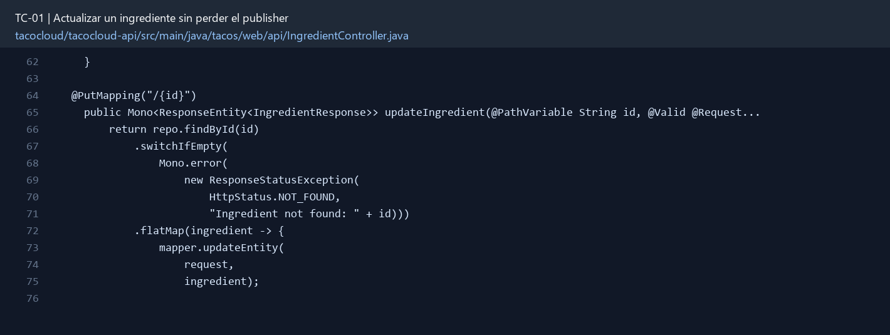
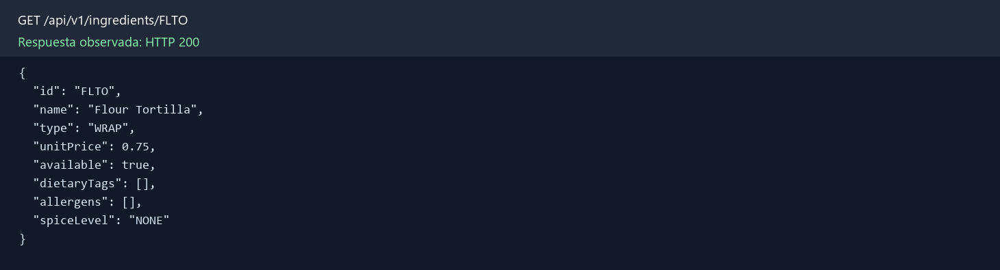

# TC-01 — Actualizar un ingrediente sin perder el publisher

## 1.- Ficha Técnica del Reto

| Campo | Detalle |
|---|---|
| Identificador | TC-01 |
| Nombre del Reto | Actualizar un ingrediente sin perder el publisher |
| Laboratorio | Lab 1 — Cazar operaciones fantasma |
| Nivel, puntos y dependencias | Inicial; Puntos: 5; Lab: 1; Dependencias: Ninguna |
| Código Base Involucrado | SRC-07 IngredientController; SRC-11 IngredientRepository. |
| Contrato | `PUT /api/ingredients/{id}` con JSON de ingrediente. Respuestas: 200, 400 o 404. |
| Resultado Funcional | La edición de un ingrediente debe producir una escritura real en MongoDB y responder con un contrato HTTP verificable. |

## 2.- Diagnóstico del Defecto en el Baseline

El resultado esperado es el siguiente: La edición de un ingrediente debe producir una escritura real en MongoDB y responder con un contrato HTTP verificable. La ficha del PDF ubica la revisión en SRC-07 IngredientController; SRC-11 IngredientRepository. La modificación principal consiste en cambiar el endpoint PUT para retornar `Mono<ResponseEntity<Ingredient>>` o un contrato reactivo equivalente.

**Riesgos que se deben evitar:**

- La escritura debe formar parte de la cadena retornada al framework.
- La existencia se comprueba antes de guardar; no crear accidentalmente un registro con PUT.
- El endpoint debe conservar `application/json` y no filtrar excepciones internas.

## 3.- Diff (Cambios solicitados y archivos relacionados)

El PDF señala como archivos objetivo: `tacocloud-api/.../IngredientController.java` y pruebas del módulo API.

La modificación funcional se comprueba con las siguientes tareas:

- Cambiar el endpoint PUT para retornar `Mono<ResponseEntity<Ingredient>>` o un contrato reactivo equivalente.
- Validar que el identificador de la ruta y el cuerpo sean consistentes; no confiar silenciosamente en uno de ellos.
- Devolver 200 con la entidad actualizada, 404 cuando el ingrediente no existe y 400 ante un ID inconsistente.
- Evitar cualquier llamada manual a `subscribe()`.

**Archivo para revisar en el repositorio:** [IngredientController.java](../tacocloud/tacocloud-api/src/main/java/tacos/web/api/IngredientController.java#L62).



*Figura 1. Extracto visual de IngredientController.java, a partir de la línea 62; las líneas extensas se recortan para su lectura. Permite localizar el cambio en el código actual.*

## 4.- Pruebas Automatizadas

Las pruebas mínimas indicadas para el reto son:

- Prueba de controlador para 200/400/404.
- Prueba con StepVerifier que confirme emisión y finalización.
- Regresión: verificar que `repo.save()` sí sea invocado al suscribirse.

**Archivos de prueba relacionados en este repositorio:**

- [IngredientControllerTest.java](../tacocloud/tacocloud-api/src/test/java/tacos/web/api/IngredientControllerTest.java)

## 5.- Pruebas Manuales en Postman

**Preparación:** use `http://localhost:8080` como URL base. Las rutas del PDF que empiezan por `/api/` se prueban aquí bajo `/api/v1/`. Antes de cada método distinto de GET, solicite `GET /csrf` en la misma sesión, conserve `JSESSIONID` y envíe el `X-CSRF-TOKEN` recién obtenido con Basic Auth (`habuma` / `password`). Siga [la guía de pruebas HTTP](PRUEBAS_HTTP.md).

### Caso 1: Actualización Exitosa de un Ingrediente Existente (200 OK)

**Objetivo:** comprobar que el ingrediente `FLTO` cambia de nombre y que el GET posterior muestra la escritura real.

**Método y URL:** `PUT http://localhost:8080/api/v1/ingredients/FLTO`

**Headers:** `Content-Type: application/json`, `Accept: application/json`, `X-CSRF-TOKEN: {{csrfToken}}` y Basic Auth.

**Body (raw → JSON):**

```json
{"name":"Flour Tortilla Extra Soft","type":"WRAP"}
```

**Status esperado:** `200 OK`, con `id: FLTO` y el nombre actualizado. Después, `GET /api/v1/ingredients/FLTO` debe mostrar el mismo nombre.

### Caso 2: Recurso Inexistente (404 Not Found)

**Método y URL:** `PUT http://localhost:8080/api/v1/ingredients/NO_EXISTE_TC_DOC`

**Body (raw → JSON):**

```json
{"name":"Ghost Pepper","type":"SAUCE"}
```

**Status esperado:** `404 Not Found`, con `code: RESOURCE_NOT_FOUND`; `GET` del mismo ID también debe devolver 404 y no debe existir un nuevo documento.

### Caso 3: ID en el Cuerpo (400 Bad Request)

**Método y URL:** `PUT http://localhost:8080/api/v1/ingredients/FLTO`

**Body (raw → JSON):**

```json
{"id":"COTO","name":"Modified Tortilla","type":"WRAP"}
```

**Status esperado:** `400 Bad Request`. El DTO rechaza propiedades desconocidas, incluido `id`; la identidad válida procede de la ruta.

### Caso 4: Validación del Cuerpo (400 Bad Request)

**Método y URL:** `PUT http://localhost:8080/api/v1/ingredients/FLTO`

**Body (raw → JSON):**

```json
{"name":"","type":null}
```

**Status esperado:** `400 Bad Request`, con violaciones para `name` y `type`; `GET` debe mostrar que el ingrediente no cambió.

**Verificación local:** el PUT con ID inexistente respondió 404; los cuerpos con `id` adicional y con `name` vacío y `type` nulo respondieron 400. El GET posterior de `FLTO` conservó `name: Flour Tortilla`.

**Evidencia HTTP observada:** `GET /api/v1/ingredients/FLTO` respondió `200` en la aplicación local. La imagen reproduce el JSON de esa respuesta; si es largo, se muestran las primeras líneas.



## 6.- Defensa Técnica

**Pregunta:** ¿Por qué una llamada a `repo.save()` puede “verse correcta” y aun así no ejecutar I/O?

**Respuesta:** `repo.save()` devuelve un `Mono` frío. La escritura ocurre cuando el framework se suscribe al publisher retornado; descartarlo en un método `void` deja la operación sin ejecutar.

## 7.- Criterios de Aceptación

- [ ] Una actualización válida cambia el dato consultado después por GET.
- [ ] Un ID inexistente no crea un documento.
- [ ] Un ID del cuerpo distinto al de la ruta genera error de cliente.
- [ ] El código no contiene `subscribe()`, `block()` ni `void` en esta operación.