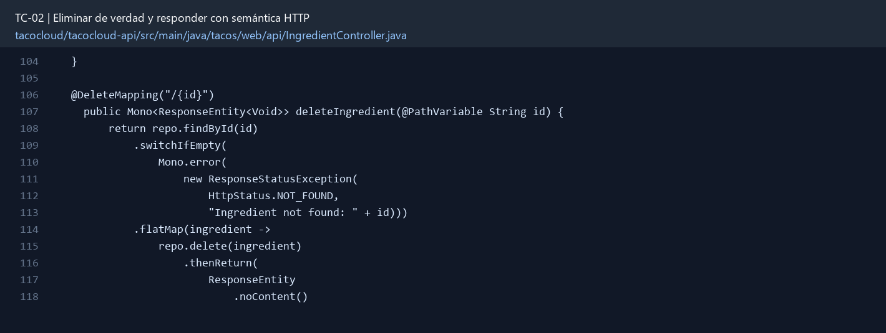

# TC-02 — Eliminar de verdad y responder con semántica HTTP

## 1.- Ficha Técnica del Reto

| Campo | Detalle |
|---|---|
| Identificador | TC-02 |
| Nombre del Reto | Eliminar de verdad y responder con semántica HTTP |
| Laboratorio | Lab 1 — Cazar operaciones fantasma |
| Nivel, puntos y dependencias | Inicial; Puntos: 5; Lab: 1; Dependencias: Ninguna |
| Código Base Involucrado | SRC-07 IngredientController; SRC-11 repositorios. |
| Contrato | `DELETE /api/ingredients/{id}`. Respuestas: 204 o 404. |
| Resultado Funcional | La eliminación debe ocurrir, distinguir “no existe” y ser observable por el cliente. |

## 2.- Diagnóstico del Defecto en el Baseline

El resultado esperado es el siguiente: La eliminación debe ocurrir, distinguir “no existe” y ser observable por el cliente. La ficha del PDF ubica la revisión en SRC-07 IngredientController; SRC-11 repositorios. La modificación principal consiste en reemplazar el método `void` por una cadena reactiva retornada.

**Riesgos que se deben evitar:**

- La verificación de existencia y el delete deben estar encadenados.
- No responder con cuerpo en 204.
- No usar `try/catch` alrededor de un publisher sin suscripción.

## 3.- Diff (Cambios solicitados y archivos relacionados)

El PDF señala como archivos objetivo: `IngredientController.java`, manejador de errores y pruebas.

La modificación funcional se comprueba con las siguientes tareas:

- Reemplazar el método `void` por una cadena reactiva retornada.
- Devolver 204 cuando se elimina y 404 cuando el recurso no existe.
- Hacer que una segunda eliminación del mismo ID responda de forma definida y documentada.
- No capturar excepciones que un repositorio reactivo no lanzará de manera síncrona.

**Archivo para revisar en el repositorio:** [IngredientController.java](../tacocloud/tacocloud-api/src/main/java/tacos/web/api/IngredientController.java#L104).

*Figura 1. Extracto visual de IngredientController.java, a partir de la línea 104; las líneas extensas se recortan para su lectura. Permite localizar el cambio en el código actual.*

## 4.- Pruebas Automatizadas

Las pruebas mínimas indicadas para el reto son:

- Prueba 204 y verificación de `delete`.
- Prueba 404 sin invocar delete.
- Prueba de integración con Mongo para confirmar desaparición.

**Archivos de prueba relacionados en este repositorio:**

- [IngredientControllerTest.java](../tacocloud/tacocloud-api/src/test/java/tacos/web/api/IngredientControllerTest.java)

## 5.- Pruebas Manuales en Postman

**Preparación:** use `http://localhost:8080` como URL base. Las rutas del PDF que empiezan por `/api/` se prueban aquí bajo `/api/v1/`. Antes de cada método distinto de GET, solicite `GET /csrf` en la misma sesión, conserve `JSESSIONID` y envíe el `X-CSRF-TOKEN` recién obtenido con Basic Auth (`habuma` / `password`). Siga [la guía de pruebas HTTP](PRUEBAS_HTTP.md).

### Caso 1: Operación principal

**Objetivo:** La eliminación debe ocurrir, distinguir “no existe” y ser observable por el cliente.

**Método y URL:** `DELETE /api/ingredients/{id}`. Respuestas: 204 o 404.

**Datos o preparación:** Reemplazar el método `void` por una cadena reactiva retornada.

**Comprobación:** Después de 204, GET ya no devuelve el ingrediente.

### Caso 2: Rechazo o condición límite

**Datos o preparación:** Prueba 404 sin invocar delete.

**Comprobación:** ID ausente produce 404.

## 6.- Defensa Técnica

**Pregunta:** ¿DELETE debe ser idempotente aunque la segunda llamada responda 404? Distinga idempotencia de igualdad de respuesta.

**Respuesta:** DELETE puede ser idempotente en su efecto aunque la segunda petición responda 404: después de una o varias llamadas, el recurso permanece ausente.

## 7.- Criterios de Aceptación

- [ ] Después de 204, GET ya no devuelve el ingrediente.
- [ ] ID ausente produce 404.
- [ ] La eliminación se ejecuta exactamente una vez.
- [ ] No hay `subscribe()` manual.
