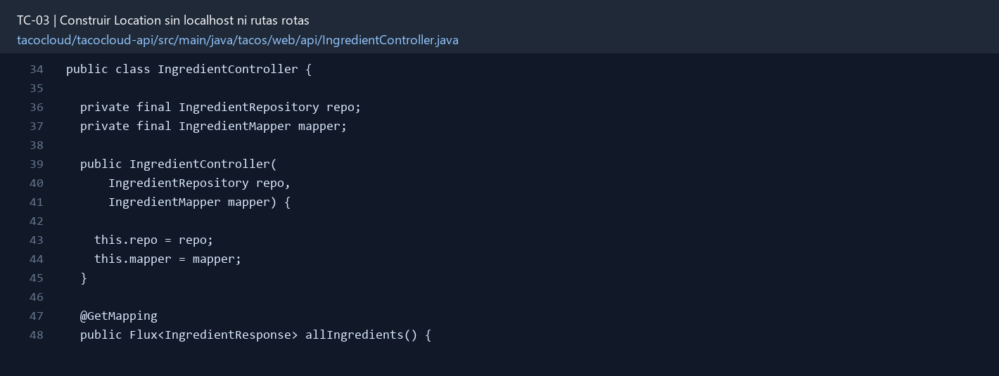

# TC-03 — Construir Location sin localhost ni rutas rotas

## 1.- Ficha Técnica del Reto

| Campo | Detalle |
|---|---|
| Identificador | TC-03 |
| Nombre del Reto | Construir Location sin localhost ni rutas rotas |
| Laboratorio | Lab 1 — Cazar operaciones fantasma |
| Nivel, puntos y dependencias | Inicial; Puntos: 5; Lab: 1; Dependencias: Ninguna |
| Código Base Involucrado | SRC-07 IngredientController; SRC-05 configuración. |
| Contrato | `POST /api/ingredients` → 201, `Location: .../api/ingredients/{id}`. |
| Resultado Funcional | La creación de ingredientes debe devolver una URI correcta aun detrás de proxy, puerto distinto o contexto de aplicación. |

## 2.- Diagnóstico del Defecto en el Baseline

El resultado esperado es el siguiente: La creación de ingredientes debe devolver una URI correcta aun detrás de proxy, puerto distinto o contexto de aplicación. La ficha del PDF ubica la revisión en SRC-07 IngredientController; SRC-05 configuración. La modificación principal consiste en eliminar la URI hardcodeada `http://localhost:8080/ingredients/...`.

**Riesgos que se deben evitar:**

- La URI debe respetar host, puerto, esquema y context path de la petición.
- No concatenar strings para formar el URL completo.
- El identificador usado debe ser el asignado por persistencia.

## 3.- Diff (Cambios solicitados y archivos relacionados)

El PDF señala como archivos objetivo: `IngredientController.java` y prueba de contrato HTTP.

La modificación funcional se comprueba con las siguientes tareas:

- Eliminar la URI hardcodeada `http://localhost:8080/ingredients/...`.
- Construir `Location` a partir de la petición actual y la ruta real `/api/ingredients/{id}`.
- Devolver 201 con entidad creada y header Location.
- Validar el cuerpo antes de persistir.

**Archivo para revisar en el repositorio:** [IngredientController.java](../tacocloud/tacocloud-api/src/main/java/tacos/web/api/IngredientController.java#L34).

*Figura 1. Extracto visual de IngredientController.java, a partir de la línea 34; las líneas extensas se recortan para su lectura. Permite localizar el cambio en el código actual.*

## 4.- Pruebas Automatizadas

Las pruebas mínimas indicadas para el reto son:

- Prueba con `WebTestClient` o MockMvc que inspeccione Location.
- Prueba que siga Location y obtenga 200.
- Prueba de validación 400.

**Archivos de prueba relacionados en este repositorio:**

- [IngredientControllerTest.java](../tacocloud/tacocloud-api/src/test/java/tacos/web/api/IngredientControllerTest.java)

## 5.- Pruebas Manuales en Postman

**Preparación:** use `http://localhost:8080` como URL base. Las rutas del PDF que empiezan por `/api/` se prueban aquí bajo `/api/v1/`. Antes de cada método distinto de GET, solicite `GET /csrf` en la misma sesión, conserve `JSESSIONID` y envíe el `X-CSRF-TOKEN` recién obtenido con Basic Auth (`habuma` / `password`). Siga [la guía de pruebas HTTP](PRUEBAS_HTTP.md).

### Caso 1: Operación principal

**Objetivo:** La creación de ingredientes debe devolver una URI correcta aun detrás de proxy, puerto distinto o contexto de aplicación.

**Método y URL:** `POST /api/ingredients` → 201, `Location: .../api/ingredients/{id}`.

**Datos o preparación:** Eliminar la URI hardcodeada `http://localhost:8080/ingredients/...`.

**Comprobación:** La respuesta contiene Location resoluble mediante GET.

### Caso 2: Rechazo o condición límite

**Datos o preparación:** Prueba que siga Location y obtenga 200.

**Comprobación:** La prueba funciona con puerto aleatorio.

## 6.- Defensa Técnica

**Pregunta:** ¿Por qué una URL absoluta hardcodeada funciona en la laptop y falla en un ingress o reverse proxy?

**Respuesta:** Una URL fija usa el host y puerto del equipo de desarrollo. Tras un proxy, la dirección pública puede tener otro esquema, host o prefijo; `Location` debe partir de la petición efectiva.

## 7.- Criterios de Aceptación

- [ ] La respuesta contiene Location resoluble mediante GET.
- [ ] La prueba funciona con puerto aleatorio.
- [ ] No queda ninguna referencia a `localhost:8080` en el controlador.
- [ ] Un body inválido no se guarda.
