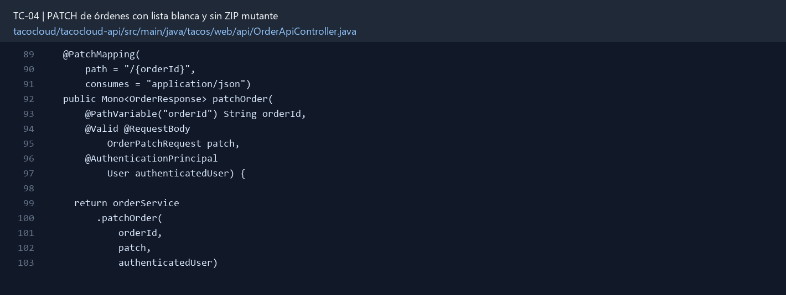

# TC-04 — PATCH de órdenes con lista blanca y sin ZIP mutante

## 1.- Ficha Técnica del Reto

| Campo | Detalle |
|---|---|
| Identificador | TC-04 |
| Nombre del Reto | PATCH de órdenes con lista blanca y sin ZIP mutante |
| Laboratorio | Lab 1 — Cazar operaciones fantasma |
| Nivel, puntos y dependencias | Intermedio; Puntos: 8; Lab: 1; Dependencias: TC-08 recomendado |
| Código Base Involucrado | SRC-08 OrderApiController; SRC-10 TacoOrder. |
| Contrato | `PATCH /api/orders/{orderId}` con `OrderPatchRequest` limitado a datos de entrega. |
| Resultado Funcional | La edición parcial modifica únicamente campos autorizados, corrige el defecto ZIP/estado y devuelve errores claros. |

## 2.- Diagnóstico del Defecto en el Baseline

El resultado esperado es el siguiente: La edición parcial modifica únicamente campos autorizados, corrige el defecto ZIP/estado y devuelve errores claros. La ficha del PDF ubica la revisión en SRC-08 OrderApiController; SRC-10 TacoOrder. La modificación principal consiste en corregir la asignación de `deliveryZip` que actualmente toma `deliveryState`.

**Riesgos que se deben evitar:**

- No recibir `TacoOrder` completo como documento de patch.
- No aplicar reflection ciega ni copiar propiedades masivamente.
- Las reglas de autorización deben comprobar propietario o rol administrativo.

## 3.- Diff (Cambios solicitados y archivos relacionados)

El PDF señala como archivos objetivo: `OrderApiController.java`, DTO de patch, servicio de órdenes y pruebas.

La modificación funcional se comprueba con las siguientes tareas:

- Corregir la asignación de `deliveryZip` que actualmente toma `deliveryState`.
- Crear un DTO específico de patch con campos opcionales permitidos.
- Impedir que PATCH cambie ID, usuario, fecha, total, estado, pago o lista de tacos.
- Devolver 404 si no existe y 422/400 si el resultado viola validaciones.
- Guardar una sola vez al final de la composición.

**Archivo para revisar en el repositorio:** [OrderApiController.java](../tacocloud/tacocloud-api/src/main/java/tacos/web/api/OrderApiController.java#L89).

*Figura 1. Extracto visual de OrderApiController.java, a partir de la línea 89; las líneas extensas se recortan para su lectura. Permite localizar el cambio en el código actual.*

## 4.- Pruebas Automatizadas

Las pruebas mínimas indicadas para el reto son:

- Prueba de regresión del ZIP.
- Prueba de campo prohibido.
- Prueba de ownership y 404.

**Archivos de prueba relacionados en este repositorio:**

- [OrderApiControllerTest.java](../tacocloud/tacocloud-api/src/test/java/tacos/web/api/OrderApiControllerTest.java)

## 5.- Pruebas Manuales en Postman

**Preparación:** use `http://localhost:8080` como URL base. Las rutas del PDF que empiezan por `/api/` se prueban aquí bajo `/api/v1/`. Antes de cada método distinto de GET, solicite `GET /csrf` en la misma sesión, conserve `JSESSIONID` y envíe el `X-CSRF-TOKEN` recién obtenido con Basic Auth (`habuma` / `password`). Siga [la guía de pruebas HTTP](PRUEBAS_HTTP.md).

### Caso 1: Operación principal

**Objetivo:** La edición parcial modifica únicamente campos autorizados, corrige el defecto ZIP/estado y devuelve errores claros.

**Método y URL:** `PATCH /api/orders/{orderId}` con `OrderPatchRequest` limitado a datos de entrega.

**Datos o preparación:** Corregir la asignación de `deliveryZip` que actualmente toma `deliveryState`.

**Comprobación:** Cambiar ZIP no altera estado y viceversa.

### Caso 2: Rechazo o condición límite

**Datos o preparación:** Prueba de campo prohibido.

**Comprobación:** Campos no permitidos son ignorados con rechazo explícito o provocan 400.

## 6.- Defensa Técnica

**Pregunta:** ¿PATCH es “copiar todo lo no nulo” o ejecutar una operación de negocio controlada?

**Respuesta:** PATCH modifica únicamente los campos permitidos. Una lista blanca evita cambiar identificadores, dueño o estados mediante un payload, y el ZIP debe validarse sin alterar campos ajenos.

## 7.- Criterios de Aceptación

- [ ] Cambiar ZIP no altera estado y viceversa.
- [ ] Campos no permitidos son ignorados con rechazo explícito o provocan 400.
- [ ] Orden inexistente genera 404.
- [ ] El usuario no puede modificar una orden ajena.