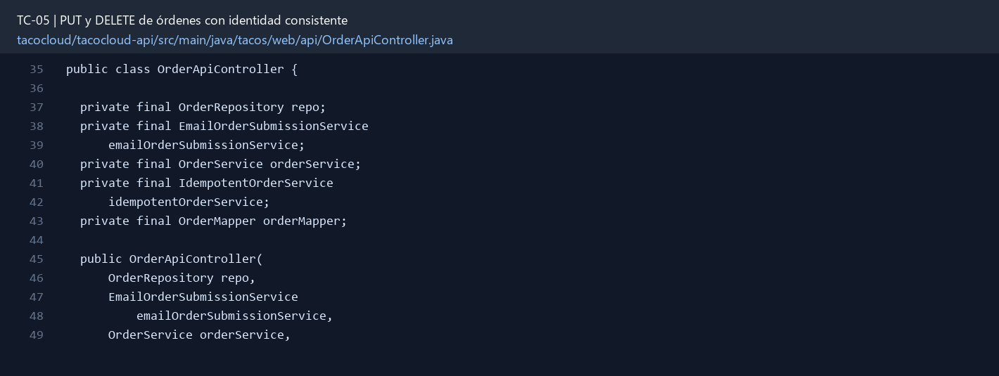

# TC-05 — PUT y DELETE de órdenes con identidad consistente

## 1.- Ficha Técnica del Reto

| Campo | Detalle |
|---|---|
| Identificador | TC-05 |
| Nombre del Reto | PUT y DELETE de órdenes con identidad consistente |
| Laboratorio | Lab 1 — Cazar operaciones fantasma |
| Nivel, puntos y dependencias | Intermedio; Puntos: 8; Lab: 1; Dependencias: TC-08 recomendado |
| Código Base Involucrado | SRC-08 OrderApiController; SRC-11 OrderRepository. |
| Contrato | `PUT /api/orders/{id}` y `DELETE /api/orders/{id}`. |
| Resultado Funcional | Las operaciones de reemplazo y eliminación respetan el ID de la ruta, ownership y estados HTTP. |

## 2.- Diagnóstico del Defecto en el Baseline

El resultado esperado es el siguiente: Las operaciones de reemplazo y eliminación respetan el ID de la ruta, ownership y estados HTTP. La ficha del PDF ubica la revisión en SRC-08 OrderApiController; SRC-11 OrderRepository. La modificación principal consiste en agregar `@PathVariable orderId` al PUT y obligar a que el reemplazo apunte a esa orden.

**Riesgos que se deben evitar:**

- PUT no debe crear silenciosamente una orden nueva salvo que el contrato lo declare.
- DELETE debe componer búsqueda, autorización y efecto.
- No usar el dominio persistente como request sin protección.

## 3.- Diff (Cambios solicitados y archivos relacionados)

El PDF señala como archivos objetivo: `OrderApiController.java`, `OrderService`, DTOs y pruebas.

La modificación funcional se comprueba con las siguientes tareas:

- Agregar `@PathVariable orderId` al PUT y obligar a que el reemplazo apunte a esa orden.
- Evitar que el body cambie ID, usuario, fecha de creación o datos de pago.
- Eliminar con publisher retornado; quitar el `try/catch` síncrono actual.
- Permitir cancelación/eliminación sólo al propietario o ADMIN y sólo en estados permitidos.
- Devolver 200/204, 403, 404 o 409 según el caso.

**Archivo para revisar en el repositorio:** [OrderApiController.java](../tacocloud/tacocloud-api/src/main/java/tacos/web/api/OrderApiController.java#L35).

*Figura 1. Extracto visual de OrderApiController.java, a partir de la línea 35; las líneas extensas se recortan para su lectura. Permite localizar el cambio en el código actual.*

## 4.- Pruebas Automatizadas

Las pruebas mínimas indicadas para el reto son:

- PUT con IDs contradictorios.
- DELETE existente/ausente/ajeno.
- Prueba de estado no cancelable.

**Archivos de prueba relacionados en este repositorio:**

- [OrderApiControllerTest.java](../tacocloud/tacocloud-api/src/test/java/tacos/web/api/OrderApiControllerTest.java)

## 5.- Pruebas Manuales en Postman

**Preparación:** use `http://localhost:8080` como URL base. Las rutas del PDF que empiezan por `/api/` se prueban aquí bajo `/api/v1/`. Antes de cada método distinto de GET, solicite `GET /csrf` en la misma sesión, conserve `JSESSIONID` y envíe el `X-CSRF-TOKEN` recién obtenido con Basic Auth (`habuma` / `password`). Siga [la guía de pruebas HTTP](PRUEBAS_HTTP.md).

### Caso 1: Operación principal

**Objetivo:** Las operaciones de reemplazo y eliminación respetan el ID de la ruta, ownership y estados HTTP.

**Método y URL:** `PUT /api/orders/{id}` y `DELETE /api/orders/{id}`.

**Datos o preparación:** Agregar `@PathVariable orderId` al PUT y obligar a que el reemplazo apunte a esa orden.

**Comprobación:** El ID del body no puede redirigir la escritura.

### Caso 2: Rechazo o condición límite

**Datos o preparación:** DELETE existente/ausente/ajeno.

**Comprobación:** Una orden ajena no se modifica ni elimina.

## 6.- Defensa Técnica

**Pregunta:** ¿Cuándo conviene eliminación física y cuándo una transición a CANCELLED?

**Respuesta:** PUT reemplaza la representación editable con identidad estable, mientras DELETE retira el recurso. Ambos distinguen un ID ausente y evitan que el cuerpo reasigne la identidad.

## 7.- Criterios de Aceptación

- [ ] El ID del body no puede redirigir la escritura.
- [ ] Una orden ajena no se modifica ni elimina.
- [ ] Una orden en preparación no se elimina físicamente; se rechaza o cancela según TC-25.
- [ ] La respuesta 204 implica que el efecto ya terminó.
