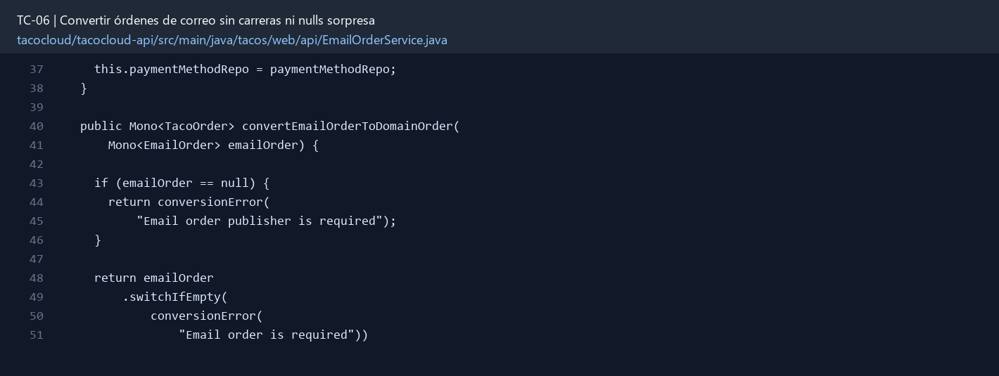

# TC-06 — Convertir órdenes de correo sin carreras ni nulls sorpresa

## 1.- Ficha Técnica del Reto

| Campo | Detalle |
|---|---|
| Identificador | TC-06 |
| Nombre del Reto | Convertir órdenes de correo sin carreras ni nulls sorpresa |
| Laboratorio | Lab 1 — Cazar operaciones fantasma |
| Nivel, puntos y dependencias | Intermedio; Puntos: 8; Lab: 1; Dependencias: Ninguna |
| Código Base Involucrado | SRC-09 EmailOrderService; SRC-15 módulo email; SRC-11 repositorios. |
| Contrato | Entrada interna `Mono<EmailOrder>` → salida `Mono<TacoOrder>` completa o error tipado. |
| Resultado Funcional | Una orden recibida por correo se convierte de manera determinista, esperando usuarios, pago e ingredientes antes de emitir el resultado. |

## 2.- Diagnóstico del Defecto en el Baseline

El resultado esperado es el siguiente: Una orden recibida por correo se convierte de manera determinista, esperando usuarios, pago e ingredientes antes de emitir el resultado. La ficha del PDF ubica la revisión en SRC-09 EmailOrderService; SRC-15 módulo email; SRC-11 repositorios. La modificación principal consiste en eliminar todos los `subscribe()` anidados y los `ArrayList` mutados desde callbacks.

**Riesgos que se deben evitar:**

- Una sola cadena desde `EmailOrder` hasta `TacoOrder`.
- No usar `block()`, sleeps ni estado mutable compartido.
- Preservar el orden de tacos; documentar si el orden de ingredientes importa.

## 3.- Diff (Cambios solicitados y archivos relacionados)

El PDF señala como archivos objetivo: `EmailOrderService.java`, excepciones de dominio y pruebas del servicio.

La modificación funcional se comprueba con las siguientes tareas:

- Eliminar todos los `subscribe()` anidados y los `ArrayList` mutados desde callbacks.
- Resolver usuario y método de pago con errores explícitos cuando falten.
- Convertir cada taco con `Flux.fromIterable(...).flatMap/concatMap` y `collectList`.
- No emitir la orden hasta que todos los ingredientes estén disponibles.
- Rechazar IDs de ingrediente desconocidos indicando cuál falló.

**Archivo para revisar en el repositorio:** [EmailOrderService.java](../tacocloud/tacocloud-api/src/main/java/tacos/web/api/EmailOrderService.java#L37).

*Figura 1. Extracto visual de EmailOrderService.java, a partir de la línea 37; las líneas extensas se recortan para su lectura. Permite localizar el cambio en el código actual.*

## 4.- Pruebas Automatizadas

Las pruebas mínimas indicadas para el reto son:

- StepVerifier para caso feliz con varios tacos.
- Prueba ingrediente inexistente.
- Prueba usuario y método de pago ausentes.

**Archivos de prueba relacionados en este repositorio:**

- [EmailOrderServiceTest.java](../tacocloud/tacocloud-api/src/test/java/tacos/web/api/EmailOrderServiceTest.java)
- [EmailOrderSubmissionServiceTest.java](../tacocloud/tacocloud-api/src/test/java/tacos/service/EmailOrderSubmissionServiceTest.java)

## 5.- Pruebas Manuales en Postman

**Preparación:** use `http://localhost:8080` como URL base. Las rutas del PDF que empiezan por `/api/` se prueban aquí bajo `/api/v1/`. Antes de cada método distinto de GET, solicite `GET /csrf` en la misma sesión, conserve `JSESSIONID` y envíe el `X-CSRF-TOKEN` recién obtenido con Basic Auth (`habuma` / `password`). Siga [la guía de pruebas HTTP](PRUEBAS_HTTP.md).

**Alcance:** el contrato de este reto es interno o de configuración; Postman no lo invoca directamente. Se observa a través del flujo HTTP que lo utiliza y de las pruebas de integración.

### Caso 1: Flujo que utiliza el componente

**Objetivo:** Una orden recibida por correo se convierte de manera determinista, esperando usuarios, pago e ingredientes antes de emitir el resultado.

**Acción:** Eliminar todos los `subscribe()` anidados y los `ArrayList` mutados desde callbacks.

**Comprobación:** La orden emitida contiene todos los tacos e ingredientes solicitados.

### Caso 2: Condición límite

**Acción:** Prueba ingrediente inexistente.

**Comprobación:** Usuario, pago o ingrediente faltante produce error controlado.

## 6.- Defensa Técnica

**Pregunta:** ¿Qué diferencia hay entre “ejecutar en paralelo” y “terminar antes de construir el objeto”?

**Respuesta:** La conversión de correo construye una orden completa antes de persistirla. Acceder a datos opcionales sin validación o suscribirse por separado crea fallos tardíos y carreras.

## 7.- Criterios de Aceptación

- [ ] La orden emitida contiene todos los tacos e ingredientes solicitados.
- [ ] Usuario, pago o ingrediente faltante produce error controlado.
- [ ] No existe `subscribe()` dentro del servicio.
- [ ] La prueba no depende de tiempos arbitrarios.
