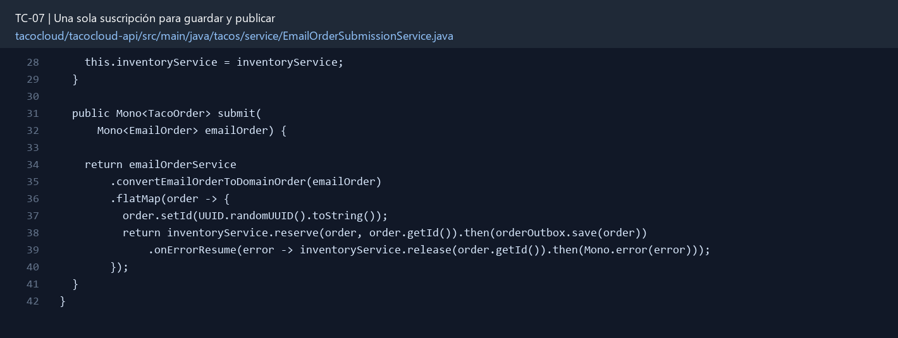

# TC-07 — Una sola suscripción para guardar y publicar

## 1.- Ficha Técnica del Reto

| Campo | Detalle |
|---|---|
| Identificador | TC-07 |
| Nombre del Reto | Una sola suscripción para guardar y publicar |
| Laboratorio | Lab 2 — Contratos y seguridad |
| Nivel, puntos y dependencias | Intermedio; Puntos: 8; Lab: 2; Dependencias: TC-06 |
| Código Base Involucrado | SRC-08 OrderApiController; SRC-09 EmailOrderService; SRC-13 mensajería. |
| Contrato | `POST /api/orders/fromEmail` → 201 sólo cuando la secuencia acordada termina. |
| Resultado Funcional | La orden proveniente de correo se convierte, persiste y publica exactamente una vez. |

## 2.- Diagnóstico del Defecto en el Baseline

El resultado esperado es el siguiente: La orden proveniente de correo se convierte, persiste y publica exactamente una vez. La ficha del PDF ubica la revisión en SRC-08 OrderApiController; SRC-09 EmailOrderService; SRC-13 mensajería. La modificación principal consiste en eliminar la suscripción manual de `postOrderFromEmail`.

**Riesgos que se deben evitar:**

- El controlador no orquesta efectos con variables Mono reutilizadas y `subscribe()`.
- La publicación debe poder participar en la cadena; si la interfaz es `void`, encapsular temporalmente el efecto y marcar deuda.
- No afirmar atomicidad entre Mongo y broker en esta fase.

## 3.- Diff (Cambios solicitados y archivos relacionados)

El PDF señala como archivos objetivo: `OrderApiController.java`, `OrderService`, interfaz de mensajería y pruebas.

La modificación funcional se comprueba con las siguientes tareas:

- Eliminar la suscripción manual de `postOrderFromEmail`.
- Componer conversión, persistencia y publicación en una única secuencia.
- Definir y documentar si se publica antes o después de guardar; justificar la decisión.
- Garantizar una sola invocación visible en la prueba de regresión.
- Preparar el servicio para ser reemplazado por outbox en TC-29.

**Archivo para revisar en el repositorio:** [EmailOrderSubmissionService.java](../tacocloud/tacocloud-api/src/main/java/tacos/service/EmailOrderSubmissionService.java#L28).

*Figura 1. Extracto visual de EmailOrderSubmissionService.java, a partir de la línea 28; las líneas extensas se recortan para su lectura. Permite localizar el cambio en el código actual.*

## 4.- Pruebas Automatizadas

Las pruebas mínimas indicadas para el reto son:

- Contadores/mock para exactamente una invocación.
- Error de conversión y de guardado.
- Prueba con publisher frío para demostrar que no se duplica.

**Archivos de prueba relacionados en este repositorio:**

- [EmailOrderSubmissionServiceTest.java](../tacocloud/tacocloud-api/src/test/java/tacos/service/EmailOrderSubmissionServiceTest.java)

## 5.- Pruebas Manuales en Postman

**Preparación:** use `http://localhost:8080` como URL base. Las rutas del PDF que empiezan por `/api/` se prueban aquí bajo `/api/v1/`. Antes de cada método distinto de GET, solicite `GET /csrf` en la misma sesión, conserve `JSESSIONID` y envíe el `X-CSRF-TOKEN` recién obtenido con Basic Auth (`habuma` / `password`). Siga [la guía de pruebas HTTP](PRUEBAS_HTTP.md).

### Caso 1: Operación principal

**Objetivo:** La orden proveniente de correo se convierte, persiste y publica exactamente una vez.

**Método y URL:** `POST /api/orders/fromEmail` → 201 sólo cuando la secuencia acordada termina.

**Datos o preparación:** Eliminar la suscripción manual de `postOrderFromEmail`.

**Comprobación:** Una petición crea una orden y produce una publicación, no dos.

### Caso 2: Rechazo o condición límite

**Datos o preparación:** Error de conversión y de guardado.

**Comprobación:** Un error de conversión no persiste ni publica.

## 6.- Defensa Técnica

**Pregunta:** ¿“Guardar y luego publicar” es atómico? ¿Qué ventana de fallo sigue abierta?

**Respuesta:** Guardar y publicar forman una sola composición reactiva. Dos suscripciones independientes pueden publicar antes del guardado o repetir un efecto durante un reintento.

## 7.- Criterios de Aceptación

- [ ] Una petición crea una orden y produce una publicación, no dos.
- [ ] Un error de conversión no persiste ni publica.
- [ ] Un error de persistencia no publica si la política es save-then-send.
- [ ] No hay suscripciones manuales.
