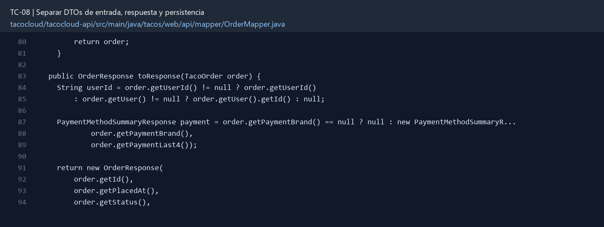

# TC-08 — Separar DTOs de entrada, respuesta y persistencia

## 1.- Ficha Técnica del Reto

| Campo | Detalle |
|---|---|
| Identificador | TC-08 |
| Nombre del Reto | Separar DTOs de entrada, respuesta y persistencia |
| Laboratorio | Lab 2 — Contratos y seguridad |
| Nivel, puntos y dependencias | Intermedio; Puntos: 8; Lab: 2; Dependencias: TC-01 a TC-07 recomendados |
| Código Base Involucrado | SRC-08 controladores; SRC-10 dominio; SRC-11 persistencia. |
| Contrato | Los endpoints existentes consumen requests específicos y retornan responses seguros. |
| Resultado Funcional | La API deja de exponer directamente entidades Mongo, usuarios y datos internos. |

## 2.- Diagnóstico del Defecto en el Baseline

El resultado esperado es el siguiente: La API deja de exponer directamente entidades Mongo, usuarios y datos internos. La ficha del PDF ubica la revisión en SRC-08 controladores; SRC-10 dominio; SRC-11 persistencia. La modificación principal consiste en crear `OrderCreateRequest`, `OrderResponse`, `IngredientRequest/Response` y los mappers correspondientes.

**Riesgos que se deben evitar:**

- Los DTOs no deben usar `@Document` ni extender interfaces de seguridad.
- Los campos server-owned no aparecen en requests.
- El mapper no consulta repositorios; sólo transforma datos ya disponibles.

## 3.- Diff (Cambios solicitados y archivos relacionados)

El PDF señala como archivos objetivo: Nuevo paquete `tacos.api.dto`, mappers, controladores y pruebas de serialización.

La modificación funcional se comprueba con las siguientes tareas:

- Crear `OrderCreateRequest`, `OrderResponse`, `IngredientRequest/Response` y los mappers correspondientes.
- Excluir de la respuesta password, autoridades, PAN, CVV, token completo y objetos User embebidos.
- Usar identificadores y valores de negocio estables, no documentos Mongo como contrato.
- Conservar compatibilidad o versionar explícitamente los cambios.
- Evitar lógica de negocio dentro del mapper.

**Archivo para revisar en el repositorio:** [OrderMapper.java](../tacocloud/tacocloud-api/src/main/java/tacos/web/api/mapper/OrderMapper.java#L80).

*Figura 1. Extracto visual de OrderMapper.java, a partir de la línea 80; las líneas extensas se recortan para su lectura. Permite localizar el cambio en el código actual.*

## 4.- Pruebas Automatizadas

Las pruebas mínimas indicadas para el reto son:

- Prueba de serialización negativa de campos sensibles.
- Prueba de mapeo request→comando y entidad→response.
- Prueba de mass assignment: campos adicionales no alteran el dominio.

## 5.- Pruebas Manuales en Postman

**Preparación:** use `http://localhost:8080` como URL base. Las rutas del PDF que empiezan por `/api/` se prueban aquí bajo `/api/v1/`. Antes de cada método distinto de GET, solicite `GET /csrf` en la misma sesión, conserve `JSESSIONID` y envíe el `X-CSRF-TOKEN` recién obtenido con Basic Auth (`habuma` / `password`). Siga [la guía de pruebas HTTP](PRUEBAS_HTTP.md).

### Caso 1: Operación principal

**Objetivo:** La API deja de exponer directamente entidades Mongo, usuarios y datos internos.

**Método y URL:** GET /api/v1/ingredients/FLTO y GET /api/v1/tacos; compruebe que las respuestas contienen sólo campos públicos.

**Datos o preparación:** Crear `OrderCreateRequest`, `OrderResponse`, `IngredientRequest/Response` y los mappers correspondientes.

**Comprobación:** La serialización de una orden no contiene `password`, `ccNumber`, `ccCVV` ni `authorities`.

### Caso 2: Rechazo o condición límite

**Datos o preparación:** Prueba de mapeo request→comando y entidad→response.

**Comprobación:** El cliente no puede fijar ID, placedAt, status, total ni userId ajeno.

## 6.- Defensa Técnica

**Pregunta:** ¿Una entidad de persistencia es automáticamente un buen contrato público?

**Respuesta:** Un DTO de entrada limita los campos aceptados y uno de salida controla los datos expuestos. La entidad Mongo conserva detalles internos fuera del contrato público.

## 7.- Criterios de Aceptación

- [ ] La serialización de una orden no contiene `password`, `ccNumber`, `ccCVV` ni `authorities`.
- [ ] El cliente no puede fijar ID, placedAt, status, total ni userId ajeno.
- [ ] Las pruebas snapshot/JSON documentan el contrato.
- [ ] Los controladores no reciben `TacoOrder` como body.
