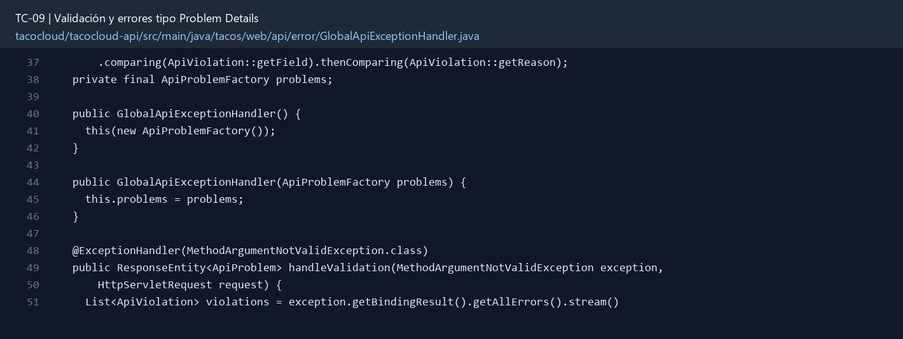

# TC-09 — Validación y errores tipo Problem Details

## 1.- Ficha Técnica del Reto

| Campo | Detalle |
|---|---|
| Identificador | TC-09 |
| Nombre del Reto | Validación y errores tipo Problem Details |
| Laboratorio | Lab 2 — Contratos y seguridad |
| Nivel, puntos y dependencias | Intermedio; Puntos: 8; Lab: 2; Dependencias: TC-08 |
| Código Base Involucrado | SRC-07/SRC-08 controladores; SRC-10 validaciones. |
| Contrato | Errores `application/problem+json` o JSON equivalente documentado. |
| Resultado Funcional | Todos los errores funcionales relevantes tienen forma uniforme, código, estado HTTP y detalle utilizable por la UI. |

## 2.- Diagnóstico del Defecto en el Baseline

El resultado esperado es el siguiente: Todos los errores funcionales relevantes tienen forma uniforme, código, estado HTTP y detalle utilizable por la UI. La ficha del PDF ubica la revisión en SRC-07/SRC-08 controladores; SRC-10 validaciones. La modificación principal consiste en agregar validaciones de requeridos, tamaños, formatos, cantidades y rangos.

**Riesgos que se deben evitar:**

- La base Spring 5.3 no posee la clase moderna `ProblemDetail`; implementar DTO propio sin forzar upgrade accidental.
- Los códigos funcionales son estables y documentados.
- La validación se ejecuta antes de efectos externos.

## 3.- Diff (Cambios solicitados y archivos relacionados)

El PDF señala como archivos objetivo: DTOs, anotaciones Bean Validation, `@RestControllerAdvice`, `ApiProblem` y pruebas.

La modificación funcional se comprueba con las siguientes tareas:

- Agregar validaciones de requeridos, tamaños, formatos, cantidades y rangos.
- Crear un DTO `ApiProblem` compatible conceptualmente con RFC 9457: type, title, status, detail, instance, code y violations.
- Mapear validación, recurso inexistente, conflicto, autorización y regla de negocio.
- No devolver stack traces ni mensajes de drivers.
- Agregar un identificador de correlación cuando TC-31 esté disponible.

**Archivo para revisar en el repositorio:** [GlobalApiExceptionHandler.java](../tacocloud/tacocloud-api/src/main/java/tacos/web/api/error/GlobalApiExceptionHandler.java#L37).

*Figura 1. Extracto visual de GlobalApiExceptionHandler.java, a partir de la línea 37; las líneas extensas se recortan para su lectura. Permite localizar el cambio en el código actual.*

## 4.- Pruebas Automatizadas

Las pruebas mínimas indicadas para el reto son:

- Pruebas de validación con varios campos.
- Prueba de excepción de negocio a 422/409.
- Prueba de que no aparece stacktrace ni nombre de driver.

**Archivos de prueba relacionados en este repositorio:**

- [GlobalApiExceptionHandlerTest.java](../tacocloud/tacocloud-api/src/test/java/tacos/web/api/error/GlobalApiExceptionHandlerTest.java)

## 5.- Pruebas Manuales en Postman

**Preparación:** use `http://localhost:8080` como URL base. Las rutas del PDF que empiezan por `/api/` se prueban aquí bajo `/api/v1/`. Antes de cada método distinto de GET, solicite `GET /csrf` en la misma sesión, conserve `JSESSIONID` y envíe el `X-CSRF-TOKEN` recién obtenido con Basic Auth (`habuma` / `password`). Siga [la guía de pruebas HTTP](PRUEBAS_HTTP.md).

### Caso 1: Operación principal

**Objetivo:** Todos los errores funcionales relevantes tienen forma uniforme, código, estado HTTP y detalle utilizable por la UI.

**Método y URL:** GET /api/v1/ingredients/NO_EXISTE_TC_DOC; inspeccione estado y cuerpo de error.

**Datos o preparación:** Agregar validaciones de requeridos, tamaños, formatos, cantidades y rangos.

**Comprobación:** Todas las respuestas 4xx/5xx controladas comparten estructura.

### Caso 2: Rechazo o condición límite

**Datos o preparación:** Prueba de excepción de negocio a 422/409.

**Comprobación:** Una orden inválida lista campos y razones sin revelar implementación.

## 6.- Defensa Técnica

**Pregunta:** ¿Cuándo usar 400, 409 y 422? Defina la política del curso y úsela consistentemente.

**Respuesta:** Validar en el borde evita persistir entradas inválidas. Un error uniforme permite distinguir causa, estado HTTP y campo afectado sin depender de trazas internas.

## 7.- Criterios de Aceptación

- [ ] Todas las respuestas 4xx/5xx controladas comparten estructura.
- [ ] Una orden inválida lista campos y razones sin revelar implementación.
- [ ] 404, 409 y 422 no se convierten en 500.
- [ ] El `instance` identifica la ruta solicitada.
