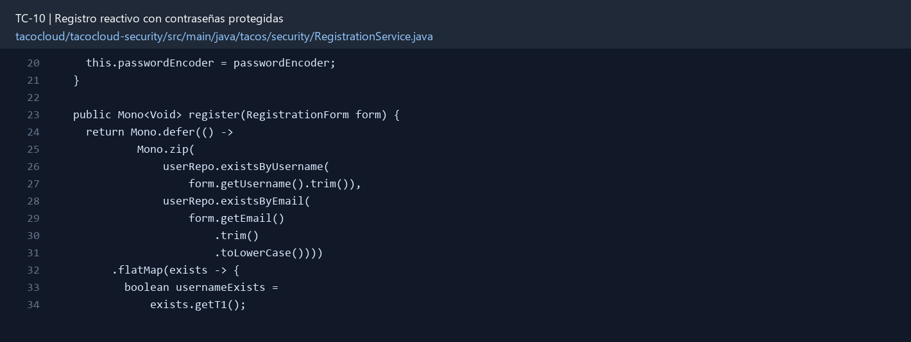

# TC-10 — Registro reactivo con contraseñas protegidas

## 1.- Ficha Técnica del Reto

| Campo | Detalle |
|---|---|
| Identificador | TC-10 |
| Nombre del Reto | Registro reactivo con contraseñas protegidas |
| Laboratorio | Lab 2 — Contratos y seguridad |
| Nivel, puntos y dependencias | Intermedio; Puntos: 8; Lab: 2; Dependencias: TC-09 recomendado |
| Código Base Involucrado | SRC-12 RegistrationController, RegistrationForm y SecurityConfig; SRC-11 UserRepository. |
| Contrato | `POST /register` o `POST /api/users` según la ruta de la clase; 201/redirect después de persistir. |
| Resultado Funcional | El alta de usuario persiste realmente y nunca almacena la contraseña en texto claro. |

## 2.- Diagnóstico del Defecto en el Baseline

El resultado esperado es el siguiente: El alta de usuario persiste realmente y nunca almacena la contraseña en texto claro. La ficha del PDF ubica la revisión en SRC-12 RegistrationController, RegistrationForm y SecurityConfig; SRC-11 UserRepository. La modificación principal consiste en reemplazar `NoOpPasswordEncoder` por `PasswordEncoderFactories.createDelegatingPasswordEncoder()`.

**Riesgos que se deben evitar:**

- El hash debe incluir el identificador de algoritmo (`{bcrypt}` u otro delegado).
- La contraseña se recibe por TLS en despliegue real y se elimina del objeto de respuesta.
- La unicidad no puede depender sólo de “consultar antes”; usar índice para carreras.

## 3.- Diff (Cambios solicitados y archivos relacionados)

El PDF señala como archivos objetivo: Módulo security, DTO/formulario de registro, repositorio y pruebas.

La modificación funcional se comprueba con las siguientes tareas:

- Reemplazar `NoOpPasswordEncoder` por `PasswordEncoderFactories.createDelegatingPasswordEncoder()`.
- Retornar/componer el `userRepo.save(...)` reactivo en el flujo del registro.
- Validar unicidad de username y email antes de guardar y también mediante índice único.
- No devolver password ni hash en respuesta o logs.
- Definir respuesta REST 201 o redirección sólo después de completar el guardado.

**Archivo para revisar en el repositorio:** [RegistrationService.java](../tacocloud/tacocloud-security/src/main/java/tacos/security/RegistrationService.java#L20).

*Figura 1. Extracto visual de RegistrationService.java, a partir de la línea 20; las líneas extensas se recortan para su lectura. Permite localizar el cambio en el código actual.*

## 4.- Pruebas Automatizadas

Las pruebas mínimas indicadas para el reto son:

- Prueba del encoder y hash.
- Prueba de persistencia/reactividad.
- Prueba de carrera o DuplicateKeyException a 409.

**Archivos de prueba relacionados en este repositorio:**

- [RegistrationServiceTest.java](../tacocloud/tacocloud-security/src/test/java/tacos/security/RegistrationServiceTest.java)
- [RegistrationControllerTest.java](../tacocloud/tacocloud-security/src/test/java/tacos/security/RegistrationControllerTest.java)

## 5.- Pruebas Manuales en Postman

**Preparación:** use `http://localhost:8080` como URL base. Las rutas del PDF que empiezan por `/api/` se prueban aquí bajo `/api/v1/`. Antes de cada método distinto de GET, solicite `GET /csrf` en la misma sesión, conserve `JSESSIONID` y envíe el `X-CSRF-TOKEN` recién obtenido con Basic Auth (`habuma` / `password`). Siga [la guía de pruebas HTTP](PRUEBAS_HTTP.md).

### Caso 1: Operación principal

**Objetivo:** El alta de usuario persiste realmente y nunca almacena la contraseña en texto claro.

**Método y URL:** `POST /register` o `POST /api/users` según la ruta de la clase; 201/redirect después de persistir.

**Datos o preparación:** Reemplazar `NoOpPasswordEncoder` por `PasswordEncoderFactories.createDelegatingPasswordEncoder()`.

**Comprobación:** La contraseña almacenada no coincide con el texto ingresado y `matches` retorna true.

### Caso 2: Rechazo o condición límite

**Datos o preparación:** Prueba de persistencia/reactividad.

**Comprobación:** El registro queda disponible para autenticación.

## 6.- Defensa Técnica

**Pregunta:** ¿Por qué “cifrar” contraseñas no es la meta y sí lo es aplicar hash adaptativo con salt?

**Respuesta:** La contraseña se verifica con un hash adaptativo y salt, no con cifrado reversible. El identificador `{bcrypt}` permite al encoder delegado reconocer el algoritmo almacenado.

## 7.- Criterios de Aceptación

- [ ] La contraseña almacenada no coincide con el texto ingresado y `matches` retorna true.
- [ ] El registro queda disponible para autenticación.
- [ ] Duplicado de username/email genera 409.
- [ ] No hay publisher descartado.
