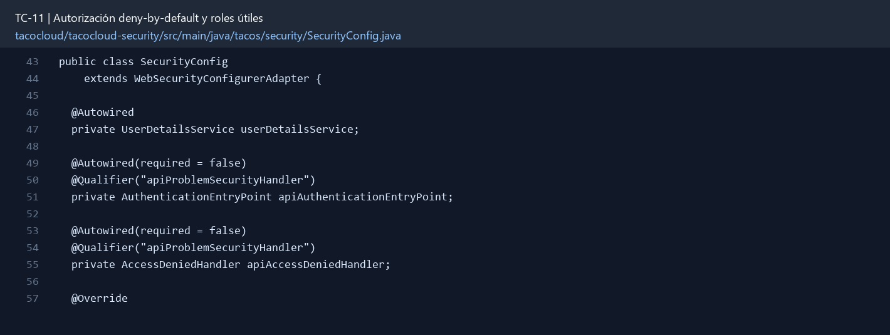

# TC-11 — Autorización deny-by-default y roles útiles

## 1.- Ficha Técnica del Reto

| Campo | Detalle |
|---|---|
| Identificador | TC-11 |
| Nombre del Reto | Autorización deny-by-default y roles útiles |
| Laboratorio | Lab 2 — Contratos y seguridad |
| Nivel, puntos y dependencias | Avanzado; Puntos: 13; Lab: 2; Dependencias: TC-10 |
| Código Base Involucrado | SRC-12 SecurityConfig y User; SRC-05 application.yml. |
| Contrato | Matriz de autorización documentada para `/api/**`, `/data-api/**` y `/actuator/**`. |
| Resultado Funcional | La aplicación deja de terminar en `permitAll` y protege operaciones de lectura/escritura por rol y ownership. |

## 2.- Diagnóstico del Defecto en el Baseline

El resultado esperado es el siguiente: La aplicación deja de terminar en `permitAll` y protege operaciones de lectura/escritura por rol y ownership. La ficha del PDF ubica la revisión en SRC-12 SecurityConfig y User; SRC-05 application.yml. La modificación principal consiste en definir roles USER, ADMIN y KITCHEN con una matriz de acceso explícita.

**Riesgos que se deben evitar:**

- Incluir pruebas negativas 401 y 403, no sólo casos felices.
- No confiar en un userId enviado por el cliente.
- Configurar CORS con orígenes externos, no comodín por comodidad.
- Revisar CSRF según el mecanismo de autenticación elegido.

## 3.- Diff (Cambios solicitados y archivos relacionados)

El PDF señala como archivos objetivo: Configuración Spring Security, autoridades de usuario, controladores/servicios y pruebas.

La modificación funcional se comprueba con las siguientes tareas:

- Definir roles USER, ADMIN y KITCHEN con una matriz de acceso explícita.
- Permitir lectura pública del catálogo; exigir autenticación para pedidos/favoritos/rating; ADMIN para ingredientes; KITCHEN para cola/estado.
- Terminar con una regla de denegación o autenticación, nunca `permitAll` global.
- Aplicar ownership en servicio para órdenes, no sólo por URL.
- Cerrar o proteger `/data-api` y Actuator; health público sólo en el nivel decidido.

**Archivo para revisar en el repositorio:** [SecurityConfig.java](../tacocloud/tacocloud-security/src/main/java/tacos/security/SecurityConfig.java#L43).

*Figura 1. Extracto visual de SecurityConfig.java, a partir de la línea 43; las líneas extensas se recortan para su lectura. Permite localizar el cambio en el código actual.*

## 4.- Pruebas Automatizadas

Las pruebas mínimas indicadas para el reto son:

- Pruebas 401/403/200 por rol.
- Prueba de usuario A intentando acceder a orden de B.
- Prueba de endpoint no listado denegado.
- Prueba de Actuator/Data REST.

## 5.- Pruebas Manuales en Postman

**Preparación:** use `http://localhost:8080` como URL base. Las rutas del PDF que empiezan por `/api/` se prueban aquí bajo `/api/v1/`. Antes de cada método distinto de GET, solicite `GET /csrf` en la misma sesión, conserve `JSESSIONID` y envíe el `X-CSRF-TOKEN` recién obtenido con Basic Auth (`habuma` / `password`). Siga [la guía de pruebas HTTP](PRUEBAS_HTTP.md).

### Caso 1: Operación principal

**Objetivo:** La aplicación deja de terminar en `permitAll` y protege operaciones de lectura/escritura por rol y ownership.

**Método y URL:** GET /api/v1/users/me/favorites sin credenciales y después con Basic Auth; compare 401 y acceso autorizado.

**Datos o preparación:** Definir roles USER, ADMIN y KITCHEN con una matriz de acceso explícita.

**Comprobación:** Anónimo puede consultar catálogo pero no crear orden.

### Caso 2: Rechazo o condición límite

**Datos o preparación:** Prueba de usuario A intentando acceder a orden de B.

**Comprobación:** USER crea y consulta sólo sus órdenes.

## 6.- Defensa Técnica

**Pregunta:** ¿Qué falla más seguido: una regla equivocada o una ruta nueva que nadie agregó a la matriz?

**Respuesta:** La autorización denegada por defecto obliga a declarar cada ruta pública o rol permitido. La interfaz puede ocultar botones, pero la API debe comprobar permisos en el servidor.

## 7.- Criterios de Aceptación

- [ ] Anónimo puede consultar catálogo pero no crear orden.
- [ ] USER crea y consulta sólo sus órdenes.
- [ ] ADMIN administra ingredientes y puede auditar órdenes.
- [ ] KITCHEN reclama/actualiza cocina sin administrar usuarios.
- [ ] Una ruta nueva queda negada por defecto.
