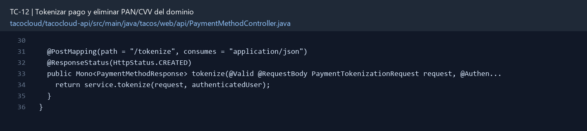

# TC-12 — Tokenizar pago y eliminar PAN/CVV del dominio

## 1.- Ficha Técnica del Reto

| Campo | Detalle |
|---|---|
| Identificador | TC-12 |
| Nombre del Reto | Tokenizar pago y eliminar PAN/CVV del dominio |
| Laboratorio | Lab 2 — Contratos y seguridad |
| Nivel, puntos y dependencias | Avanzado; Puntos: 13; Lab: 2; Dependencias: TC-08, TC-09 |
| Código Base Involucrado | SRC-10 TacoOrder, PaymentMethod y User; SRC-13 mensajería; SRC-08 API. |
| Contrato | `POST /api/payment-methods/tokenize` (simulado) y pedidos con `paymentMethodId` o token seguro. |
| Resultado Funcional | Las órdenes, eventos y respuestas dejan de persistir o transportar datos de tarjeta prohibidos. |

## 2.- Diagnóstico del Defecto en el Baseline

El resultado esperado es el siguiente: Las órdenes, eventos y respuestas dejan de persistir o transportar datos de tarjeta prohibidos. La ficha del PDF ubica la revisión en SRC-10 TacoOrder, PaymentMethod y User; SRC-13 mensajería; SRC-08 API. La modificación principal consiste en remover `ccNumber`, `ccExpiration` y `ccCVV` de `TacoOrder` y del payload de eventos.

**Riesgos que se deben evitar:**

- CVV nunca se guarda, reenvía ni registra después de autorizar/tokenizar.
- El token completo no se expone en respuestas.
- No inventar cifrado casero como sustituto de tokenización.
- Usar datos sintéticos de prueba, nunca tarjetas reales.

## 3.- Diff (Cambios solicitados y archivos relacionados)

El PDF señala como archivos objetivo: Dominio, DTOs, repositorios, mappers, logs y un adaptador `PaymentGateway` simulado.

La modificación funcional se comprueba con las siguientes tareas:

- Remover `ccNumber`, `ccExpiration` y `ccCVV` de `TacoOrder` y del payload de eventos.
- Remodelar `PaymentMethod` para guardar `paymentToken`, `brand`, `last4` y expiración no sensible si la política lo permite.
- Crear puerto `PaymentGateway` y un adaptador fake para clase que tokenice una solicitud sin persistir CVV.
- Asegurar masking en logs y respuestas.
- Agregar migración o script que detecte/elimine campos sensibles existentes en Mongo de laboratorio.

**Archivo para revisar en el repositorio:** [PaymentMethodController.java](../tacocloud/tacocloud-api/src/main/java/tacos/web/api/PaymentMethodController.java#L30).

*Figura 1. Extracto visual de PaymentMethodController.java, a partir de la línea 30; las líneas extensas se recortan para su lectura. Permite localizar el cambio en el código actual.*

## 4.- Pruebas Automatizadas

Las pruebas mínimas indicadas para el reto son:

- Prueba de serialización segura.
- Prueba de persistencia sin PAN/CVV.
- Prueba de redacción de logs/eventos.
- Prueba del fake gateway con datos sintéticos.

**Archivos de prueba relacionados en este repositorio:**

- [PaymentMethodServiceTest.java](../tacocloud/tacocloud-api/src/test/java/tacos/payment/PaymentMethodServiceTest.java)

## 5.- Pruebas Manuales en Postman

**Preparación:** use `http://localhost:8080` como URL base. Las rutas del PDF que empiezan por `/api/` se prueban aquí bajo `/api/v1/`. Antes de cada método distinto de GET, solicite `GET /csrf` en la misma sesión, conserve `JSESSIONID` y envíe el `X-CSRF-TOKEN` recién obtenido con Basic Auth (`habuma` / `password`). Siga [la guía de pruebas HTTP](PRUEBAS_HTTP.md).

### Caso 1: Operación principal

**Objetivo:** Las órdenes, eventos y respuestas dejan de persistir o transportar datos de tarjeta prohibidos.

**Método y URL:** `POST /api/payment-methods/tokenize` (simulado) y pedidos con `paymentMethodId` o token seguro.

**Datos o preparación:** Remover `ccNumber`, `ccExpiration` y `ccCVV` de `TacoOrder` y del payload de eventos.

**Comprobación:** Buscar `ccCVV`, `ccNumber` y logs de orden no revela datos sensibles.

### Caso 2: Rechazo o condición límite

**Datos o preparación:** Prueba de persistencia sin PAN/CVV.

**Comprobación:** Una orden se puede crear con un método tokenizado.

## 6.- Defensa Técnica

**Pregunta:** ¿Cifrar PAN y CVV en Mongo arregla el problema? Explique por qué CVV sigue siendo un no-go.

**Respuesta:** Un token de pago representa el instrumento sin conservar PAN ni CVV en órdenes, respuestas o logs. La tokenización reduce los datos sensibles manejados por la aplicación.

## 7.- Criterios de Aceptación

- [ ] Buscar `ccCVV`, `ccNumber` y logs de orden no revela datos sensibles.
- [ ] Una orden se puede crear con un método tokenizado.
- [ ] La respuesta muestra únicamente brand/last4.
- [ ] El evento de cocina contiene cero información de pago.
- [ ] La prueba de migración elimina campos heredados.
