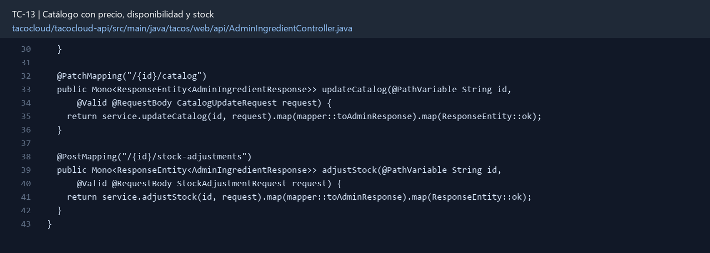

# TC-13 — Catálogo con precio, disponibilidad y stock

## 1.- Ficha Técnica del Reto

| Campo | Detalle |
|---|---|
| Identificador | TC-13 |
| Nombre del Reto | Catálogo con precio, disponibilidad y stock |
| Laboratorio | Lab 3 — Motor de negocio |
| Nivel, puntos y dependencias | Intermedio; Puntos: 8; Lab: 3; Dependencias: TC-08, TC-09 |
| Código Base Involucrado | SRC-10 Ingredient; SRC-11 IngredientRepository; SRC-07 IngredientController. |
| Contrato | `GET /api/ingredients`; `PATCH /api/admin/ingredients/{id}/catalog`; `POST /api/admin/ingredients/{id}/stock-adjustments`. |
| Resultado Funcional | Cada ingrediente deja de ser sólo nombre/tipo y se convierte en un recurso vendible y controlable. |

## 2.- Diagnóstico del Defecto en el Baseline

El resultado esperado es el siguiente: Cada ingrediente deja de ser sólo nombre/tipo y se convierte en un recurso vendible y controlable. La ficha del PDF ubica la revisión en SRC-10 Ingredient; SRC-11 IngredientRepository; SRC-07 IngredientController. La modificación principal consiste en agregar `unitPrice` con BigDecimal, `available`, `stockOnHand`, `reorderLevel` y `@Version`.

**Riesgos que se deben evitar:**

- No usar `double` para dinero.
- No permitir stock negativo por actualización directa.
- Las operaciones de inventario deben prepararse para concurrencia mediante versión u operación atómica.

## 3.- Diff (Cambios solicitados y archivos relacionados)

El PDF señala como archivos objetivo: Entidad Ingredient, DTOs, repositorio, API de administración, datos de desarrollo y pruebas.

La modificación funcional se comprueba con las siguientes tareas:

- Agregar `unitPrice` con BigDecimal, `available`, `stockOnHand`, `reorderLevel` y `@Version`.
- Validar precio no negativo, stock entero no negativo y consistencia entre available/stock.
- Permitir a ADMIN ajustar precio, disponibilidad y stock mediante operaciones explícitas.
- Evitar que usuarios normales vean metadatos operativos innecesarios si el contrato no los requiere.
- Actualizar datos iniciales de desarrollo con valores coherentes.

**Archivo para revisar en el repositorio:** [AdminIngredientController.java](../tacocloud/tacocloud-api/src/main/java/tacos/web/api/AdminIngredientController.java#L30).

*Figura 1. Extracto visual de AdminIngredientController.java, a partir de la línea 30; las líneas extensas se recortan para su lectura. Permite localizar el cambio en el código actual.*

## 4.- Pruebas Automatizadas

Las pruebas mínimas indicadas para el reto son:

- Prueba de BigDecimal y redondeo.
- Prueba stock negativo 422/409.
- Prueba de optimistic locking.
- Prueba de autorización ADMIN.

## 5.- Pruebas Manuales en Postman

**Preparación:** use `http://localhost:8080` como URL base. Las rutas del PDF que empiezan por `/api/` se prueban aquí bajo `/api/v1/`. Antes de cada método distinto de GET, solicite `GET /csrf` en la misma sesión, conserve `JSESSIONID` y envíe el `X-CSRF-TOKEN` recién obtenido con Basic Auth (`habuma` / `password`). Siga [la guía de pruebas HTTP](PRUEBAS_HTTP.md).

### Caso 1: Operación principal

**Objetivo:** Cada ingrediente deja de ser sólo nombre/tipo y se convierte en un recurso vendible y controlable.

**Método y URL:** `GET /api/ingredients`; `PATCH /api/admin/ingredients/{id}/catalog`; `POST /api/admin/ingredients/{id}/stock-adjustments`.

**Datos o preparación:** Agregar `unitPrice` con BigDecimal, `available`, `stockOnHand`, `reorderLevel` y `@Version`.

**Comprobación:** El catálogo muestra precio y disponibilidad de venta.

### Caso 2: Rechazo o condición límite

**Datos o preparación:** Prueba stock negativo 422/409.

**Comprobación:** Un ajuste que produciría stock negativo es rechazado.

## 6.- Defensa Técnica

**Pregunta:** ¿`available=false` y `stockOnHand>0` es una contradicción o una pausa comercial válida?

**Respuesta:** El precio y la disponibilidad pertenecen al catálogo del servidor. Comprobar sólo en la interfaz permite que otro cliente envíe ingredientes agotados o precios alterados.

## 7.- Criterios de Aceptación

- [ ] El catálogo muestra precio y disponibilidad de venta.
- [ ] Un ajuste que produciría stock negativo es rechazado.
- [ ] Conflictos de versión se detectan y traducen a 409.
- [ ] Sólo ADMIN modifica datos operativos.
- [ ] Los seed data arrancan sin errores de validación.
