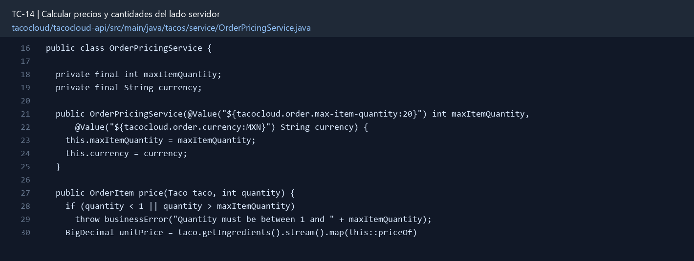

# TC-14 — Calcular precios y cantidades del lado servidor

## 1.- Ficha Técnica del Reto

| Campo | Detalle |
|---|---|
| Identificador | TC-14 |
| Nombre del Reto | Calcular precios y cantidades del lado servidor |
| Laboratorio | Lab 3 — Motor de negocio |
| Nivel, puntos y dependencias | Avanzado; Puntos: 13; Lab: 3; Dependencias: TC-08, TC-13 |
| Código Base Involucrado | SRC-10 TacoOrder/Taco; SRC-16 Angular cart/order; SRC-11 repositorios. |
| Contrato | `POST /api/orders` con `items:[{taco:{name,ingredientIds}, quantity}]`; response con subtotal/total calculados. |
| Resultado Funcional | La orden representa cantidades reales y el total se calcula con precios confiables del catálogo. |

## 2.- Diagnóstico del Defecto en el Baseline

El resultado esperado es el siguiente: La orden representa cantidades reales y el total se calcula con precios confiables del catálogo. La ficha del PDF ubica la revisión en SRC-10 TacoOrder/Taco; SRC-16 Angular cart/order; SRC-11 repositorios. La modificación principal consiste en introducir líneas de pedido con `taco`, `quantity`, `unitPriceAtPurchase` y subtotal.

**Riesgos que se deben evitar:**

- Cantidad entre 1 y un máximo configurable.
- Total, subtotal y precio unitario son server-owned.
- Usar `RoundingMode` explícito y una moneda definida.
- Una modificación posterior del catálogo no altera órdenes históricas.

## 3.- Diff (Cambios solicitados y archivos relacionados)

El PDF señala como archivos objetivo: DTOs de líneas, servicio de pricing, dominio de orden, UI carrito y pruebas.

La modificación funcional se comprueba con las siguientes tareas:

- Introducir líneas de pedido con `taco`, `quantity`, `unitPriceAtPurchase` y subtotal.
- Hacer que la UI envíe cantidades, pero ignorar cualquier total calculado por el cliente.
- Resolver precios actuales de ingredientes y calcular subtotal con BigDecimal.
- Definir redondeo, moneda y política de precio del taco (suma, base fee o reglas).
- Persistir el snapshot de precio usado para auditoría.

**Archivo para revisar en el repositorio:** [OrderPricingService.java](../tacocloud/tacocloud-api/src/main/java/tacos/service/OrderPricingService.java#L16).

*Figura 1. Extracto visual de OrderPricingService.java, a partir de la línea 16; las líneas extensas se recortan para su lectura. Permite localizar el cambio en el código actual.*

## 4.- Pruebas Automatizadas

Las pruebas mínimas indicadas para el reto son:

- Prueba de cálculo con decimales.
- Prueba de manipulación de total.
- Prueba de snapshot histórico.
- Prueba e2e del carrito con cantidad >1.

**Archivos de prueba relacionados en este repositorio:**

- [OrderPricingServiceTest.java](../tacocloud/tacocloud-api/src/test/java/tacos/service/OrderPricingServiceTest.java)

## 5.- Pruebas Manuales en Postman

**Preparación:** use `http://localhost:8080` como URL base. Las rutas del PDF que empiezan por `/api/` se prueban aquí bajo `/api/v1/`. Antes de cada método distinto de GET, solicite `GET /csrf` en la misma sesión, conserve `JSESSIONID` y envíe el `X-CSRF-TOKEN` recién obtenido con Basic Auth (`habuma` / `password`). Siga [la guía de pruebas HTTP](PRUEBAS_HTTP.md).

### Caso 1: Operación principal

**Objetivo:** La orden representa cantidades reales y el total se calcula con precios confiables del catálogo.

**Método y URL:** `POST /api/orders` con `items:[{taco:{name,ingredientIds}, quantity}]`; response con subtotal/total calculados.

**Datos o preparación:** Introducir líneas de pedido con `taco`, `quantity`, `unitPriceAtPurchase` y subtotal.

**Comprobación:** Dos unidades producen el doble del subtotal de la línea.

### Caso 2: Rechazo o condición límite

**Datos o preparación:** Prueba de manipulación de total.

**Comprobación:** Un total falso enviado por cliente se ignora o rechaza.

## 6.- Defensa Técnica

**Pregunta:** ¿El precio pertenece al taco, al ingrediente, a la orden o a los tres en momentos distintos?

**Respuesta:** El servidor calcula cada importe a partir del catálogo y cantidades válidas. Aceptar un total del cliente permitiría cobrar una cifra distinta de la derivada de los artículos.

## 7.- Criterios de Aceptación

- [ ] Dos unidades producen el doble del subtotal de la línea.
- [ ] Un total falso enviado por cliente se ignora o rechaza.
- [ ] Precios históricos permanecen estables.
- [ ] Cantidad 0, negativa o excesiva genera error.
- [ ] La UI conserva y envía cantidades correctamente.
