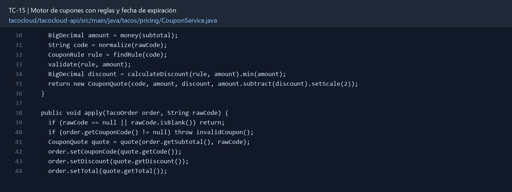

# TC-15 — Motor de cupones con reglas y fecha de expiración

## 1.- Ficha Técnica del Reto

| Campo | Detalle |
|---|---|
| Identificador | TC-15 |
| Nombre del Reto | Motor de cupones con reglas y fecha de expiración |
| Laboratorio | Lab 3 — Motor de negocio |
| Nivel, puntos y dependencias | Intermedio; Puntos: 8; Lab: 3; Dependencias: TC-14 |
| Código Base Involucrado | SRC-16 `DiscountCodeProps`/DiscountController como antecedente; SRC-05 application.yml. |
| Contrato | `POST /api/orders/quote` y/o `POST /api/coupons/validate` con subtotal y código. |
| Resultado Funcional | El antiguo mapa de descuentos se convierte en un motor funcional, validable y divertido para promociones de clase. |

## 2.- Diagnóstico del Defecto en el Baseline

El resultado esperado es el siguiente: El antiguo mapa de descuentos se convierte en un motor funcional, validable y divertido para promociones de clase. La ficha del PDF ubica la revisión en SRC-16 `DiscountCodeProps`/DiscountController como antecedente; SRC-05 application.yml. La modificación principal consiste en reubicar la idea de `DiscountCodeProps` a un módulo incluido en el runtime principal.

**Riesgos que se deben evitar:**

- Inyectar `Clock` para probar fechas; no usar `LocalDate.now()` directo en la lógica.
- El descuento nunca vuelve negativo el total.
- La configuración sensible o comercial puede venir de YAML/variables, no del código.
- No devolver lista completa de cupones a usuarios.

## 3.- Diff (Cambios solicitados y archivos relacionados)

El PDF señala como archivos objetivo: Nuevo paquete activo de pricing, configuración externa, DTOs, endpoint y pruebas con Clock.

La modificación funcional se comprueba con las siguientes tareas:

- Reubicar la idea de `DiscountCodeProps` a un módulo incluido en el runtime principal.
- Soportar descuentos PERCENTAGE y FIXED con vigencia, mínimo de compra y descuento máximo.
- Normalizar códigos sin revelar en la respuesta qué códigos existen.
- Aplicar máximo un cupón por orden y guardar el código aplicado de forma segura.
- Agregar endpoint de validación/quote sin crear la orden.

**Archivo para revisar en el repositorio:** [CouponService.java](../tacocloud/tacocloud-api/src/main/java/tacos/pricing/CouponService.java#L30).

*Figura 1. Extracto visual de CouponService.java, a partir de la línea 30; las líneas extensas se recortan para su lectura. Permite localizar el cambio en el código actual.*

## 4.- Pruebas Automatizadas

Las pruebas mínimas indicadas para el reto son:

- Pruebas parametrizadas por tipo y fechas.
- Prueba de límite de descuento/total cero.
- Prueba de Clock en frontera de día.
- Prueba que endpoint no enumera códigos.

**Archivos de prueba relacionados en este repositorio:**

- [CouponServiceTest.java](../tacocloud/tacocloud-api/src/test/java/tacos/pricing/CouponServiceTest.java)

## 5.- Pruebas Manuales en Postman

**Preparación:** use `http://localhost:8080` como URL base. Las rutas del PDF que empiezan por `/api/` se prueban aquí bajo `/api/v1/`. Antes de cada método distinto de GET, solicite `GET /csrf` en la misma sesión, conserve `JSESSIONID` y envíe el `X-CSRF-TOKEN` recién obtenido con Basic Auth (`habuma` / `password`). Siga [la guía de pruebas HTTP](PRUEBAS_HTTP.md).

### Caso 1: Operación principal

**Objetivo:** El antiguo mapa de descuentos se convierte en un motor funcional, validable y divertido para promociones de clase.

**Método y URL:** `POST /api/orders/quote` y/o `POST /api/coupons/validate` con subtotal y código.

**Datos o preparación:** Reubicar la idea de `DiscountCodeProps` a un módulo incluido en el runtime principal.

**Comprobación:** Cupón válido calcula el valor exacto.

### Caso 2: Rechazo o condición límite

**Datos o preparación:** Prueba de límite de descuento/total cero.

**Comprobación:** Expirado, no iniciado, mínimo no alcanzado y desconocido tienen respuesta definida.

## 6.- Defensa Técnica

**Pregunta:** ¿Conviene responder “código inexistente” distinto de “expirado”, o eso ayuda a enumerar promociones?

**Respuesta:** Un cupón valida vigencia, elegibilidad y límites antes del descuento. El cálculo debe ser reproducible con la misma fecha y pedido, sin generar importes negativos.

## 7.- Criterios de Aceptación

- [ ] Cupón válido calcula el valor exacto.
- [ ] Expirado, no iniciado, mínimo no alcanzado y desconocido tienen respuesta definida.
- [ ] Max discount limita porcentajes altos.
- [ ] Código se trata case-insensitive según política.
- [ ] No se puede aplicar dos veces.
