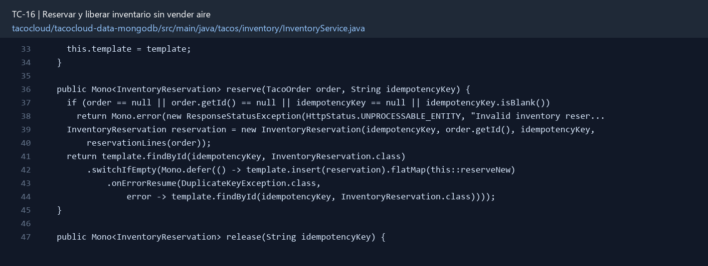

# TC-16 — Reservar y liberar inventario sin vender aire

## 1.- Ficha Técnica del Reto

| Campo | Detalle |
|---|---|
| Identificador | TC-16 |
| Nombre del Reto | Reservar y liberar inventario sin vender aire |
| Laboratorio | Lab 3 — Motor de negocio |
| Nivel, puntos y dependencias | Avanzado; Puntos: 13; Lab: 3; Dependencias: TC-13, TC-14 |
| Código Base Involucrado | SRC-10 dominio; SRC-11 repositorios; SRC-08 API. |
| Contrato | Caso de uso interno `reserve(orderDraft)`; error 409/422 `INSUFFICIENT_STOCK` en creación. |
| Resultado Funcional | Crear una orden reserva existencias; fallar o cancelar libera de forma controlada y concurrente. |

## 2.- Diagnóstico del Defecto en el Baseline

El resultado esperado es el siguiente: Crear una orden reserva existencias; fallar o cancelar libera de forma controlada y concurrente. La ficha del PDF ubica la revisión en SRC-10 dominio; SRC-11 repositorios; SRC-08 API. La modificación principal consiste en reservar stock por ingrediente y cantidad antes de confirmar la orden.

**Riesgos que se deben evitar:**

- No implementar read-modify-write simple bajo concurrencia.
- Procesar ingredientes en orden estable para evitar comportamientos no deterministas.
- Si no se usa transacción Mongo, implementar compensación verificable.
- Las reservas tienen ID, estado y vínculo con orderId/idempotencyKey.

## 3.- Diff (Cambios solicitados y archivos relacionados)

El PDF señala como archivos objetivo: InventoryService con ReactiveMongoTemplate, documento de reserva, flujo de órdenes y pruebas concurrentes.

La modificación funcional se comprueba con las siguientes tareas:

- Reservar stock por ingrediente y cantidad antes de confirmar la orden.
- Usar actualización atómica condicionada a `stockOnHand >= requested`.
- Rechazar con detalle de ingrediente insuficiente sin llevar ningún saldo a negativo.
- Liberar reservas cuando la orden falla antes de aceptación o se cancela en estado permitido.
- Guardar un registro de reserva/idempotencia para no descontar o liberar dos veces.

**Archivo para revisar en el repositorio:** [InventoryService.java](../tacocloud/tacocloud-data-mongodb/src/main/java/tacos/inventory/InventoryService.java#L33).

*Figura 1. Extracto visual de InventoryService.java, a partir de la línea 33; las líneas extensas se recortan para su lectura. Permite localizar el cambio en el código actual.*

## 4.- Pruebas Automatizadas

Las pruebas mínimas indicadas para el reto son:

- Prueba concurrente con stock 1 y dos compradores.
- Prueba de compensación parcial.
- Prueba de doble liberación.
- Prueba de integración con Mongo real.

**Archivos de prueba relacionados en este repositorio:**

- [CatalogInventoryServiceTest.java](../tacocloud/tacocloud-api/src/test/java/tacos/service/CatalogInventoryServiceTest.java)
- [InventoryServiceTest.java](../tacocloud/tacocloud-data-mongodb/src/test/java/tacos/inventory/InventoryServiceTest.java)
- [InventoryServiceMongoTest.java](../tacocloud/tacocloud-data-mongodb/src/test/java/tacos/inventory/InventoryServiceMongoTest.java)

## 5.- Pruebas Manuales en Postman

**Preparación:** use `http://localhost:8080` como URL base. Las rutas del PDF que empiezan por `/api/` se prueban aquí bajo `/api/v1/`. Antes de cada método distinto de GET, solicite `GET /csrf` en la misma sesión, conserve `JSESSIONID` y envíe el `X-CSRF-TOKEN` recién obtenido con Basic Auth (`habuma` / `password`). Siga [la guía de pruebas HTTP](PRUEBAS_HTTP.md).

**Alcance:** el contrato de este reto es interno o de configuración; Postman no lo invoca directamente. Se observa a través del flujo HTTP que lo utiliza y de las pruebas de integración.

### Caso 1: Flujo que utiliza el componente

**Objetivo:** Crear una orden reserva existencias; fallar o cancelar libera de forma controlada y concurrente.

**Acción:** Reservar stock por ingrediente y cantidad antes de confirmar la orden.

**Comprobación:** Dos pedidos concurrentes no venden más que el stock disponible.

### Caso 2: Condición límite

**Acción:** Prueba de compensación parcial.

**Comprobación:** Fallo a mitad libera lo ya reservado.

## 6.- Defensa Técnica

**Pregunta:** ¿Qué garantía ofrece una actualización atómica por ingrediente y cuál falta para una orden con diez ingredientes?

**Respuesta:** La actualización condicionada evita stock negativo por ingrediente. Una orden con varios ingredientes aún necesita transacción o compensación para impedir reservas parciales.

## 7.- Criterios de Aceptación

- [ ] Dos pedidos concurrentes no venden más que el stock disponible.
- [ ] Fallo a mitad libera lo ya reservado.
- [ ] Reintento con misma reserva no descuenta de nuevo.
- [ ] Cancelación libera exactamente una vez.
- [ ] Nunca se observa stock negativo.
