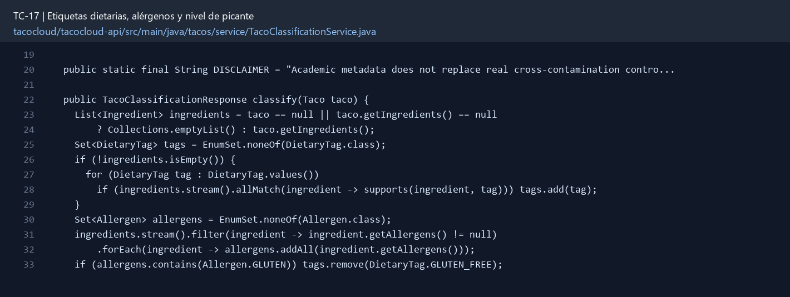

# TC-17 — Etiquetas dietarias, alérgenos y nivel de picante

## 1.- Ficha Técnica del Reto

| Campo | Detalle |
|---|---|
| Identificador | TC-17 |
| Nombre del Reto | Etiquetas dietarias, alérgenos y nivel de picante |
| Laboratorio | Lab 3 — Motor de negocio |
| Nivel, puntos y dependencias | Intermedio; Puntos: 8; Lab: 3; Dependencias: TC-13 |
| Código Base Involucrado | SRC-10 Ingredient/Taco; SRC-07 TacoController; SRC-16 UI. |
| Contrato | `GET /api/tacos/{id}/classification` y campos derivados en response. |
| Resultado Funcional | El catálogo puede responder preguntas reales: vegano, sin gluten, alérgenos y qué tan incendiario viene el taco. |

## 2.- Diagnóstico del Defecto en el Baseline

El resultado esperado es el siguiente: El catálogo puede responder preguntas reales: vegano, sin gluten, alérgenos y qué tan incendiario viene el taco. La ficha del PDF ubica la revisión en SRC-10 Ingredient/Taco; SRC-07 TacoController; SRC-16 UI. La modificación principal consiste en agregar `dietaryTags`, `allergens` y `spiceLevel` a ingrediente o metadata asociada.

**Riesgos que se deben evitar:**

- Usar enums, no strings libres.
- Una etiqueta “sin X” sólo es verdadera si todos los ingredientes cumplen.
- Los alérgenos se unen; nunca se eliminan por mayoría.
- Agregar disclaimer académico: metadata no sustituye control real de contaminación cruzada.

## 3.- Diff (Cambios solicitados y archivos relacionados)

El PDF señala como archivos objetivo: Dominio, DTOs, servicio de clasificación, endpoint/filtros y pruebas.

La modificación funcional se comprueba con las siguientes tareas:

- Agregar `dietaryTags`, `allergens` y `spiceLevel` a ingrediente o metadata asociada.
- Derivar la clasificación del taco a partir de sus ingredientes; no aceptar etiquetas del cliente como verdad.
- Definir reglas claras para VEGAN, VEGETARIAN, GLUTEN_FREE y alérgenos.
- Calcular nivel de picante del taco con una política documentada.
- Exponer la información en catálogo y quote.

**Archivo para revisar en el repositorio:** [TacoClassificationService.java](../tacocloud/tacocloud-api/src/main/java/tacos/service/TacoClassificationService.java#L19).

*Figura 1. Extracto visual de TacoClassificationService.java, a partir de la línea 19; las líneas extensas se recortan para su lectura. Permite localizar el cambio en el código actual.*

## 4.- Pruebas Automatizadas

Las pruebas mínimas indicadas para el reto son:

- Pruebas de composición de tags.
- Prueba de alérgenos múltiples.
- Prueba de spice policy.
- Prueba de mass assignment.

**Archivos de prueba relacionados en este repositorio:**

- [TacoClassificationServiceTest.java](../tacocloud/tacocloud-api/src/test/java/tacos/service/TacoClassificationServiceTest.java)

## 5.- Pruebas Manuales en Postman

**Preparación:** use `http://localhost:8080` como URL base. Las rutas del PDF que empiezan por `/api/` se prueban aquí bajo `/api/v1/`. Antes de cada método distinto de GET, solicite `GET /csrf` en la misma sesión, conserve `JSESSIONID` y envíe el `X-CSRF-TOKEN` recién obtenido con Basic Auth (`habuma` / `password`). Siga [la guía de pruebas HTTP](PRUEBAS_HTTP.md).

### Caso 1: Operación principal

**Objetivo:** El catálogo puede responder preguntas reales: vegano, sin gluten, alérgenos y qué tan incendiario viene el taco.

**Método y URL:** `GET /api/tacos/{id}/classification` y campos derivados en response.

**Datos o preparación:** Agregar `dietaryTags`, `allergens` y `spiceLevel` a ingrediente o metadata asociada.

**Comprobación:** Taco con un ingrediente no vegano no se clasifica como vegano.

### Caso 2: Rechazo o condición límite

**Datos o preparación:** Prueba de alérgenos múltiples.

**Comprobación:** Alérgenos son la unión exacta.

## 6.- Defensa Técnica

**Pregunta:** ¿Qué reglas son datos del ingrediente y cuáles son políticas derivadas del producto?

**Respuesta:** Las etiquetas dietarias se derivan de ingredientes y reglas verificables. Los alérgenos deben acumularse sin ocultar uno presente.

## 7.- Criterios de Aceptación

- [ ] Taco con un ingrediente no vegano no se clasifica como vegano.
- [ ] Alérgenos son la unión exacta.
- [ ] Picante se calcula de forma determinista.
- [ ] El cliente no puede falsificar etiquetas en POST.
- [ ] Filtros de TC-19 usan la clasificación.
