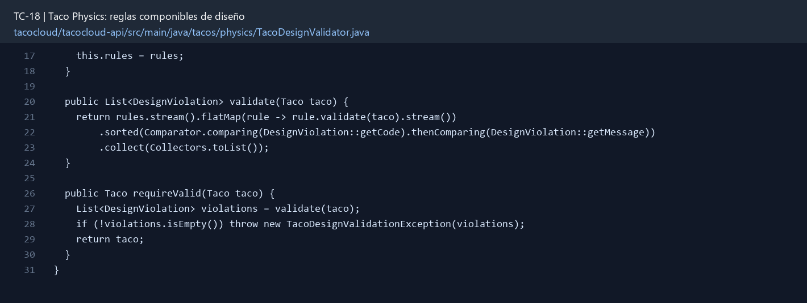

# TC-18 — Taco Physics: reglas componibles de diseño

## 1.- Ficha Técnica del Reto

| Campo | Detalle |
|---|---|
| Identificador | TC-18 |
| Nombre del Reto | Taco Physics: reglas componibles de diseño |
| Laboratorio | Lab 3 — Motor de negocio |
| Nivel, puntos y dependencias | Avanzado; Puntos: 13; Lab: 3; Dependencias: TC-13, TC-17 |
| Código Base Involucrado | SRC-10 Taco/Ingredient; SRC-07 TacoController. |
| Contrato | `POST /api/tacos/validate` y uso interno antes de persistir/ordenar. |
| Resultado Funcional | Un taco inválido deja de colarse al sistema y las reglas pueden crecer sin un `if` kilométrico. |

## 2.- Diagnóstico del Defecto en el Baseline

El resultado esperado es el siguiente: Un taco inválido deja de colarse al sistema y las reglas pueden crecer sin un `if` kilométrico. La ficha del PDF ubica la revisión en SRC-10 Taco/Ingredient; SRC-07 TacoController. La modificación principal consiste en implementar reglas: exactamente una base (wrap o bowl), entre 2 y 12 ingredientes, sin duplicados y sólo ingredientes disponibles.

**Riesgos que se deben evitar:**

- Una clase/regla por responsabilidad o reglas pequeñas agrupadas con criterio.
- No codificar IDs mágicos sin configuración o metadata.
- Los códigos de violación son estables para la UI.
- El orden de reglas no debe cambiar el resultado final salvo que se documente fail-fast.

## 3.- Diff (Cambios solicitados y archivos relacionados)

El PDF señala como archivos objetivo: Paquete de reglas, servicio validador, DTO de diseño, endpoint y pruebas parametrizadas.

La modificación funcional se comprueba con las siguientes tareas:

- Implementar reglas: exactamente una base (wrap o bowl), entre 2 y 12 ingredientes, sin duplicados y sólo ingredientes disponibles.
- Agregar al menos dos reglas divertidas configurables, por ejemplo “Ghost Pepper exige bebida” o “Vegan no admite carnita”.
- Cada regla retorna una violación con código y mensaje; no lanza excepción genérica por sí sola.
- El validador ejecuta una colección inyectada de reglas.
- Rechazar el diseño antes de guardar, cotizar o reservar inventario.

**Archivo para revisar en el repositorio:** [TacoDesignValidator.java](../tacocloud/tacocloud-api/src/main/java/tacos/physics/TacoDesignValidator.java#L17).

*Figura 1. Extracto visual de TacoDesignValidator.java, a partir de la línea 17; las líneas extensas se recortan para su lectura. Permite localizar el cambio en el código actual.*

## 4.- Pruebas Automatizadas

Las pruebas mínimas indicadas para el reto son:

- Pruebas unitarias por regla.
- Prueba de composición con múltiples fallos.
- Prueba de extensibilidad agregando regla fake.
- Prueba que validación ocurre antes de reserva.

**Archivos de prueba relacionados en este repositorio:**

- [TacoDesignValidatorTest.java](../tacocloud/tacocloud-api/src/test/java/tacos/physics/TacoDesignValidatorTest.java)

## 5.- Pruebas Manuales en Postman

**Preparación:** use `http://localhost:8080` como URL base. Las rutas del PDF que empiezan por `/api/` se prueban aquí bajo `/api/v1/`. Antes de cada método distinto de GET, solicite `GET /csrf` en la misma sesión, conserve `JSESSIONID` y envíe el `X-CSRF-TOKEN` recién obtenido con Basic Auth (`habuma` / `password`). Siga [la guía de pruebas HTTP](PRUEBAS_HTTP.md).

### Caso 1: Operación principal

**Objetivo:** Un taco inválido deja de colarse al sistema y las reglas pueden crecer sin un `if` kilométrico.

**Método y URL:** `POST /api/tacos/validate` y uso interno antes de persistir/ordenar.

**Datos o preparación:** Implementar reglas: exactamente una base (wrap o bowl), entre 2 y 12 ingredientes, sin duplicados y sólo ingredientes disponibles.

**Comprobación:** Diseños válidos pasan sin violaciones.

### Caso 2: Rechazo o condición límite

**Datos o preparación:** Prueba de composición con múltiples fallos.

**Comprobación:** Diseños inválidos retornan todas las violaciones acordadas.

## 6.- Defensa Técnica

**Pregunta:** ¿Es Specification, Chain of Responsibility o Strategy? Defienda el nombre por comportamiento, no por sticker arquitectónico.

**Respuesta:** Reglas pequeñas y componibles hacen explícitos los motivos de rechazo. El orden de evaluación debe ser estable para que el mismo diseño produzca el mismo resultado.

## 7.- Criterios de Aceptación

- [ ] Diseños válidos pasan sin violaciones.
- [ ] Diseños inválidos retornan todas las violaciones acordadas.
- [ ] Agregar una regla nueva no requiere modificar el validador central.
- [ ] No se consulta inventario más de lo necesario.
- [ ] Los mismos rules se usan en create y quote.
