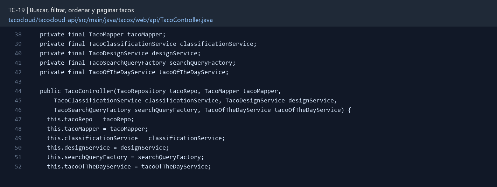
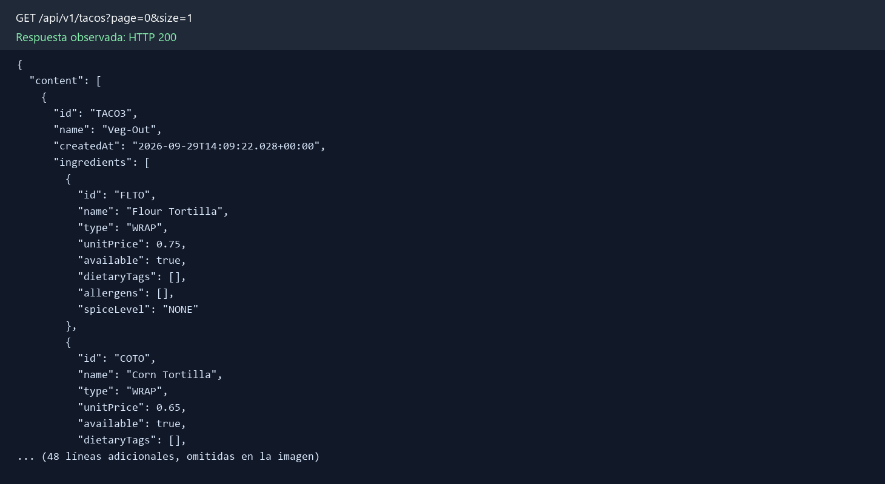

# TC-19 — Buscar, filtrar, ordenar y paginar tacos

## 1.- Ficha Técnica del Reto

| Campo | Detalle |
|---|---|
| Identificador | TC-19 |
| Nombre del Reto | Buscar, filtrar, ordenar y paginar tacos |
| Laboratorio | Lab 4 — Funciones que sí dan ganas de usar |
| Nivel, puntos y dependencias | Intermedio; Puntos: 8; Lab: 4; Dependencias: TC-17 recomendado |
| Código Base Involucrado | SRC-07 TacoController; SRC-11 TacoRepository; SRC-16 RecentTacosService. |
| Contrato | `GET /api/tacos?name=&ingredientId=&diet=&excludeAllergen=&spice=&page=0&size=20&sort=create dAt,desc`. |
| Resultado Funcional | El catálogo deja de ser una lista plana y permite explorar por nombre, ingrediente, dieta, picante y fecha. |

## 2.- Diagnóstico del Defecto en el Baseline

El resultado esperado es el siguiente: El catálogo deja de ser una lista plana y permite explorar por nombre, ingrediente, dieta, picante y fecha. La ficha del PDF ubica la revisión en SRC-07 TacoController; SRC-11 TacoRepository; SRC-16 RecentTacosService. La modificación principal consiste en implementar filtros opcionales por texto, ingredientId, dietary tag, allergen excluded y spice.

**Riesgos que se deben evitar:**

- Tamaño máximo configurable; page y size validados.
- Lista blanca de campos de sort.
- No cargar todos los tacos para filtrar en memoria.
- Agregar índices acordes a los filtros principales.

## 3.- Diff (Cambios solicitados y archivos relacionados)

El PDF señala como archivos objetivo: Repositorio custom con ReactiveMongoTemplate, query DTO, controller/UI y pruebas.

La modificación funcional se comprueba con las siguientes tareas:

- Implementar filtros opcionales por texto, ingredientId, dietary tag, allergen excluded y spice.
- Agregar page/size y sort con límites seguros.
- Corregir la ruta de la UI que actualmente consulta `/tacos?recent` en lugar de `/api/tacos`.
- Retornar metadata mínima de paginación o cursor.
- Escapar/limitar búsqueda de texto para evitar regex costosa.

**Archivo para revisar en el repositorio:** [TacoController.java](../tacocloud/tacocloud-api/src/main/java/tacos/web/api/TacoController.java#L38).

*Figura 1. Extracto visual de TacoController.java, a partir de la línea 38; las líneas extensas se recortan para su lectura. Permite localizar el cambio en el código actual.*

## 4.- Pruebas Automatizadas

Las pruebas mínimas indicadas para el reto son:

- Pruebas de filtros aislados y combinados.
- Prueba de límites de paginación/sort.
- Prueba de estabilidad entre páginas.
- Prueba de integración con índices/datos reales.

**Archivos de prueba relacionados en este repositorio:**

- [DesignTacoControllerWebTest.java](../tacocloud/tacocloud/src/test/java/tacos/DesignTacoControllerWebTest.java)
- [TacoControllerTest.java](../tacocloud/tacocloud-api/src/test/java/tacos/web/api/TacoControllerTest.java)
- [DesignTacoControllerBrowserTest.java](../tacocloud/tacocloud/src/test/java/tacos/DesignTacoControllerBrowserTest.java)
- [DesignTacoControllerBrowserTest.java](../tacocloud/tacocloud-web/src/test/java/tacos/DesignTacoControllerBrowserTest.java)

## 5.- Pruebas Manuales en Postman

**Preparación:** use `http://localhost:8080` como URL base. Las rutas del PDF que empiezan por `/api/` se prueban aquí bajo `/api/v1/`. Antes de cada método distinto de GET, solicite `GET /csrf` en la misma sesión, conserve `JSESSIONID` y envíe el `X-CSRF-TOKEN` recién obtenido con Basic Auth (`habuma` / `password`). Siga [la guía de pruebas HTTP](PRUEBAS_HTTP.md).

### Caso 1: Operación principal

**Objetivo:** El catálogo deja de ser una lista plana y permite explorar por nombre, ingrediente, dieta, picante y fecha.

**Método y URL:** `GET /api/tacos?name=&ingredientId=&diet=&excludeAllergen=&spice=&page=0&size=20&sort=create dAt,desc`.

**Datos o preparación:** Implementar filtros opcionales por texto, ingredientId, dietary tag, allergen excluded y spice.

**Comprobación:** Combinaciones de filtros producen intersección correcta.

### Caso 2: Rechazo o condición límite

**Datos o preparación:** Prueba de límites de paginación/sort.

**Comprobación:** Paginación es estable con orden secundario por ID.

**Evidencia HTTP observada:** `GET /api/v1/tacos?page=0&size=1` respondió `200` en la aplicación local. La imagen reproduce el JSON de esa respuesta; si es largo, se muestran las primeras líneas.

## 6.- Defensa Técnica

**Pregunta:** ¿Offset paging es suficiente o un cursor sería más estable cuando se insertan tacos nuevos?

**Respuesta:** Filtrar y paginar en el repositorio evita cargar el catálogo completo. El orden requiere un desempate estable para que un registro no aparezca en dos páginas.

## 7.- Criterios de Aceptación

- [ ] Combinaciones de filtros producen intersección correcta.
- [ ] Paginación es estable con orden secundario por ID.
- [ ] Size excesivo se limita o rechaza.
- [ ] La UI usa la ruta correcta.
- [ ] Query vacía retorna primera página sin error.
