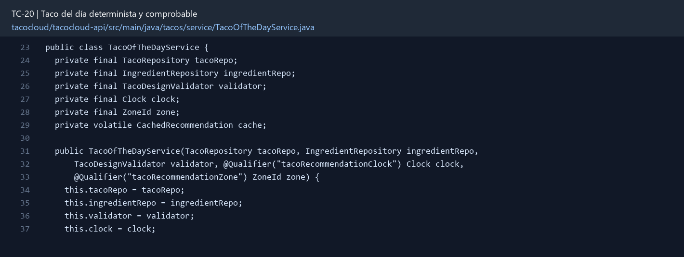
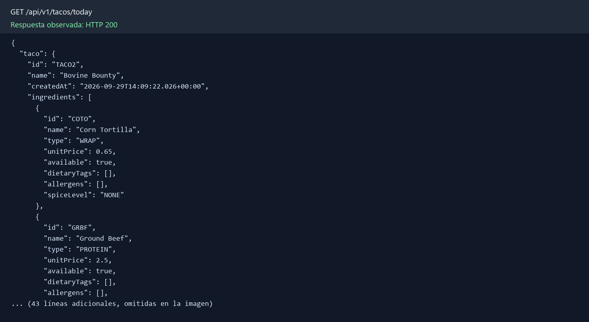

# TC-20 — Taco del día determinista y comprobable

## 1.- Ficha Técnica del Reto

| Campo | Detalle |
|---|---|
| Identificador | TC-20 |
| Nombre del Reto | Taco del día determinista y comprobable |
| Laboratorio | Lab 4 — Funciones que sí dan ganas de usar |
| Nivel, puntos y dependencias | Intermedio; Puntos: 8; Lab: 4; Dependencias: TC-17, TC-19 recomendados |
| Código Base Involucrado | SRC-07 TacoController; SRC-11 TacoRepository. |
| Contrato | `GET /api/tacos/today` → taco, date, reason. |
| Resultado Funcional | Cada fecha tiene una recomendación estable que cambia al día siguiente y puede probarse sin viajar en el tiempo. |

## 2.- Diagnóstico del Defecto en el Baseline

El resultado esperado es el siguiente: Cada fecha tiene una recomendación estable que cambia al día siguiente y puede probarse sin viajar en el tiempo. La ficha del PDF ubica la revisión en SRC-07 TacoController; SRC-11 TacoRepository. La modificación principal consiste en seleccionar entre tacos disponibles y válidos de forma determinista para la fecha y zona configurada.

**Riesgos que se deben evitar:**

- Ordenar candidatos por identificador estable antes de calcular índice.
- Cachear como máximo por fecha y invalidar si el taco deja de estar disponible.
- No persistir un nuevo taco por cada consulta.

## 3.- Diff (Cambios solicitados y archivos relacionados)

El PDF señala como archivos objetivo: Servicio de recomendación, Clock, endpoint, cache opcional y pruebas.

La modificación funcional se comprueba con las siguientes tareas:

- Seleccionar entre tacos disponibles y válidos de forma determinista para la fecha y zona configurada.
- La misma fecha produce el mismo taco en todas las instancias con el mismo catálogo.
- Inyectar `Clock` y zona; no usar random o now directos.
- Definir comportamiento cuando no hay candidatos.
- Incluir una explicación breve (“porque hoy es...”) sin inventar datos sensibles.

**Archivo para revisar en el repositorio:** [TacoOfTheDayService.java](../tacocloud/tacocloud-api/src/main/java/tacos/service/TacoOfTheDayService.java#L23).

*Figura 1. Extracto visual de TacoOfTheDayService.java, a partir de la línea 23; las líneas extensas se recortan para su lectura. Permite localizar el cambio en el código actual.*

## 4.- Pruebas Automatizadas

Las pruebas mínimas indicadas para el reto son:

- Pruebas con FixedClock para dos fechas.
- Prueba de orden estable.
- Prueba sin candidatos.
- Prueba de invalidación de disponibilidad.

**Archivos de prueba relacionados en este repositorio:**

- [TacoOfTheDayServiceTest.java](../tacocloud/tacocloud-api/src/test/java/tacos/service/TacoOfTheDayServiceTest.java)

## 5.- Pruebas Manuales en Postman

**Preparación:** use `http://localhost:8080` como URL base. Las rutas del PDF que empiezan por `/api/` se prueban aquí bajo `/api/v1/`. Antes de cada método distinto de GET, solicite `GET /csrf` en la misma sesión, conserve `JSESSIONID` y envíe el `X-CSRF-TOKEN` recién obtenido con Basic Auth (`habuma` / `password`). Siga [la guía de pruebas HTTP](PRUEBAS_HTTP.md).

### Caso 1: Operación principal

**Objetivo:** Cada fecha tiene una recomendación estable que cambia al día siguiente y puede probarse sin viajar en el tiempo.

**Método y URL:** `GET /api/tacos/today` → taco, date, reason.

**Datos o preparación:** Seleccionar entre tacos disponibles y válidos de forma determinista para la fecha y zona configurada.

**Comprobación:** Dos llamadas el mismo día retornan el mismo ID.

### Caso 2: Rechazo o condición límite

**Datos o preparación:** Prueba de orden estable.

**Comprobación:** Cambiar Clock al día siguiente puede cambiar de forma predecible.

**Evidencia HTTP observada:** `GET /api/v1/tacos/today` respondió `200` en la aplicación local. La imagen reproduce el JSON de esa respuesta; si es largo, se muestran las primeras líneas.

## 6.- Defensa Técnica

**Pregunta:** ¿Determinismo significa que necesariamente debe cambiar todos los días?

**Respuesta:** La recomendación determinista depende de la fecha y un catálogo elegible estable. Así puede repetirse en pruebas y no cambia entre solicitudes del mismo día.

## 7.- Criterios de Aceptación

- [ ] Dos llamadas el mismo día retornan el mismo ID.
- [ ] Cambiar Clock al día siguiente puede cambiar de forma predecible.
- [ ] Dos listas con distinto orden físico producen el mismo resultado.
- [ ] Sin candidatos retorna 404/204 documentado.
- [ ] Taco no disponible no se recomienda.
