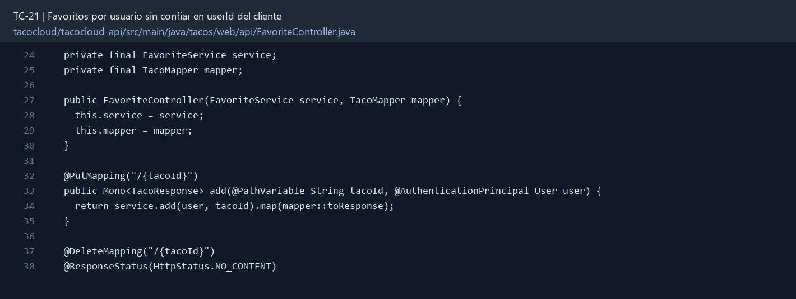

# TC-21 — Favoritos por usuario sin confiar en userId del cliente

## 1.- Ficha Técnica del Reto

| Campo | Detalle |
|---|---|
| Identificador | TC-21 |
| Nombre del Reto | Favoritos por usuario sin confiar en userId del cliente |
| Laboratorio | Lab 4 — Funciones que sí dan ganas de usar |
| Nivel, puntos y dependencias | Intermedio; Puntos: 8; Lab: 4; Dependencias: TC-10, TC-11, TC-19 |
| Código Base Involucrado | SRC-10 User/Taco; SRC-11 repositorios; SRC-16 UI. |
| Contrato | `PUT/DELETE /api/users/me/favorites/{tacoId}`; `GET /api/users/me/favorites`. |
| Resultado Funcional | Los usuarios pueden guardar y consultar tacos favoritos con operaciones idempotentes. |

## 2.- Diagnóstico del Defecto en el Baseline

El resultado esperado es el siguiente: Los usuarios pueden guardar y consultar tacos favoritos con operaciones idempotentes. La ficha del PDF ubica la revisión en SRC-10 User/Taco; SRC-11 repositorios; SRC-16 UI. La modificación principal consiste en crear favoritos asociados al usuario autenticado y taco existente.

**Riesgos que se deben evitar:**

- Obtener identidad desde Principal/SecurityContext.
- Mapear DuplicateKeyException a éxito idempotente o conflicto documentado.
- No guardar el objeto User completo dentro del favorito.

## 3.- Diff (Cambios solicitados y archivos relacionados)

El PDF señala como archivos objetivo: Nuevo documento Favorite, repositorio, servicio, endpoints “me” y UI.

La modificación funcional se comprueba con las siguientes tareas:

- Crear favoritos asociados al usuario autenticado y taco existente.
- PUT agrega de forma idempotente; DELETE elimina; GET lista paginada.
- Usar índice único compuesto userId+tacoId para evitar duplicados concurrentes.
- No aceptar userId en body/path para operaciones del usuario normal.
- Eliminar o marcar favorito huérfano si el taco deja de existir.

**Archivo para revisar en el repositorio:** [FavoriteController.java](../tacocloud/tacocloud-api/src/main/java/tacos/web/api/FavoriteController.java#L24).

*Figura 1. Extracto visual de FavoriteController.java, a partir de la línea 24; las líneas extensas se recortan para su lectura. Permite localizar el cambio en el código actual.*

## 4.- Pruebas Automatizadas

Las pruebas mínimas indicadas para el reto son:

- Prueba de índice único/concurrencia.
- Prueba de aislamiento por usuario.
- Prueba PUT/DELETE idempotente.
- Prueba taco inexistente.

**Archivos de prueba relacionados en este repositorio:**

- [FavoriteServiceTest.java](../tacocloud/tacocloud-api/src/test/java/tacos/service/FavoriteServiceTest.java)
- [FavoriteControllerTest.java](../tacocloud/tacocloud-api/src/test/java/tacos/web/api/FavoriteControllerTest.java)
- [FavoriteRepositoryMongoTest.java](../tacocloud/tacocloud-data-mongodb/src/test/java/tacos/data/FavoriteRepositoryMongoTest.java)

## 5.- Pruebas Manuales en Postman

**Preparación:** use `http://localhost:8080` como URL base. Las rutas del PDF que empiezan por `/api/` se prueban aquí bajo `/api/v1/`. Antes de cada método distinto de GET, solicite `GET /csrf` en la misma sesión, conserve `JSESSIONID` y envíe el `X-CSRF-TOKEN` recién obtenido con Basic Auth (`habuma` / `password`). Siga [la guía de pruebas HTTP](PRUEBAS_HTTP.md).

### Caso 1: Operación principal

**Objetivo:** Los usuarios pueden guardar y consultar tacos favoritos con operaciones idempotentes.

**Método y URL:** `PUT/DELETE /api/users/me/favorites/{tacoId}`; `GET /api/users/me/favorites`.

**Datos o preparación:** Crear favoritos asociados al usuario autenticado y taco existente.

**Comprobación:** Doble PUT produce un solo favorito.

### Caso 2: Rechazo o condición límite

**Datos o preparación:** Prueba de aislamiento por usuario.

**Comprobación:** Usuario A no ve favoritos de B.

## 6.- Defensa Técnica

**Pregunta:** ¿Qué diferencia práctica hay entre POST y PUT para “marcar favorito”?

**Respuesta:** El usuario se obtiene del contexto autenticado. Aceptar `userId` en el cuerpo permitiría añadir o consultar favoritos de otra persona.

## 7.- Criterios de Aceptación

- [ ] Doble PUT produce un solo favorito.
- [ ] Usuario A no ve favoritos de B.
- [ ] Taco inexistente genera 404.
- [ ] Doble DELETE es idempotente según contrato.
- [ ] La UI refleja estado favorito después de recargar.
