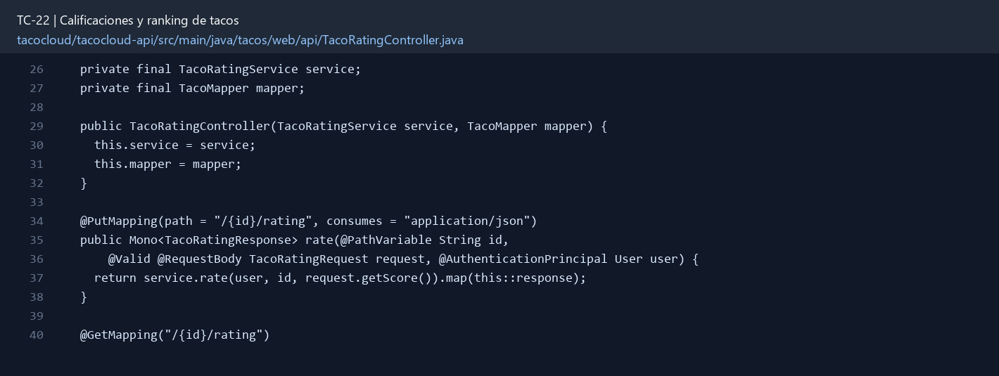
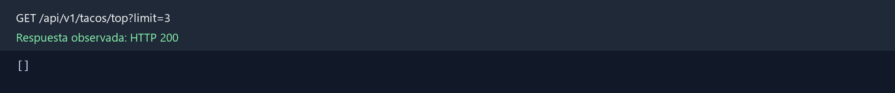

# TC-22 — Calificaciones y ranking de tacos

## 1.- Ficha Técnica del Reto

| Campo | Detalle |
|---|---|
| Identificador | TC-22 |
| Nombre del Reto | Calificaciones y ranking de tacos |
| Laboratorio | Lab 4 — Funciones que sí dan ganas de usar |
| Nivel, puntos y dependencias | Intermedio; Puntos: 8; Lab: 4; Dependencias: TC-11, TC-19 |
| Código Base Involucrado | SRC-10 Taco/User; SRC-11 repositorios; SRC-07 API. |
| Contrato | `PUT /api/tacos/{id}/rating {score}`; `GET /api/tacos/top?limit=10`. |
| Resultado Funcional | Los usuarios califican tacos una vez y el sistema produce un top real, no una lista ordenada a ojo. |

## 2.- Diagnóstico del Defecto en el Baseline

El resultado esperado es el siguiente: Los usuarios califican tacos una vez y el sistema produce un top real, no una lista ordenada a ojo. La ficha del PDF ubica la revisión en SRC-10 Taco/User; SRC-11 repositorios; SRC-07 API. La modificación principal consiste en permitir calificación de 1 a 5 por usuario y taco; PUT actualiza la calificación propia.

**Riesgos que se deben evitar:**

- Promedio con precisión definida.
- No permitir voto anónimo ni userId suministrado por cliente.
- La agregación se realiza en Mongo o servicio eficiente, no N+1 por taco.
- No sobrescribir votos de otros usuarios.

## 3.- Diff (Cambios solicitados y archivos relacionados)

El PDF señala como archivos objetivo: Nuevo documento TacoRating, repositorio, servicio de agregación, endpoints y UI.

La modificación funcional se comprueba con las siguientes tareas:

- Permitir calificación de 1 a 5 por usuario y taco; PUT actualiza la calificación propia.
- Crear índice único userId+tacoId.
- Calcular promedio, cantidad y distribución; definir regla de desempate.
- Exponer top N con mínimo de votos configurable para evitar un “5.0 de una persona”.
- Impedir calificar un taco inexistente o no publicado.

**Archivo para revisar en el repositorio:** [TacoRatingController.java](../tacocloud/tacocloud-api/src/main/java/tacos/web/api/TacoRatingController.java#L26).

*Figura 1. Extracto visual de TacoRatingController.java, a partir de la línea 26; las líneas extensas se recortan para su lectura. Permite localizar el cambio en el código actual.*

## 4.- Pruebas Automatizadas

Las pruebas mínimas indicadas para el reto son:

- Prueba de upsert único.
- Prueba de actualización del voto.
- Prueba de ranking y desempate.
- Prueba de score inválido.

**Archivos de prueba relacionados en este repositorio:**

- [TacoRatingServiceTest.java](../tacocloud/tacocloud-api/src/test/java/tacos/service/TacoRatingServiceTest.java)
- [TacoRatingControllerTest.java](../tacocloud/tacocloud-api/src/test/java/tacos/web/api/TacoRatingControllerTest.java)
- [TacoRatingRepositoryMongoTest.java](../tacocloud/tacocloud-data-mongodb/src/test/java/tacos/data/TacoRatingRepositoryMongoTest.java)

## 5.- Pruebas Manuales en Postman

**Preparación:** use `http://localhost:8080` como URL base. Las rutas del PDF que empiezan por `/api/` se prueban aquí bajo `/api/v1/`. Antes de cada método distinto de GET, solicite `GET /csrf` en la misma sesión, conserve `JSESSIONID` y envíe el `X-CSRF-TOKEN` recién obtenido con Basic Auth (`habuma` / `password`). Siga [la guía de pruebas HTTP](PRUEBAS_HTTP.md).

### Caso 1: Operación principal

**Objetivo:** Los usuarios califican tacos una vez y el sistema produce un top real, no una lista ordenada a ojo.

**Método y URL:** `PUT /api/tacos/{id}/rating {score}`; `GET /api/tacos/top?limit=10`.

**Datos o preparación:** Permitir calificación de 1 a 5 por usuario y taco; PUT actualiza la calificación propia.

**Comprobación:** Repetir PUT cambia el voto, no aumenta el conteo.

### Caso 2: Rechazo o condición límite

**Datos o preparación:** Prueba de actualización del voto.

**Comprobación:** Puntuación fuera de rango produce 400.

**Evidencia HTTP observada:** `GET /api/v1/tacos/top?limit=3` respondió `200` en la aplicación local. La imagen reproduce el JSON de esa respuesta; si es largo, se muestran las primeras líneas.

## 6.- Defensa Técnica

**Pregunta:** ¿Ordenar por promedio puro es justo? Proponga mínimo de votos o una puntuación bayesiana.

**Respuesta:** Una calificación por usuario y taco permite actualizar el voto sin duplicarlo. El ranking debe usar un criterio explícito y considerar el número de votos.

## 7.- Criterios de Aceptación

- [ ] Repetir PUT cambia el voto, no aumenta el conteo.
- [ ] Puntuación fuera de rango produce 400.
- [ ] Ranking respeta mínimo de votos y desempate.
- [ ] Promedio/conteo coinciden con datos.
- [ ] Usuario no puede votar por otro.
