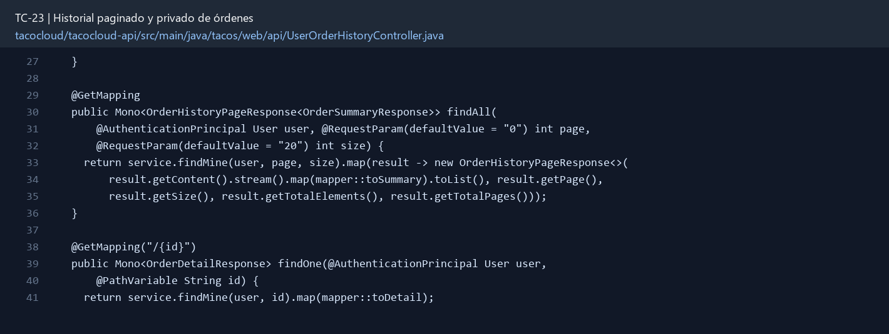

# TC-23 — Historial paginado y privado de órdenes

## 1.- Ficha Técnica del Reto

| Campo | Detalle |
|---|---|
| Identificador | TC-23 |
| Nombre del Reto | Historial paginado y privado de órdenes |
| Laboratorio | Lab 4 — Funciones que sí dan ganas de usar |
| Nivel, puntos y dependencias | Intermedio; Puntos: 8; Lab: 4; Dependencias: TC-11, TC-14 |
| Código Base Involucrado | SRC-08 OrderApiController; SRC-11 OrderRepository; SRC-10 TacoOrder. |
| Contrato | `GET /api/users/me/orders?page=&size=`; `GET /api/users/me/orders/{id}`; admin separado. |
| Resultado Funcional | Cada usuario consulta su historial sin acceder a órdenes ajenas ni exponer información sensible. |

## 2.- Diagnóstico del Defecto en el Baseline

El resultado esperado es el siguiente: Cada usuario consulta su historial sin acceder a órdenes ajenas ni exponer información sensible. La ficha del PDF ubica la revisión en SRC-08 OrderApiController; SRC-11 OrderRepository; SRC-10 TacoOrder. La modificación principal consiste en reemplazar el acceso global `allOrders()` para USER por rutas “me”.

**Riesgos que se deben evitar:**

- UserId proviene de autenticación.
- Evitar filtrar en memoria después de `findAll`.
- Usar respuesta paginada estable.
- No revelar existencia de orden ajena si la política prefiere 404 sobre 403.

## 3.- Diff (Cambios solicitados y archivos relacionados)

El PDF señala como archivos objetivo: Repositorio/query, servicio, DTO de resumen y detalle, controller/UI y pruebas.

La modificación funcional se comprueba con las siguientes tareas:

- Reemplazar el acceso global `allOrders()` para USER por rutas “me”.
- Agregar historial paginado ordenado por placedAt desc e ID.
- Definir resumen de orden y detalle seguro; no incluir pago token completo ni User.
- Permitir ADMIN consultar global con filtros separados.
- Aplicar ownership en detalle y acciones.

**Archivo para revisar en el repositorio:** [UserOrderHistoryController.java](../tacocloud/tacocloud-api/src/main/java/tacos/web/api/UserOrderHistoryController.java#L27).

*Figura 1. Extracto visual de UserOrderHistoryController.java, a partir de la línea 27; las líneas extensas se recortan para su lectura. Permite localizar el cambio en el código actual.*

## 4.- Pruebas Automatizadas

Las pruebas mínimas indicadas para el reto son:

- Prueba de aislamiento A/B.
- Prueba de orden y paginación estable.
- Prueba de JSON seguro.
- Prueba de admin vs user.

## 5.- Pruebas Manuales en Postman

**Preparación:** use `http://localhost:8080` como URL base. Las rutas del PDF que empiezan por `/api/` se prueban aquí bajo `/api/v1/`. Antes de cada método distinto de GET, solicite `GET /csrf` en la misma sesión, conserve `JSESSIONID` y envíe el `X-CSRF-TOKEN` recién obtenido con Basic Auth (`habuma` / `password`). Siga [la guía de pruebas HTTP](PRUEBAS_HTTP.md).

### Caso 1: Operación principal

**Objetivo:** Cada usuario consulta su historial sin acceder a órdenes ajenas ni exponer información sensible.

**Método y URL:** `GET /api/users/me/orders?page=&size=`; `GET /api/users/me/orders/{id}`; admin separado.

**Datos o preparación:** Reemplazar el acceso global `allOrders()` para USER por rutas “me”.

**Comprobación:** Usuario ve sólo sus órdenes.

### Caso 2: Rechazo o condición límite

**Datos o preparación:** Prueba de orden y paginación estable.

**Comprobación:** Orden más reciente aparece primero.

## 6.- Defensa Técnica

**Pregunta:** ¿Responder 403 o 404 al pedir una orden ajena? ¿Qué información revela cada opción?

**Respuesta:** El historial se filtra por el principal autenticado antes de paginar. Consultar primero por ID puede revelar datos de otro usuario.

## 7.- Criterios de Aceptación

- [ ] Usuario ve sólo sus órdenes.
- [ ] Orden más reciente aparece primero.
- [ ] Detalle no contiene datos sensibles.
- [ ] Página fuera de rango se comporta según contrato.
- [ ] ADMIN usa endpoint explícito, no bypass oculto.
