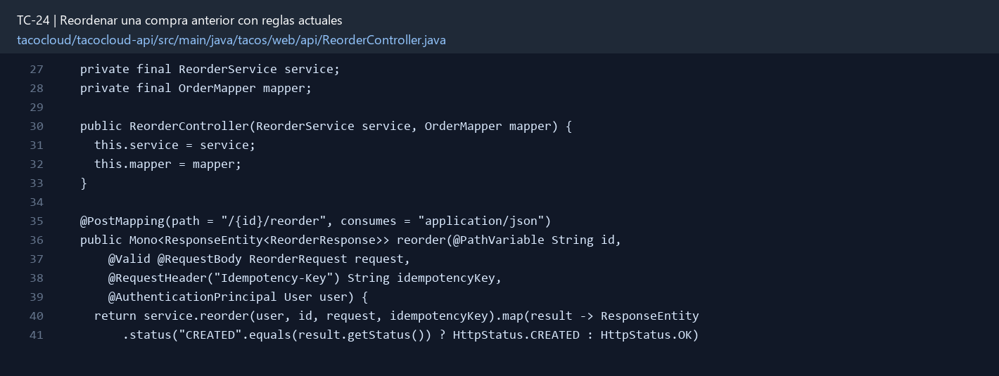

# TC-24 — Reordenar una compra anterior con reglas actuales

## 1.- Ficha Técnica del Reto

| Campo | Detalle |
|---|---|
| Identificador | TC-24 |
| Nombre del Reto | Reordenar una compra anterior con reglas actuales |
| Laboratorio | Lab 4 — Funciones que sí dan ganas de usar |
| Nivel, puntos y dependencias | Avanzado; Puntos: 13; Lab: 4; Dependencias: TC-14, TC-16, TC-23 |
| Código Base Involucrado | SRC-08 OrderApiController; SRC-10 dominio; SRC-11 repositorios. |
| Contrato | `POST /api/orders/{id}/reorder` con paymentMethodId y confirmPriceChange; crea nueva orden o retorna quote/conflict. |
| Resultado Funcional | Un usuario puede repetir una orden histórica, pero el sistema vuelve a validar precio, inventario y disponibilidad. |

## 2.- Diagnóstico del Defecto en el Baseline

El resultado esperado es el siguiente: Un usuario puede repetir una orden histórica, pero el sistema vuelve a validar precio, inventario y disponibilidad. La ficha del PDF ubica la revisión en SRC-08 OrderApiController; SRC-10 dominio; SRC-11 repositorios. La modificación principal consiste en crear una nueva orden desde una orden propia; nunca reutilizar ID, estado, timestamps ni eventos.

**Riesgos que se deben evitar:**

- La orden original permanece inmutable.
- El reordenamiento debe pasar por el mismo caso de uso que una orden nueva.
- No clonar documentos Mongo completos.
- La respuesta distingue quote de confirmación.

## 3.- Diff (Cambios solicitados y archivos relacionados)

El PDF señala como archivos objetivo: OrderApplicationService, pricing, inventory, endpoint, DTO de diferencias y pruebas.

La modificación funcional se comprueba con las siguientes tareas:

- Crear una nueva orden desde una orden propia; nunca reutilizar ID, estado, timestamps ni eventos.
- Revalidar todos los tacos con reglas actuales, disponibilidad, precio, cupón e inventario.
- No copiar CVV/PAN ni token obsoleto; usar método de pago válido seleccionado.
- Informar diferencias de precio o ingredientes y pedir confirmación según política.
- Hacer idempotente la operación con TC-34 o una key específica.

**Archivo para revisar en el repositorio:** [ReorderController.java](../tacocloud/tacocloud-api/src/main/java/tacos/web/api/ReorderController.java#L27).

*Figura 1. Extracto visual de ReorderController.java, a partir de la línea 27; las líneas extensas se recortan para su lectura. Permite localizar el cambio en el código actual.*

## 4.- Pruebas Automatizadas

Las pruebas mínimas indicadas para el reto son:

- Prueba de nueva identidad/estado.
- Prueba de cambio de precio.
- Prueba de stock agotado.
- Prueba de ownership.
- Prueba de reintento/idempotencia.

**Archivos de prueba relacionados en este repositorio:**

- [ReorderServiceTest.java](../tacocloud/tacocloud-api/src/test/java/tacos/service/ReorderServiceTest.java)
- [ReorderControllerTest.java](../tacocloud/tacocloud-api/src/test/java/tacos/web/api/ReorderControllerTest.java)

## 5.- Pruebas Manuales en Postman

**Preparación:** use `http://localhost:8080` como URL base. Las rutas del PDF que empiezan por `/api/` se prueban aquí bajo `/api/v1/`. Antes de cada método distinto de GET, solicite `GET /csrf` en la misma sesión, conserve `JSESSIONID` y envíe el `X-CSRF-TOKEN` recién obtenido con Basic Auth (`habuma` / `password`). Siga [la guía de pruebas HTTP](PRUEBAS_HTTP.md).

### Caso 1: Operación principal

**Objetivo:** Un usuario puede repetir una orden histórica, pero el sistema vuelve a validar precio, inventario y disponibilidad.

**Método y URL:** `POST /api/orders/{id}/reorder` con paymentMethodId y confirmPriceChange; crea nueva orden o retorna quote/conflict.

**Datos o preparación:** Crear una nueva orden desde una orden propia; nunca reutilizar ID, estado, timestamps ni eventos.

**Comprobación:** Nueva orden tiene ID, fecha y estado nuevos.

### Caso 2: Rechazo o condición límite

**Datos o preparación:** Prueba de cambio de precio.

**Comprobación:** Precio actual se aplica y diferencia se comunica.

## 6.- Defensa Técnica

**Pregunta:** ¿Reordenar significa copiar, cotizar o ejecutar nuevamente un comando?

**Respuesta:** Reordenar toma los artículos previos como intención y aplica precios, disponibilidad y reservas vigentes. Copiar el total histórico omite las reglas actuales.

## 7.- Criterios de Aceptación

- [ ] Nueva orden tiene ID, fecha y estado nuevos.
- [ ] Precio actual se aplica y diferencia se comunica.
- [ ] Ingrediente agotado impide o propone sustitución según contrato.
- [ ] Orden ajena no se puede reordenar.
- [ ] La original no cambia.
