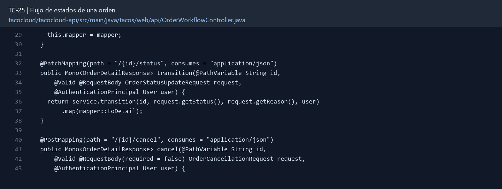

# TC-25 — Flujo de estados de una orden

## 1.- Ficha Técnica del Reto

| Campo | Detalle |
|---|---|
| Identificador | TC-25 |
| Nombre del Reto | Flujo de estados de una orden |
| Laboratorio | Lab 5 — Cocina y mensajería confiable |
| Nivel, puntos y dependencias | Avanzado; Puntos: 13; Lab: 5; Dependencias: TC-08, TC-09, TC-11 |
| Código Base Involucrado | SRC-10 TacoOrder; SRC-14 cocina; SRC-08 OrderApiController. |
| Contrato | `PATCH /api/orders/{id}/status` para roles autorizados; `POST /api/orders/{id}/cancel` para owner. |
| Resultado Funcional | La orden avanza mediante transiciones válidas y auditables en lugar de ser un documento sin ciclo de vida. |

## 2.- Diagnóstico del Defecto en el Baseline

El resultado esperado es el siguiente: La orden avanza mediante transiciones válidas y auditables en lugar de ser un documento sin ciclo de vida. La ficha del PDF ubica la revisión en SRC-10 TacoOrder; SRC-14 cocina; SRC-08 OrderApiController. La modificación principal consiste en agregar estados CREATED, ACCEPTED, PREPARING, READY, OUT_FOR_DELIVERY, DELIVERED y CANCELLED.

**Riesgos que se deben evitar:**

- No permitir asignar status directamente desde OrderCreateRequest.
- La validación de transición vive en un servicio central, no en cada controlador/listener.
- Una transición repetida se trata como idempotente o conflicto documentado.
- La auditoría no contiene datos sensibles.

## 3.- Diff (Cambios solicitados y archivos relacionados)

El PDF señala como archivos objetivo: Dominio, workflow service, historial de estado, endpoints de usuario/cocina y pruebas.

La modificación funcional se comprueba con las siguientes tareas:

- Agregar estados CREATED, ACCEPTED, PREPARING, READY, OUT_FOR_DELIVERY, DELIVERED y CANCELLED.
- Definir matriz de transiciones permitidas y roles capaces de ejecutarlas.
- Registrar quién, cuándo, origen y razón de cada cambio.
- Permitir cancelación del usuario sólo antes del punto definido.
- Usar `@Version` para detectar actualizaciones concurrentes.

**Archivo para revisar en el repositorio:** [OrderWorkflowController.java](../tacocloud/tacocloud-api/src/main/java/tacos/web/api/OrderWorkflowController.java#L29).

*Figura 1. Extracto visual de OrderWorkflowController.java, a partir de la línea 29; las líneas extensas se recortan para su lectura. Permite localizar el cambio en el código actual.*

## 4.- Pruebas Automatizadas

Las pruebas mínimas indicadas para el reto son:

- Pruebas parametrizadas de matriz completa.
- Prueba de rol/ownership por transición.
- Prueba de optimistic locking.
- Prueba de historial/auditoría.

**Archivos de prueba relacionados en este repositorio:**

- [OrderWorkflowServiceTest.java](../tacocloud/tacocloud-api/src/test/java/tacos/service/OrderWorkflowServiceTest.java)
- [OrderWorkflowControllerTest.java](../tacocloud/tacocloud-api/src/test/java/tacos/web/api/OrderWorkflowControllerTest.java)

## 5.- Pruebas Manuales en Postman

**Preparación:** use `http://localhost:8080` como URL base. Las rutas del PDF que empiezan por `/api/` se prueban aquí bajo `/api/v1/`. Antes de cada método distinto de GET, solicite `GET /csrf` en la misma sesión, conserve `JSESSIONID` y envíe el `X-CSRF-TOKEN` recién obtenido con Basic Auth (`habuma` / `password`). Siga [la guía de pruebas HTTP](PRUEBAS_HTTP.md).

### Caso 1: Operación principal

**Objetivo:** La orden avanza mediante transiciones válidas y auditables en lugar de ser un documento sin ciclo de vida.

**Método y URL:** `PATCH /api/orders/{id}/status` para roles autorizados; `POST /api/orders/{id}/cancel` para owner.

**Datos o preparación:** Agregar estados CREATED, ACCEPTED, PREPARING, READY, OUT_FOR_DELIVERY, DELIVERED y CANCELLED.

**Comprobación:** CREATED→ACCEPTED→PREPARING→READY funciona.

### Caso 2: Rechazo o condición límite

**Datos o preparación:** Prueba de rol/ownership por transición.

**Comprobación:** CREATED→DELIVERED falla con 409.

## 6.- Defensa Técnica

**Pregunta:** ¿El estado debe ser sólo un enum o una máquina de estados explícita? ¿Qué complejidad justifica cada opción?

**Respuesta:** Los estados forman transiciones autorizadas. Un cambio atómico condicionado por el estado anterior impide caminos incompatibles ante solicitudes concurrentes.

## 7.- Criterios de Aceptación

- [ ] CREATED→ACCEPTED→PREPARING→READY funciona.
- [ ] CREATED→DELIVERED falla con 409.
- [ ] Usuario no marca DELIVERED y cocina no cambia ownership.
- [ ] Dos actualizaciones con versión obsoleta producen conflicto.
- [ ] Historial ordenado registra todos los cambios.
