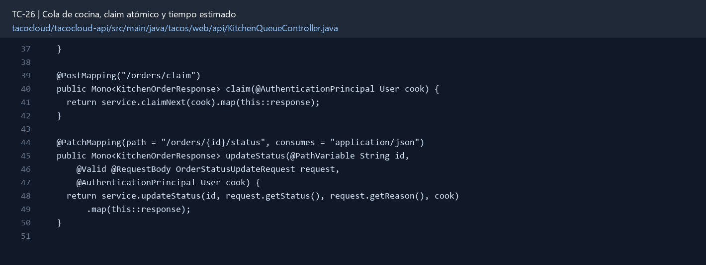

# TC-26 — Cola de cocina, claim atómico y tiempo estimado

## 1.- Ficha Técnica del Reto

| Campo | Detalle |
|---|---|
| Identificador | TC-26 |
| Nombre del Reto | Cola de cocina, claim atómico y tiempo estimado |
| Laboratorio | Lab 5 — Cocina y mensajería confiable |
| Nivel, puntos y dependencias | Avanzado; Puntos: 13; Lab: 5; Dependencias: TC-16, TC-25 |
| Código Base Involucrado | SRC-14 KitchenUI/receivers/listeners; SRC-10 TacoOrder. |
| Contrato | `GET /api/kitchen/queue`; `POST /api/kitchen/orders/claim`; `PATCH .../status`. |
| Resultado Funcional | La cocina puede reclamar la siguiente orden sin que dos estaciones cocinen el mismo taco y mostrar un ETA razonable. |

## 2.- Diagnóstico del Defecto en el Baseline

El resultado esperado es el siguiente: La cocina puede reclamar la siguiente orden sin que dos estaciones cocinen el mismo taco y mostrar un ETA razonable. La ficha del PDF ubica la revisión en SRC-14 KitchenUI/receivers/listeners; SRC-10 TacoOrder. La modificación principal consiste en listar órdenes CREATED ordenadas por placedAt e ID.

**Riesgos que se deben evitar:**

- Claim usa findAndModify condicionado por estado, no read-then-save.
- Station/cook se obtiene de identidad autenticada o configuración del proceso.
- ETA es una estimación, no una promesa transaccional; debe ser determinista para los mismos datos.
- No exponer información de pago/dirección completa a cocina.

## 3.- Diff (Cambios solicitados y archivos relacionados)

El PDF señala como archivos objetivo: API de cocina, ReactiveMongoTemplate, servicio de cola, UI de cocina y pruebas concurrentes.

La modificación funcional se comprueba con las siguientes tareas:

- Listar órdenes CREATED ordenadas por placedAt e ID.
- Implementar `claim next` atómico que cambie CREATED→ACCEPTED y asigne stationId/cookId.
- Calcular `estimatedPrepMinutes` con una fórmula configurable basada en cola, cantidad y complejidad.
- Impedir que una estación reclame dos veces o que dos estaciones reclamen la misma orden.
- Actualizar KitchenUI para mostrar cola, claim y avance de estado.

**Archivo para revisar en el repositorio:** [KitchenQueueController.java](../tacocloud/tacocloud-api/src/main/java/tacos/web/api/KitchenQueueController.java#L37).

*Figura 1. Extracto visual de KitchenQueueController.java, a partir de la línea 37; las líneas extensas se recortan para su lectura. Permite localizar el cambio en el código actual.*

## 4.- Pruebas Automatizadas

Las pruebas mínimas indicadas para el reto son:

- Prueba concurrente de claim único.
- Prueba de orden FIFO estable.
- Prueba de cálculo ETA.
- Prueba de rol y DTO seguro.

**Archivos de prueba relacionados en este repositorio:**

- [KitchenQueueServiceTest.java](../tacocloud/tacocloud-api/src/test/java/tacos/service/KitchenQueueServiceTest.java)
- [KitchenQueueControllerTest.java](../tacocloud/tacocloud-api/src/test/java/tacos/web/api/KitchenQueueControllerTest.java)
- [KitchenQueueRepositoryTest.java](../tacocloud/tacocloud-data-mongodb/src/test/java/tacos/data/KitchenQueueRepositoryTest.java)
- [KitchenQueueRepositoryMongoTest.java](../tacocloud/tacocloud-data-mongodb/src/test/java/tacos/data/KitchenQueueRepositoryMongoTest.java)

## 5.- Pruebas Manuales en Postman

**Preparación:** use `http://localhost:8080` como URL base. Las rutas del PDF que empiezan por `/api/` se prueban aquí bajo `/api/v1/`. Antes de cada método distinto de GET, solicite `GET /csrf` en la misma sesión, conserve `JSESSIONID` y envíe el `X-CSRF-TOKEN` recién obtenido con Basic Auth (`habuma` / `password`). Siga [la guía de pruebas HTTP](PRUEBAS_HTTP.md).

### Caso 1: Operación principal

**Objetivo:** La cocina puede reclamar la siguiente orden sin que dos estaciones cocinen el mismo taco y mostrar un ETA razonable.

**Método y URL:** `GET /api/kitchen/queue`; `POST /api/kitchen/orders/claim`; `PATCH .../status`.

**Datos o preparación:** Listar órdenes CREATED ordenadas por placedAt e ID.

**Comprobación:** Dos claims concurrentes obtienen órdenes distintas o uno recibe queue empty.

### Caso 2: Rechazo o condición límite

**Datos o preparación:** Prueba de orden FIFO estable.

**Comprobación:** La orden reclamada queda ACCEPTED con station/cook.

## 6.- Defensa Técnica

**Pregunta:** ¿FIFO puro es justo cuando una orden enorme bloquea veinte órdenes pequeñas?

**Respuesta:** `findAndModify` condicionado por estado hace indivisible el claim. FIFO puro es verificable, aunque una orden grande puede aumentar la espera; el ETA refleja esa limitación.

## 7.- Criterios de Aceptación

- [ ] Dos claims concurrentes obtienen órdenes distintas o uno recibe queue empty.
- [ ] La orden reclamada queda ACCEPTED con station/cook.
- [ ] ETA aumenta con cola/cantidad según fórmula.
- [ ] Sólo KITCHEN accede.
- [ ] La respuesta no contiene datos sensibles.
