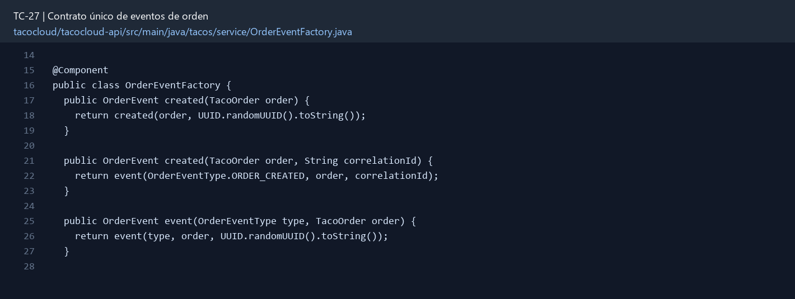

# TC-27 — Contrato único de eventos de orden

## 1.- Ficha Técnica del Reto

| Campo | Detalle |
|---|---|
| Identificador | TC-27 |
| Nombre del Reto | Contrato único de eventos de orden |
| Laboratorio | Lab 5 — Cocina y mensajería confiable |
| Nivel, puntos y dependencias | Avanzado; Puntos: 13; Lab: 5; Dependencias: TC-08, TC-12, TC-25 |
| Código Base Involucrado | SRC-13 módulos messaging; SRC-14 kitchen; SRC-03/SRC-01 POMs. |
| Contrato | Evento JSON versionado para ORDER_CREATED/STATUS_CHANGED/CANCELLED. |
| Resultado Funcional | JMS, RabbitMQ y Kafka comparten un contrato seguro y versionado en lugar de duplicar interfaz y dominio. |

## 2.- Diagnóstico del Defecto en el Baseline

El resultado esperado es el siguiente: JMS, RabbitMQ y Kafka comparten un contrato seguro y versionado en lugar de duplicar interfaz y dominio. La ficha del PDF ubica la revisión en SRC-13 módulos messaging; SRC-14 kitchen; SRC-03/SRC-01 POMs. La modificación principal consiste en crear un módulo común con `OrderEvent`, `OrderEventType`, `OrderEventPayload` y puerto `OrderMessagingService`.

**Riesgos que se deben evitar:**

- El contrato no depende de Spring, Mongo, JMS, Rabbit o Kafka.
- Campos nuevos deben ser opcionales o versionados; no reutilizar significado de campos.
- eventId es UUID o identificador global estable.
- Payload contiene snapshots necesarios para cocina, no referencias imposibles de resolver.

## 3.- Diff (Cambios solicitados y archivos relacionados)

El PDF señala como archivos objetivo: Nuevo módulo Maven `tacocloud-messaging-contract`, POMs, eventos, mappers, productores/consumidores y pruebas.

La modificación funcional se comprueba con las siguientes tareas:

- Crear un módulo común con `OrderEvent`, `OrderEventType`, `OrderEventPayload` y puerto `OrderMessagingService`.
- Incluir eventId, eventType, version, occurredAt, correlationId y payload seguro.
- Eliminar las tres copias de `OrderMessagingService` y los DTOs de dominio duplicados en cocina cuando aplique.
- No serializar entidades Mongo ni datos de pago/usuario completo.
- Agregar pruebas de compatibilidad JSON y una política de evolución.

**Archivo para revisar en el repositorio:** [OrderEventFactory.java](../tacocloud/tacocloud-api/src/main/java/tacos/service/OrderEventFactory.java#L14).

*Figura 1. Extracto visual de OrderEventFactory.java, a partir de la línea 14; las líneas extensas se recortan para su lectura. Permite localizar el cambio en el código actual.*

## 4.- Pruebas Automatizadas

Las pruebas mínimas indicadas para el reto son:

- Prueba de serialización/deserialización v1.
- Prueba negativa de campos sensibles.
- Prueba de compatibilidad con campo adicional.
- Prueba de unicidad/formatos de IDs.

**Archivos de prueba relacionados en este repositorio:**

- [OrderEventFactoryTest.java](../tacocloud/tacocloud-api/src/test/java/tacos/service/OrderEventFactoryTest.java)

## 5.- Pruebas Manuales en Postman

**Preparación:** use `http://localhost:8080` como URL base. Las rutas del PDF que empiezan por `/api/` se prueban aquí bajo `/api/v1/`. Antes de cada método distinto de GET, solicite `GET /csrf` en la misma sesión, conserve `JSESSIONID` y envíe el `X-CSRF-TOKEN` recién obtenido con Basic Auth (`habuma` / `password`). Siga [la guía de pruebas HTTP](PRUEBAS_HTTP.md).

**Alcance:** el contrato de este reto es interno o de configuración; Postman no lo invoca directamente. Se observa a través del flujo HTTP que lo utiliza y de las pruebas de integración.

### Caso 1: Flujo que utiliza el componente

**Objetivo:** JMS, RabbitMQ y Kafka comparten un contrato seguro y versionado en lugar de duplicar interfaz y dominio.

**Acción:** Crear un módulo común con `OrderEvent`, `OrderEventType`, `OrderEventPayload` y puerto `OrderMessagingService`.

**Comprobación:** Todos los adaptadores compilan contra la misma interfaz/clase.

### Caso 2: Condición límite

**Acción:** Prueba negativa de campos sensibles.

**Comprobación:** El JSON no contiene PAN, CVV, password ni User.

## 6.- Defensa Técnica

**Pregunta:** ¿Compartir una entidad de dominio por JAR es lo mismo que definir un contrato de integración?

**Respuesta:** Un contrato de evento versionado separa a productor y consumidores. El payload requiere identificador, tipo y datos mínimos sin pago o dirección innecesaria.

## 7.- Criterios de Aceptación

- [ ] Todos los adaptadores compilan contra la misma interfaz/clase.
- [ ] El JSON no contiene PAN, CVV, password ni User.
- [ ] eventId/correlationId/version siempre están presentes.
- [ ] Consumidor de v1 ignora campos adicionales compatibles.
- [ ] Prueba snapshot detecta cambios incompatibles.
