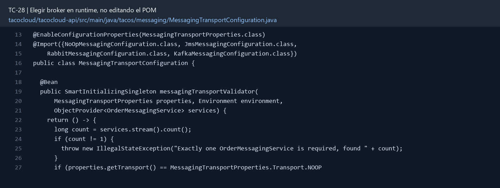

# TC-28 — Elegir broker en runtime, no editando el POM

## 1.- Ficha Técnica del Reto

| Campo | Detalle |
|---|---|
| Identificador | TC-28 |
| Nombre del Reto | Elegir broker en runtime, no editando el POM |
| Laboratorio | Lab 5 — Cocina y mensajería confiable |
| Nivel, puntos y dependencias | Avanzado; Puntos: 13; Lab: 5; Dependencias: TC-27 |
| Código Base Involucrado | SRC-13 messaging POMs/configs; SRC-06 API POM; SRC-05 properties. |
| Contrato | Propiedad `tacocloud.messaging.transport=noop|jms|rabbit|kafka` y propiedades específicas por adaptador. |
| Resultado Funcional | El transporte se selecciona por propiedad o perfil y los adaptadores comparten el mismo puerto. |

## 2.- Diagnóstico del Defecto en el Baseline

El resultado esperado es el siguiente: El transporte se selecciona por propiedad o perfil y los adaptadores comparten el mismo puerto. La ficha del PDF ubica la revisión en SRC-13 messaging POMs/configs; SRC-06 API POM; SRC-05 properties. La modificación principal consiste en incluir adaptadores noop, JMS, Rabbit y Kafka como dependencias opcionales/gestionadas del runtime de laboratorio.

**Riesgos que se deben evitar:**

- No requerir editar comentarios del POM para cambiar de transporte.
- No crear un switch gigante en el servicio de aplicación.
- No almacenar credenciales en Git.
- No conectar a brokers durante tests de contexto salvo perfil de integración.

## 3.- Diff (Cambios solicitados y archivos relacionados)

El PDF señala como archivos objetivo: POMs, configuraciones renombradas, adaptadores condicionales, propiedades y tests de contexto.

La modificación funcional se comprueba con las siguientes tareas:

- Incluir adaptadores noop, JMS, Rabbit y Kafka como dependencias opcionales/gestionadas del runtime de laboratorio.
- Renombrar clases `MessagingConfig` que hoy colisionan por FQCN.
- Activar exactamente un `OrderMessagingService` con `tacocloud.messaging.transport`.
- Parametrizar destinos, hosts y credenciales; eliminar nombres hardcodeados donde existan.
- Fall ar al arranque si el valor es desconocido o hay más de un adaptador activo.

**Archivo para revisar en el repositorio:** [MessagingTransportConfiguration.java](../tacocloud/tacocloud-api/src/main/java/tacos/messaging/MessagingTransportConfiguration.java#L13).

*Figura 1. Extracto visual de MessagingTransportConfiguration.java, a partir de la línea 13; las líneas extensas se recortan para su lectura. Permite localizar el cambio en el código actual.*

## 4.- Pruebas Automatizadas

Las pruebas mínimas indicadas para el reto son:

- ApplicationContextRunner por cada transporte.
- Prueba de bean único.
- Prueba de propiedad inválida.
- Prueba de no secretos/defaults inseguros.

**Archivos de prueba relacionados en este repositorio:**

- [MessagingTransportConfigurationTest.java](../tacocloud/tacocloud-api/src/test/java/tacos/messaging/MessagingTransportConfigurationTest.java)

## 5.- Pruebas Manuales en Postman

**Preparación:** use `http://localhost:8080` como URL base. Las rutas del PDF que empiezan por `/api/` se prueban aquí bajo `/api/v1/`. Antes de cada método distinto de GET, solicite `GET /csrf` en la misma sesión, conserve `JSESSIONID` y envíe el `X-CSRF-TOKEN` recién obtenido con Basic Auth (`habuma` / `password`). Siga [la guía de pruebas HTTP](PRUEBAS_HTTP.md).

**Alcance:** el contrato de este reto es interno o de configuración; Postman no lo invoca directamente. Se observa a través del flujo HTTP que lo utiliza y de las pruebas de integración.

### Caso 1: Flujo que utiliza el componente

**Objetivo:** El transporte se selecciona por propiedad o perfil y los adaptadores comparten el mismo puerto.

**Acción:** Incluir adaptadores noop, JMS, Rabbit y Kafka como dependencias opcionales/gestionadas del runtime de laboratorio.

**Comprobación:** Cada valor válido crea exactamente un bean del puerto.

### Caso 2: Condición límite

**Acción:** Prueba de bean único.

**Comprobación:** Valor inválido impide arrancar con mensaje claro.

## 6.- Defensa Técnica

**Pregunta:** ¿Es mejor perfil o propiedad? ¿Qué pasa cuando se activan dos perfiles por accidente?

**Respuesta:** Seleccionar el broker por configuración mantiene un artefacto desplegable. Las implementaciones deben ser excluyentes para evitar envíos duplicados.

## 7.- Criterios de Aceptación

- [ ] Cada valor válido crea exactamente un bean del puerto.
- [ ] Valor inválido impide arrancar con mensaje claro.
- [ ] Noop es default sólo para dev/test, nunca silencioso en prod.
- [ ] Destino se configura externamente.
- [ ] Cambiar propiedad no requiere recompilar.
