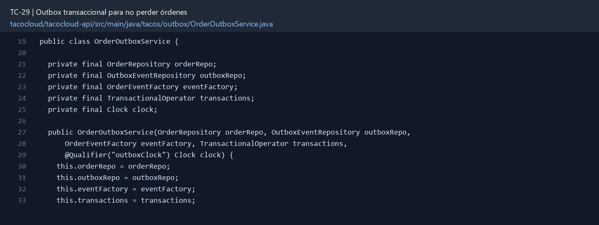

# TC-29 — Outbox transaccional para no perder órdenes

## 1.- Ficha Técnica del Reto

| Campo | Detalle |
|---|---|
| Identificador | TC-29 |
| Nombre del Reto | Outbox transaccional para no perder órdenes |
| Laboratorio | Lab 5 — Cocina y mensajería confiable |
| Nivel, puntos y dependencias | Avanzado; Puntos: 13; Lab: 5; Dependencias: TC-25, TC-27, TC-28 |
| Código Base Involucrado | SRC-08 OrderApiController; SRC-11 repositorios; SRC-13 mensajería. |
| Contrato | Caso de uso interno placeOrder; endpoint responde tras commit local. Publisher asíncrono opera outbox. |
| Resultado Funcional | Guardar una orden y registrar el evento ocurre como una sola decisión local; un publicador confiable entrega después. |

## 2.- Diagnóstico del Defecto en el Baseline

El resultado esperado es el siguiente: Guardar una orden y registrar el evento ocurre como una sola decisión local; un publicador confiable entrega después. La ficha del PDF ubica la revisión en SRC-08 OrderApiController; SRC-11 repositorios; SRC-13 mensajería. La modificación principal consiste en guardar orden y registro outbox en la misma transacción Mongo.

**Riesgos que se deben evitar:**

- La entrega será al menos una vez; TC-30 debe deduplicar.
- El claim de eventos debe impedir que dos instancias procesen el mismo registro simultáneamente o hacerlo seguro.
- El payload outbox es el contrato seguro de TC-27.
- Reintentos tienen backoff y máximo configurable; eventos agotados quedan visibles.

## 3.- Diff (Cambios solicitados y archivos relacionados)

El PDF señala como archivos objetivo: Documento OutboxEvent, repositorio, transacción Mongo, publisher programado, propiedades y pruebas.

La modificación funcional se comprueba con las siguientes tareas:

- Guardar orden y registro outbox en la misma transacción Mongo.
- Requerir/documentar Mongo replica set y registrar `ReactiveMongoTransactionManager`.
- El outbox guarda eventId, payload/version, estado NEW/PUBLISHING/PUBLISHED/FAILED, intentos y timestamps.
- Un publisher reclama lotes, envía y marca resultado; tolera reinicio y reintentos.
- No publicar directamente desde el controlador/caso de uso de creación.

**Archivo para revisar en el repositorio:** [OrderOutboxService.java](../tacocloud/tacocloud-api/src/main/java/tacos/outbox/OrderOutboxService.java#L19).

*Figura 1. Extracto visual de OrderOutboxService.java, a partir de la línea 19; las líneas extensas se recortan para su lectura. Permite localizar el cambio en el código actual.*

## 4.- Pruebas Automatizadas

Las pruebas mínimas indicadas para el reto son:

- Testcontainers Mongo configurado como replica set.
- Prueba de rollback orden+outbox.
- Prueba broker falla y luego recupera.
- Prueba de dos publishers/claim.
- Prueba de reanudación tras reinicio.

**Archivos de prueba relacionados en este repositorio:**

- [OrderOutboxMongoTest.java](../tacocloud/tacocloud-api/src/test/java/tacos/outbox/OrderOutboxMongoTest.java)
- [OrderOutboxCorrelationTest.java](../tacocloud/tacocloud-api/src/test/java/tacos/outbox/OrderOutboxCorrelationTest.java)

## 5.- Pruebas Manuales en Postman

**Preparación:** use `http://localhost:8080` como URL base. Las rutas del PDF que empiezan por `/api/` se prueban aquí bajo `/api/v1/`. Antes de cada método distinto de GET, solicite `GET /csrf` en la misma sesión, conserve `JSESSIONID` y envíe el `X-CSRF-TOKEN` recién obtenido con Basic Auth (`habuma` / `password`). Siga [la guía de pruebas HTTP](PRUEBAS_HTTP.md).

**Alcance:** el contrato de este reto es interno o de configuración; Postman no lo invoca directamente. Se observa a través del flujo HTTP que lo utiliza y de las pruebas de integración.

### Caso 1: Flujo que utiliza el componente

**Objetivo:** Guardar una orden y registrar el evento ocurre como una sola decisión local; un publicador confiable entrega después.

**Acción:** Guardar orden y registro outbox en la misma transacción Mongo.

**Comprobación:** Fallo antes del commit deja cero orden y cero outbox.

### Caso 2: Condición límite

**Acción:** Prueba de rollback orden+outbox.

**Comprobación:** Orden confirmada siempre tiene outbox NEW/PUBLISHED.

## 6.- Defensa Técnica

**Pregunta:** ¿Outbox da exactly-once? No: explique qué garantía real proporciona y dónde se completa.

**Respuesta:** El outbox guarda la intención de publicar junto con la orden y un publicador la reintenta. El consumidor también debe ser idempotente para tolerar duplicados.

## 7.- Criterios de Aceptación

- [ ] Fallo antes del commit deja cero orden y cero outbox.
- [ ] Orden confirmada siempre tiene outbox NEW/PUBLISHED.
- [ ] Fallo de broker mantiene evento reintentable.
- [ ] Reinicio procesa pendientes.
- [ ] Dos publishers no pierden ni publican simultáneamente el mismo claim sin control.
