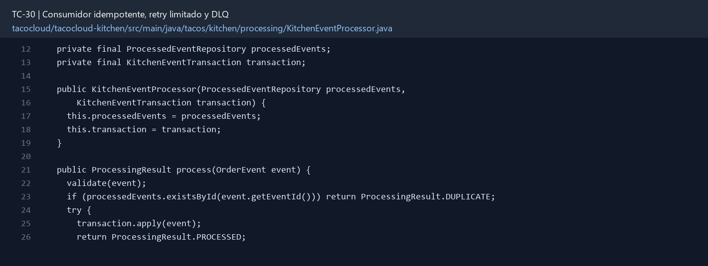

# TC-30 — Consumidor idempotente, retry limitado y DLQ

## 1.- Ficha Técnica del Reto

| Campo | Detalle |
|---|---|
| Identificador | TC-30 |
| Nombre del Reto | Consumidor idempotente, retry limitado y DLQ |
| Laboratorio | Lab 5 — Cocina y mensajería confiable |
| Nivel, puntos y dependencias | Avanzado; Puntos: 13; Lab: 5; Dependencias: TC-25, TC-27, TC-29 |
| Código Base Involucrado | SRC-14 listeners de cocina; SRC-13 adaptadores; contrato TC-27. |
| Contrato | Listener de ORDER_CREATED/STATUS_CHANGED; DLQ específica por destino. |
| Resultado Funcional | La cocina procesa redeliveries sin duplicar efectos y los mensajes venenosos terminan en una cola visible. |

## 2.- Diagnóstico del Defecto en el Baseline

El resultado esperado es el siguiente: La cocina procesa redeliveries sin duplicar efectos y los mensajes venenosos terminan en una cola visible. La ficha del PDF ubica la revisión en SRC-14 listeners de cocina; SRC-13 adaptadores; contrato TC-27. La modificación principal consiste en persistir eventId procesado con índice único y resultado/timestamp.

**Riesgos que se deben evitar:**

- Implementar al menos un broker de extremo a extremo; mantener contrato portable.
- No reconocer/commit del mensaje antes de completar el efecto durable.
- Duplicado ya procesado se confirma sin repetir negocio.
- La llave idempotente es eventId, no orderId.

## 3.- Diff (Cambios solicitados y archivos relacionados)

El PDF señala como archivos objetivo: ProcessedEvent, listener, workflow, configuración de retry/DLQ para un broker, métricas y pruebas.

La modificación funcional se comprueba con las siguientes tareas:

- Persistir eventId procesado con índice único y resultado/timestamp.
- Aplicar cambio de estado y marca de procesamiento atómicamente o con estrategia de compensación.
- Reintentar sólo errores transitorios con límite/backoff; no reintentar validación permanente.
- Enviar mensajes agotados a DLQ/DLT con headers de causa y correlación, sin datos sensibles.
- Exponer métrica y procedimiento de replay controlado.

**Archivo para revisar en el repositorio:** [KitchenEventProcessor.java](../tacocloud/tacocloud-kitchen/src/main/java/tacos/kitchen/processing/KitchenEventProcessor.java#L12).

*Figura 1. Extracto visual de KitchenEventProcessor.java, a partir de la línea 12; las líneas extensas se recortan para su lectura. Permite localizar el cambio en el código actual.*

## 4.- Pruebas Automatizadas

Las pruebas mínimas indicadas para el reto son:

- Prueba de doble entrega.
- Prueba de retry count y backoff virtual/rápido.
- Prueba de DLQ.
- Prueba de crash entre efecto y ack.
- Prueba de versión desconocida.

**Archivos de prueba relacionados en este repositorio:**

- [KitchenEventProcessorTest.java](../tacocloud/tacocloud-kitchen/src/test/java/tacos/kitchen/processing/KitchenEventProcessorTest.java)

## 5.- Pruebas Manuales en Postman

**Preparación:** use `http://localhost:8080` como URL base. Las rutas del PDF que empiezan por `/api/` se prueban aquí bajo `/api/v1/`. Antes de cada método distinto de GET, solicite `GET /csrf` en la misma sesión, conserve `JSESSIONID` y envíe el `X-CSRF-TOKEN` recién obtenido con Basic Auth (`habuma` / `password`). Siga [la guía de pruebas HTTP](PRUEBAS_HTTP.md).

**Alcance:** el contrato de este reto es interno o de configuración; Postman no lo invoca directamente. Se observa a través del flujo HTTP que lo utiliza y de las pruebas de integración.

### Caso 1: Flujo que utiliza el componente

**Objetivo:** La cocina procesa redeliveries sin duplicar efectos y los mensajes venenosos terminan en una cola visible.

**Acción:** Persistir eventId procesado con índice único y resultado/timestamp.

**Comprobación:** El mismo evento entregado dos veces cambia estado una sola vez.

### Caso 2: Condición límite

**Acción:** Prueba de retry count y backoff virtual/rápido.

**Comprobación:** Error transitorio se reintenta el número configurado.

## 6.- Defensa Técnica

**Pregunta:** ¿Qué ocurre si se guarda ProcessedEvent antes del cambio de estado y el proceso muere entre ambos?

**Respuesta:** El consumidor registra el ID procesado y limita reintentos. Una DLQ conserva mensajes irrecuperables sin bloquear indefinidamente la cola principal.

## 7.- Criterios de Aceptación

- [ ] El mismo evento entregado dos veces cambia estado una sola vez.
- [ ] Error transitorio se reintenta el número configurado.
- [ ] Error permanente llega a DLQ sin loop infinito.
- [ ] Evento desconocido/version no soportada se maneja explícitamente.
- [ ] Replay no duplica efectos.
