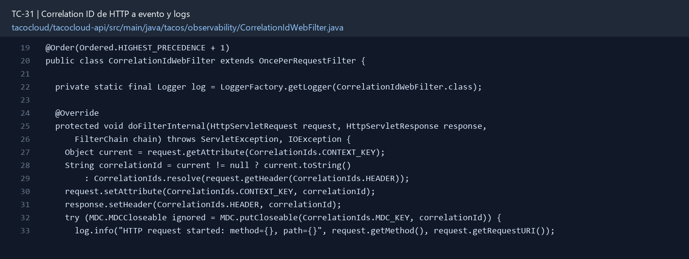

# TC-31 — Correlation ID de HTTP a evento y logs

## 1.- Ficha Técnica del Reto

| Campo | Detalle |
|---|---|
| Identificador | TC-31 |
| Nombre del Reto | Correlation ID de HTTP a evento y logs |
| Laboratorio | Lab 6 — Operación y calidad |
| Nivel, puntos y dependencias | Intermedio; Puntos: 8; Lab: 6; Dependencias: TC-27 recomendado |
| Código Base Involucrado | SRC-05 logging/config; SRC-17 Actuator/Metrics; SRC-13 eventos. |
| Contrato | Header `X-Correlation-Id` de entrada/salida; campo obligatorio en eventos. |
| Resultado Funcional | Una petición puede seguirse desde la API hasta cocina sin buscar “la orden de las 10:32 más o menos”. |

## 2.- Diagnóstico del Defecto en el Baseline

El resultado esperado es el siguiente: Una petición puede seguirse desde la API hasta cocina sin buscar “la orden de las 10:32 más o menos”. La ficha del PDF ubica la revisión en SRC-05 logging/config; SRC-17 Actuator/Metrics; SRC-13 eventos. La modificación principal consiste en aceptar `X-Correlation-Id` válido o generar UUID si no existe.

**Riesgos que se deben evitar:**

- No usar orderId como correlationId; una petición puede crear varios eventos.
- MDC ThreadLocal no se propaga mágicamente por operadores reactivos; demostrar la estrategia elegida.
- No usar IDs de alta cardinalidad como tag de métrica.
- No registrar bodies sensibles.

## 3.- Diff (Cambios solicitados y archivos relacionados)

El PDF señala como archivos objetivo: Filtro HTTP, contexto/servicios, event factory, logging pattern y pruebas.

La modificación funcional se comprueba con las siguientes tareas:

- Aceptar `X-Correlation-Id` válido o generar UUID si no existe.
- Devolverlo en el response y propagarlo a OrderEvent/outbox/DLQ.
- Incluirlo en logs mediante MDC en el borde MVC y paso explícito/Reactor Context en cadenas asíncronas.
- Limpiar MDC al terminar para no contaminar peticiones.
- Validar longitud/caracteres para evitar log injection.

**Archivo para revisar en el repositorio:** [CorrelationIdWebFilter.java](../tacocloud/tacocloud-api/src/main/java/tacos/observability/CorrelationIdWebFilter.java#L19).

*Figura 1. Extracto visual de CorrelationIdWebFilter.java, a partir de la línea 19; las líneas extensas se recortan para su lectura. Permite localizar el cambio en el código actual.*

## 4.- Pruebas Automatizadas

Las pruebas mínimas indicadas para el reto son:

- Prueba del filtro generación/preservación.
- Prueba de validación contra newline/longitud.
- Prueba de event propagation.
- Prueba de limpieza entre dos requests.

**Archivos de prueba relacionados en este repositorio:**

- [CorrelationIdWebFilterTest.java](../tacocloud/tacocloud-api/src/test/java/tacos/observability/CorrelationIdWebFilterTest.java)

## 5.- Pruebas Manuales en Postman

**Preparación:** use `http://localhost:8080` como URL base. Las rutas del PDF que empiezan por `/api/` se prueban aquí bajo `/api/v1/`. Antes de cada método distinto de GET, solicite `GET /csrf` en la misma sesión, conserve `JSESSIONID` y envíe el `X-CSRF-TOKEN` recién obtenido con Basic Auth (`habuma` / `password`). Siga [la guía de pruebas HTTP](PRUEBAS_HTTP.md).

### Caso 1: Operación principal

**Objetivo:** Una petición puede seguirse desde la API hasta cocina sin buscar “la orden de las 10:32 más o menos”.

**Método y URL:** GET /api/v1/ingredients/FLTO con `X-Correlation-Id: tc31-prueba`; inspeccione el header de respuesta.

**Datos o preparación:** Aceptar `X-Correlation-Id` válido o generar UUID si no existe.

**Comprobación:** Request sin header recibe UUID válido.

### Caso 2: Rechazo o condición límite

**Datos o preparación:** Prueba de validación contra newline/longitud.

**Comprobación:** Request con header válido conserva el valor.

## 6.- Defensa Técnica

**Pregunta:** ¿Por qué MDC puede mentir en una cadena reactiva si se asume afinidad de hilo?

**Respuesta:** El correlation ID se propaga desde HTTP al trabajo y al evento. En flujos reactivos, un `ThreadLocal` aislado no basta porque el trabajo puede cambiar de hilo.

## 7.- Criterios de Aceptación

- [ ] Request sin header recibe UUID válido.
- [ ] Request con header válido conserva el valor.
- [ ] Header malicioso/largo se reemplaza o rechaza.
- [ ] Evento y logs contienen el mismo ID.
- [ ] MDC queda limpio al terminar.
