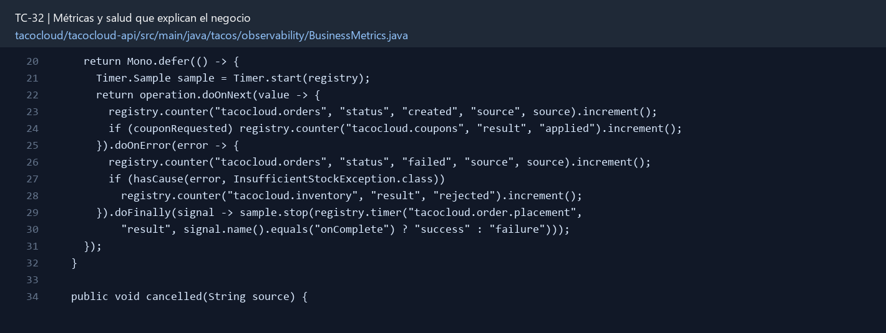

# TC-32 — Métricas y salud que explican el negocio

## 1.- Ficha Técnica del Reto

| Campo | Detalle |
|---|---|
| Identificador | TC-32 |
| Nombre del Reto | Métricas y salud que explican el negocio |
| Laboratorio | Lab 6 — Operación y calidad |
| Nivel, puntos y dependencias | Intermedio; Puntos: 8; Lab: 6; Dependencias: TC-16, TC-25, TC-29 recomendados |
| Código Base Involucrado | SRC-17 TacoMetrics/TacoCountInfoContributor/WackoHealthIndicator; SRC-05 management. |
| Contrato | `/actuator/metrics`, `/actuator/health`; endpoints protegidos según TC-11. |
| Resultado Funcional | Actuator deja de mostrar sólo “UP” y permite observar pedidos, fallos, inventario, outbox y cocina. |

## 2.- Diagnóstico del Defecto en el Baseline

El resultado esperado es el siguiente: Actuator deja de mostrar sólo “UP” y permite observar pedidos, fallos, inventario, outbox y cocina. La ficha del PDF ubica la revisión en SRC-17 TacoMetrics/TacoCountInfoContributor/WackoHealthIndicator; SRC-05 management. La modificación principal consiste en crear counters para órdenes creadas/fallidas/canceladas, cupones aplicados, rechazos de stock y eventos DLQ.

**Riesgos que se deben evitar:**

- Instrumentar en servicios/casos de uso, no sólo controladores.
- No contar dos veces en retries.
- Gauges deben leer de forma segura sin `block()` en InfoContributor.
- Los nombres/unidades se documentan.

## 3.- Diff (Cambios solicitados y archivos relacionados)

El PDF señala como archivos objetivo: MeterRegistry instrumentation, HealthIndicators, properties, pruebas y dashboard/query examples.

La modificación funcional se comprueba con las siguientes tareas:

- Crear counters para órdenes creadas/fallidas/canceladas, cupones aplicados, rechazos de stock y eventos DLQ.
- Crear timers para placement y latencia de cocina; gauge para outbox pendiente/cola.
- Usar tags de baja cardinalidad: status, source, result, transport; nunca orderId/userId/correlationId.
- Agregar health de Mongo, broker/outbox y readiness/liveness según capacidades de la versión.
- Restringir Actuator y detalles por seguridad.

**Archivo para revisar en el repositorio:** [BusinessMetrics.java](../tacocloud/tacocloud-api/src/main/java/tacos/observability/BusinessMetrics.java#L20).

*Figura 1. Extracto visual de BusinessMetrics.java, a partir de la línea 20; las líneas extensas se recortan para su lectura. Permite localizar el cambio en el código actual.*

## 4.- Pruebas Automatizadas

Las pruebas mínimas indicadas para el reto son:

- Prueba de counter/timer con SimpleMeterRegistry.
- Prueba de tags permitidos.
- Prueba de health degradado.
- Prueba de backlog gauge.
- Prueba de seguridad Actuator.

**Archivos de prueba relacionados en este repositorio:**

- [BusinessMetricsTest.java](../tacocloud/tacocloud-api/src/test/java/tacos/observability/BusinessMetricsTest.java)

## 5.- Pruebas Manuales en Postman

**Preparación:** use `http://localhost:8080` como URL base. Las rutas del PDF que empiezan por `/api/` se prueban aquí bajo `/api/v1/`. Antes de cada método distinto de GET, solicite `GET /csrf` en la misma sesión, conserve `JSESSIONID` y envíe el `X-CSRF-TOKEN` recién obtenido con Basic Auth (`habuma` / `password`). Siga [la guía de pruebas HTTP](PRUEBAS_HTTP.md).

### Caso 1: Operación principal

**Objetivo:** Actuator deja de mostrar sólo “UP” y permite observar pedidos, fallos, inventario, outbox y cocina.

**Método y URL:** GET /actuator/health y GET /actuator/metrics con el rol autorizado; compare salud y métricas.

**Datos o preparación:** Crear counters para órdenes creadas/fallidas/canceladas, cupones aplicados, rechazos de stock y eventos DLQ.

**Comprobación:** Métricas cambian al ejecutar escenarios reales.

### Caso 2: Rechazo o condición límite

**Datos o preparación:** Prueba de tags permitidos.

**Comprobación:** No aparecen tags de alta cardinalidad o datos sensibles.

## 6.- Defensa Técnica

**Pregunta:** ¿Una métrica por orderId ayuda a depurar o destruye el backend de métricas?

**Respuesta:** Una métrica de negocio representa un hecho confirmado, como orden creada o reserva rechazada. La salud distingue disponibilidad técnica de capacidad operativa.

## 7.- Criterios de Aceptación

- [ ] Métricas cambian al ejecutar escenarios reales.
- [ ] No aparecen tags de alta cardinalidad o datos sensibles.
- [ ] Outbox backlog y DLQ son visibles.
- [ ] Health degradado explica componente sin revelar credenciales.
- [ ] No se usa `block()` en contribuyentes reactivos del flujo principal.
