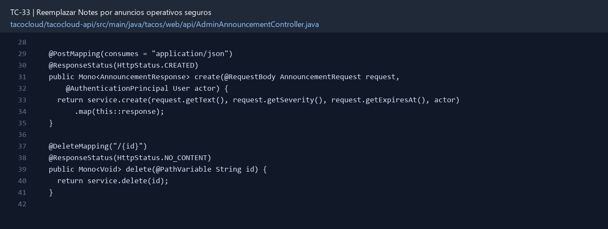
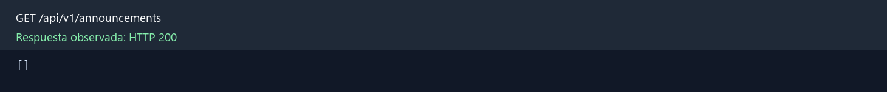

# TC-33 — Reemplazar Notes por anuncios operativos seguros

## 1.- Ficha Técnica del Reto

| Campo | Detalle |
|---|---|
| Identificador | TC-33 |
| Nombre del Reto | Reemplazar Notes por anuncios operativos seguros |
| Laboratorio | Lab 6 — Operación y calidad |
| Nivel, puntos y dependencias | Intermedio; Puntos: 8; Lab: 6; Dependencias: TC-11 |
| Código Base Involucrado | SRC-17 NotesEndpoint; SRC-05 Actuator; SRC-11 persistencia. |
| Contrato | `/actuator/announcements` o `/api/admin/announcements` con CRUD acotado. |
| Resultado Funcional | El endpoint de notas en memoria evoluciona a anuncios identificables, acotados, persistentes y administrables. |

## 2.- Diagnóstico del Defecto en el Baseline

El resultado esperado es el siguiente: El endpoint de notas en memoria evoluciona a anuncios identificables, acotados, persistentes y administrables. La ficha del PDF ubica la revisión en SRC-17 NotesEndpoint; SRC-05 Actuator; SRC-11 persistencia. La modificación principal consiste en reemplazar índice posicional por ID estable.

**Riesgos que se deben evitar:**

- No usar el índice de la lista como identificador.
- No exponer autores/datos innecesarios públicamente.
- Validar texto contra vacío y control characters.
- No convertir este endpoint en un chat sin límites.

## 3.- Diff (Cambios solicitados y archivos relacionados)

El PDF señala como archivos objetivo: OpsAnnouncement, repositorio, Actuator endpoint o REST admin, validación, seguridad y pruebas.

La modificación funcional se comprueba con las siguientes tareas:

- Reemplazar índice posicional por ID estable.
- Persistir texto, severidad, createdAt, expiresAt, createdBy y activo.
- Limitar longitud, cantidad activa y fecha de expiración; limpiar expirados.
- Permitir escritura/borrado sólo a ADMIN y lectura según política.
- Evitar `ArrayList` compartido y estado perdido al reiniciar.

**Archivo para revisar en el repositorio:** [AdminAnnouncementController.java](../tacocloud/tacocloud-api/src/main/java/tacos/web/api/AdminAnnouncementController.java#L28).

*Figura 1. Extracto visual de AdminAnnouncementController.java, a partir de la línea 28; las líneas extensas se recortan para su lectura. Permite localizar el cambio en el código actual.*

## 4.- Pruebas Automatizadas

Las pruebas mínimas indicadas para el reto son:

- Prueba de persistencia/reinicio conceptual.
- Prueba concurrente.
- Prueba de expiración con Clock.
- Prueba de seguridad y validación.

## 5.- Pruebas Manuales en Postman

**Preparación:** use `http://localhost:8080` como URL base. Las rutas del PDF que empiezan por `/api/` se prueban aquí bajo `/api/v1/`. Antes de cada método distinto de GET, solicite `GET /csrf` en la misma sesión, conserve `JSESSIONID` y envíe el `X-CSRF-TOKEN` recién obtenido con Basic Auth (`habuma` / `password`). Siga [la guía de pruebas HTTP](PRUEBAS_HTTP.md).

### Caso 1: Operación principal

**Objetivo:** El endpoint de notas en memoria evoluciona a anuncios identificables, acotados, persistentes y administrables.

**Método y URL:** GET /api/v1/announcements; el alta y retiro se prueban en `/api/v1/admin/announcements` con rol ADMIN.

**Datos o preparación:** Reemplazar índice posicional por ID estable.

**Comprobación:** Reinicio conserva anuncios.

### Caso 2: Rechazo o condición límite

**Datos o preparación:** Prueba concurrente.

**Comprobación:** Dos escrituras concurrentes no corrompen estado.

**Evidencia HTTP observada:** `GET /api/v1/announcements` respondió `200` en la aplicación local. La imagen reproduce el JSON de esa respuesta; si es largo, se muestran las primeras líneas.

## 6.- Defensa Técnica

**Pregunta:** ¿Un endpoint Actuator debe contener funcionalidad de negocio o sólo operación? Defina la frontera.

**Respuesta:** Un anuncio operativo requiere control de rol, validación y vigencia. Un endpoint de notas genéricas carece de ese contrato y de una forma segura de retirar contenido.

## 7.- Criterios de Aceptación

- [ ] Reinicio conserva anuncios.
- [ ] Dos escrituras concurrentes no corrompen estado.
- [ ] Borrado por ID elimina el correcto.
- [ ] Expirados no aparecen.
- [ ] No admin no escribe.
