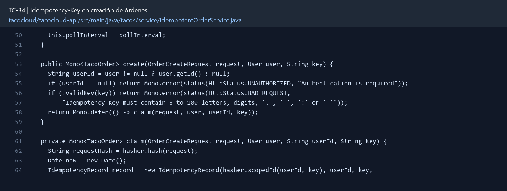

# TC-34 — Idempotency-Key en creación de órdenes

## 1.- Ficha Técnica del Reto

| Campo | Detalle |
|---|---|
| Identificador | TC-34 |
| Nombre del Reto | Idempotency-Key en creación de órdenes |
| Laboratorio | Lab 6 — Operación y calidad |
| Nivel, puntos y dependencias | Avanzado; Puntos: 13; Lab: 6; Dependencias: TC-08, TC-09, TC-14 |
| Código Base Involucrado | SRC-08 POST orders; SRC-11 repositorios; TC-16/TC-29. |
| Contrato | `POST /api/orders` con `Idempotency-Key`; respuesta repetida conserva orderId y estado acordado. |
| Resultado Funcional | Un doble clic o retry de red no genera dos órdenes ni cobra/reserva dos veces. |

## 2.- Diagnóstico del Defecto en el Baseline

El resultado esperado es el siguiente: Un doble clic o retry de red no genera dos órdenes ni cobra/reserva dos veces. La ficha del PDF ubica la revisión en SRC-08 POST orders; SRC-11 repositorios; TC-16/TC-29. La modificación principal consiste en requerir o aceptar header `Idempotency-Key` en POST orders con formato/límite.

**Riesgos que se deben evitar:**

- La key se delimita por usuario/tenant.
- Hash se calcula sobre una representación canónica de campos relevantes, no JSON textual arbitrario.
- El registro y la orden deben coordinarse con transacción/outbox cuando TC-29 existe.
- No reutilizar key para GET/DELETE.

## 3.- Diff (Cambios solicitados y archivos relacionados)

El PDF señala como archivos objetivo: IdempotencyRecord, hashing canónico, índice único, placement service, header y pruebas concurrentes.

La modificación funcional se comprueba con las siguientes tareas:

- Requerir o aceptar header `Idempotency-Key` en POST orders con formato/límite.
- Guardar key, userId, hash canónico de request, orderId, status y timestamps con índice único.
- Misma key+misma petición retorna la misma orden/respuesta; misma key+body distinto retorna 409.
- Resolver solicitudes concurrentes sin crear dos órdenes.
- Definir TTL/retención y comportamiento de registros IN_PROGRESS fallidos.

**Archivo para revisar en el repositorio:** [IdempotentOrderService.java](../tacocloud/tacocloud-api/src/main/java/tacos/service/IdempotentOrderService.java#L50).

*Figura 1. Extracto visual de IdempotentOrderService.java, a partir de la línea 50; las líneas extensas se recortan para su lectura. Permite localizar el cambio en el código actual.*

## 4.- Pruebas Automatizadas

Las pruebas mínimas indicadas para el reto son:

- Prueba secuencial.
- Prueba concurrente.
- Prueba payload conflict.
- Prueba scope por usuario.
- Prueba con outbox/inventory.

**Archivos de prueba relacionados en este repositorio:**

- [IdempotentOrderServiceTest.java](../tacocloud/tacocloud-api/src/test/java/tacos/service/IdempotentOrderServiceTest.java)

## 5.- Pruebas Manuales en Postman

**Preparación:** use `http://localhost:8080` como URL base. Las rutas del PDF que empiezan por `/api/` se prueban aquí bajo `/api/v1/`. Antes de cada método distinto de GET, solicite `GET /csrf` en la misma sesión, conserve `JSESSIONID` y envíe el `X-CSRF-TOKEN` recién obtenido con Basic Auth (`habuma` / `password`). Siga [la guía de pruebas HTTP](PRUEBAS_HTTP.md).

### Caso 1: Operación principal

**Objetivo:** Un doble clic o retry de red no genera dos órdenes ni cobra/reserva dos veces.

**Método y URL:** `POST /api/orders` con `Idempotency-Key`; respuesta repetida conserva orderId y estado acordado.

**Datos o preparación:** Requerir o aceptar header `Idempotency-Key` en POST orders con formato/límite.

**Comprobación:** Doble request secuencial crea una sola orden.

### Caso 2: Rechazo o condición límite

**Datos o preparación:** Prueba concurrente.

**Comprobación:** Dos requests concurrentes crean una sola orden.

## 6.- Defensa Técnica

**Pregunta:** ¿La respuesta repetida debe ser 200 o repetir 201? Lo importante es documentar y conservar el efecto.

**Respuesta:** La clave se delimita por usuario y se asocia al hash canónico de la petición. Repetir la solicitud devuelve el efecto previo; otro cuerpo con la misma clave produce conflicto.

## 7.- Criterios de Aceptación

- [ ] Doble request secuencial crea una sola orden.
- [ ] Dos requests concurrentes crean una sola orden.
- [ ] Misma key con payload diferente produce 409.
- [ ] Usuarios distintos pueden usar la misma key sin colisión.
- [ ] Retry no duplica inventario/evento.
