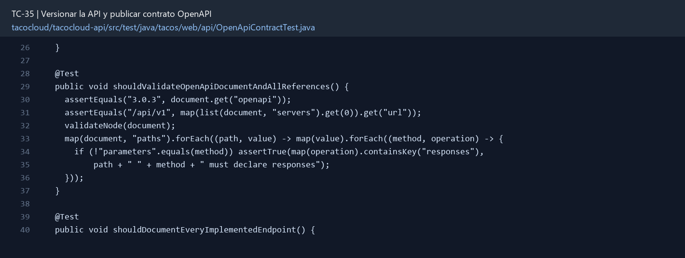

# TC-35 — Versionar la API y publicar contrato OpenAPI

## 1.- Ficha Técnica del Reto

| Campo | Detalle |
|---|---|
| Identificador | TC-35 |
| Nombre del Reto | Versionar la API y publicar contrato OpenAPI |
| Laboratorio | Lab 6 — Operación y calidad |
| Nivel, puntos y dependencias | Intermedio; Puntos: 8; Lab: 6; Dependencias: TC-08, TC-09 |
| Código Base Involucrado | SRC-07/SRC-08 controladores; SRC-16 clientes; SRC-02 README. |
| Contrato | `/api/v1/**`; `openapi.yaml`; header de deprecación/Link o documentación para alias legado. |
| Resultado Funcional | Clientes y estudiantes pueden saber qué enviar, qué recibir y qué cambia sin leer todos los controladores. |

## 2.- Diagnóstico del Defecto en el Baseline

El resultado esperado es el siguiente: Clientes y estudiantes pueden saber qué enviar, qué recibir y qué cambia sin leer todos los controladores. La ficha del PDF ubica la revisión en SRC-07/SRC-08 controladores; SRC-16 clientes; SRC-02 README. La modificación principal consiste en crear prefijo `/api/v1` para contratos públicos y plan de deprecación de `/api` legado.

**Riesgos que se deben evitar:**

- No generar el contrato a partir de entidades Mongo.
- No romper `/api` sin estrategia de transición.
- El spec está versionado en Git y revisado como código.
- Si se usa librería, elegir línea compatible con Boot 2.5; el YAML sigue siendo fuente verificable.

## 3.- Diff (Cambios solicitados y archivos relacionados)

El PDF señala como archivos objetivo: Rutas/versionado, `openapi.yaml`, ejemplos, contrato de errores y pruebas de compatibilidad.

La modificación funcional se comprueba con las siguientes tareas:

- Crear prefijo `/api/v1` para contratos públicos y plan de deprecación de `/api` legado.
- Documentar ingredientes, tacos, órdenes, favoritos, ratings, cocina y errores implementados.
- Definir schemas separados de request/response, seguridad, headers Idempotency/Correlation y ejemplos.
- Incluir estados HTTP y ApiProblem.
- Agregar prueba que valide el documento y una prueba de endpoint clave contra el schema.

**Archivo para revisar en el repositorio:** [OpenApiContractTest.java](../tacocloud/tacocloud-api/src/test/java/tacos/web/api/OpenApiContractTest.java#L26).

*Figura 1. Extracto visual de OpenApiContractTest.java, a partir de la línea 26; las líneas extensas se recortan para su lectura. Permite localizar el cambio en el código actual.*

## 4.- Pruebas Automatizadas

Las pruebas mínimas indicadas para el reto son:

- Validador de OpenAPI en build.
- Contract test de POST order/ApiProblem.
- Prueba de alias/deprecación.
- Prueba negativa de campos sensibles.

**Archivos de prueba relacionados en este repositorio:**

- [OpenApiContractTest.java](../tacocloud/tacocloud-api/src/test/java/tacos/web/api/OpenApiContractTest.java)

## 5.- Pruebas Manuales en Postman

**Preparación:** use `http://localhost:8080` como URL base. Las rutas del PDF que empiezan por `/api/` se prueban aquí bajo `/api/v1/`. Antes de cada método distinto de GET, solicite `GET /csrf` en la misma sesión, conserve `JSESSIONID` y envíe el `X-CSRF-TOKEN` recién obtenido con Basic Auth (`habuma` / `password`). Siga [la guía de pruebas HTTP](PRUEBAS_HTTP.md).

### Caso 1: Operación principal

**Objetivo:** Clientes y estudiantes pueden saber qué enviar, qué recibir y qué cambia sin leer todos los controladores.

**Método y URL:** GET /openapi.yaml y GET /api/v1/ingredients/FLTO; compare la ruta versionada con su esquema.

**Datos o preparación:** Crear prefijo `/api/v1` para contratos públicos y plan de deprecación de `/api` legado.

**Comprobación:** El spec valida sin errores.

### Caso 2: Rechazo o condición límite

**Datos o preparación:** Contract test de POST order/ApiProblem.

**Comprobación:** Cada endpoint implementado aparece con request/response correctos.

## 6.- Defensa Técnica

**Pregunta:** ¿Versionar por URL resuelve automáticamente la compatibilidad? ¿Qué pasa con semántica y eventos?

**Respuesta:** Versionar la URL no garantiza compatibilidad semántica. OpenAPI y las pruebas cubren campos, estados, errores y rutas heredadas.

## 7.- Criterios de Aceptación

- [ ] El spec valida sin errores.
- [ ] Cada endpoint implementado aparece con request/response correctos.
- [ ] Una prueba detecta un campo o status incompatible.
- [ ] La UI/cliente usa v1 o alias documentado.
- [ ] No aparecen campos sensibles en schemas.
