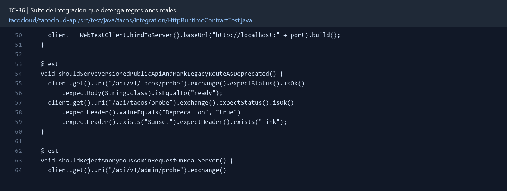

# TC-36 — Suite de integración que detenga regresiones reales

## 1.- Ficha Técnica del Reto

| Campo | Detalle |
|---|---|
| Identificador | TC-36 |
| Nombre del Reto | Suite de integración que detenga regresiones reales |
| Laboratorio | Lab 6 — Operación y calidad |
| Nivel, puntos y dependencias | Avanzado; Puntos: 13; Lab: 6; Dependencias: Todos los retos seleccionados |
| Código Base Involucrado | Todos los SRC relevantes; especialmente SRC-07/08/11/12/13/14/17. |
| Contrato | Comando reproducible Maven para test completo y subconjuntos por módulo. |
| Resultado Funcional | El proyecto obtiene una red mínima de seguridad que detecta publishers fantasma, autorización abierta, duplicados y fallos de mensajería. |

## 2.- Diagnóstico del Defecto en el Baseline

El resultado esperado es el siguiente: El proyecto obtiene una red mínima de seguridad que detecta publishers fantasma, autorización abierta, duplicados y fallos de mensajería. La ficha del PDF ubica la revisión en Todos los SRC relevantes; especialmente SRC-07/08/11/12/13/14/17. La modificación principal consiste en agregar tests unitarios rápidos para servicios puros y StepVerifier para cadenas reactivas.

**Riesgos que se deben evitar:**

- No depender de Mongo/broker instalados en la laptop.
- Usar datos sintéticos y limpiar estado por test.
- No reemplazar todas las integraciones con mocks: conservar un triángulo unit/integration/contract.
- Evitar sleeps; usar await/polling controlado o StepVerifier.
- Fijar versiones compatibles con Java/Spring base.

## 3.- Diff (Cambios solicitados y archivos relacionados)

El PDF señala como archivos objetivo: Módulos test, Testcontainers, fixtures, perfiles de test y pipeline Maven/CI.

La modificación funcional se comprueba con las siguientes tareas:

- Agregar tests unitarios rápidos para servicios puros y StepVerifier para cadenas reactivas.
- Agregar `@SpringBootTest(RANDOM_PORT)` + WebTestClient para contratos HTTP del runtime MVC real.
- Usar Testcontainers MongoDB; para mensajería, probar al menos un broker con su contenedor.
- Crear regresiones explícitas para TC-01/02/04/06/07/10/11/12/29/30/34.
- Ejecutar en CI con reportes y fallo ante tests omitidos/críticos.

**Archivo para revisar en el repositorio:** [HttpRuntimeContractTest.java](../tacocloud/tacocloud-api/src/test/java/tacos/integration/HttpRuntimeContractTest.java#L50).



*Figura 1. Extracto visual de HttpRuntimeContractTest.java, a partir de la línea 50; las líneas extensas se recortan para su lectura. Permite localizar el cambio en el código actual.*

## 4.- Pruebas Automatizadas

Las pruebas mínimas indicadas para el reto son:

- Unit tests de reglas/pricing/workflow.
- API tests de estados/seguridad/errores.
- Mongo integration tests.
- Broker/outbox/idempotency tests.
- Contract/serialization tests.

**Archivos de prueba relacionados en este repositorio:**

- [HttpRuntimeContractTest.java](../tacocloud/tacocloud-api/src/test/java/tacos/integration/HttpRuntimeContractTest.java)

## 5.- Pruebas Manuales en Postman

**Preparación:** use `http://localhost:8080` como URL base. Las rutas del PDF que empiezan por `/api/` se prueban aquí bajo `/api/v1/`. Antes de cada método distinto de GET, solicite `GET /csrf` en la misma sesión, conserve `JSESSIONID` y envíe el `X-CSRF-TOKEN` recién obtenido con Basic Auth (`habuma` / `password`). Siga [la guía de pruebas HTTP](PRUEBAS_HTTP.md).

**Alcance:** el contrato de este reto es interno o de configuración; Postman no lo invoca directamente. Se observa a través del flujo HTTP que lo utiliza y de las pruebas de integración.

### Caso 1: Flujo que utiliza el componente

**Objetivo:** El proyecto obtiene una red mínima de seguridad que detecta publishers fantasma, autorización abierta, duplicados y fallos de mensajería.

**Acción:** Agregar tests unitarios rápidos para servicios puros y StepVerifier para cadenas reactivas.

**Comprobación:** Una regresión que reintroduce `void repo.save/delete` falla.

### Caso 2: Condición límite

**Acción:** API tests de estados/seguridad/errores.

**Comprobación:** Una ruta accidental permitAll falla en pruebas negativas.

**Ejecución reproducible:** desde `tacocloud`, ejecute `.\mvnw.cmd -pl tacocloud-api -am test` para las pruebas del módulo API y sus dependencias. Para la suite completa, ejecute `.\mvnw.cmd test`. Revise los reportes Surefire de cada módulo; el resultado de estos comandos depende de las dependencias de integración disponibles en el entorno.

### Ejecución con Docker desde un checkout limpio

Requisito: Docker Engine con Compose, o Docker Desktop iniciado en modo de contenedores Linux. No se necesita instalar Java, Maven, Node, MongoDB ni RabbitMQ en el host. Ejecute desde la raíz del repositorio:

```sh
docker compose -f compose.tests.yml build tests
docker compose -f compose.tests.yml run --rm -e REPORT_SET=critical tests -Pcritical-regressions clean test
docker compose -f compose.tests.yml run --rm tests clean verify
```

Para ejecutar solamente el módulo API y sus dependencias:

```sh
docker compose -f compose.tests.yml run --rm -e REPORT_SET=module tests -pl tacocloud-api -am clean test
```

`Dockerfile.tests` copia el código fuente a una imagen con Maven 3.9.9 y Java 21. `.dockerignore` excluye `target`, dependencias de Node y otros resultados locales; cada ejecución usa `clean`. Los volúmenes Maven y npm conservan únicamente descargas y pueden omitirse usando `docker compose -f compose.tests.yml run --rm -v /root/.m2 -v /root/.npm tests clean verify` para comprobar con cachés nuevas.

Compose conecta el ejecutor al socket Docker del host. Testcontainers inicia MongoDB como replica set y RabbitMQ con puertos dinámicos y limpia sus contenedores mediante Ryuk. `host.docker.internal` permite acceder a esos puertos desde el ejecutor; `host-gateway` permite resolverlo también en Docker Engine para Linux. No se usa un MongoDB ni un broker instalado en la laptop.

`TACOCLOUD_REQUIRE_DOCKER=true` hace fallar la comprobación de infraestructura si Docker no está disponible. El ejecutor también rechaza reportes ausentes, vacíos u omitidos de las tres suites críticas con contenedores; en el perfil crítico no acepta ningún test omitido. La suite completa mantiene las pruebas históricas deshabilitadas y las pruebas Mongo optativas existentes; sus omisiones aparecen en los reportes y no se presentan como tests ejecutados.

Los reportes se exportan, incluso si Maven falla, a `test-reports/critical`, `test-reports/full` o `test-reports/module`, conservando la carpeta de cada módulo. El pipeline `.github/workflows/tacocloud-tests.yml` ejecuta estos mismos comandos y publica los reportes. Tras modificar el código, reconstruya la imagen con `build tests`.

### Evidencia de ejecución (30 de septiembre de 2026)

Se creó un clon local independiente, se aplicaron los cambios propuestos y se construyó la imagen sin `target`, `node_modules`, Maven ni MongoDB del host. La primera ejecución partió de una caché Maven vacía. Entorno validado: Docker Engine 29.7.2, Docker Desktop 4.89.0, Maven 3.9.9, Java 21 y Testcontainers 1.21.4.

- Perfil crítico: **137 pruebas, 0 fallos, 0 errores, 0 omitidas**. Se ejecutaron todas sus clases en los módulos correspondientes y sus dependencias con `tests -Pcritical-regressions -pl tacocloud-api,tacocloud-kitchen,tacocloud-security -am clean test`. El perfil completo también pasó antes de incorporar la nueva regresión del reloj, con 136 pruebas.
- Suite completa: **BUILD SUCCESS**, 301 pruebas descubiertas, **289 ejecutadas**, 0 fallos, 0 errores y 12 omisiones históricas (seis escenarios de navegador/HomeController y seis pruebas Mongo optativas). La nueva prueba del reloj se validó adicionalmente en el perfil crítico.
- MongoDB real: commit y rollback de orden/outbox, reclamación concurrente y rollback del consumidor. RabbitMQ real: encabezados y redelivery de un evento no confirmado. El runtime completo también usó MongoDB de Testcontainers.
- Prueba negativa del ejecutor: sin montar el socket Docker, termina con código 1 y explica cómo ejecutarlo mediante Compose.

Los logs y XML Surefire de esta ejecución están en `test-reports/critical-docker.log`, `test-reports/full-docker.log`, `test-reports/critical/` y `test-reports/full/` (artefactos locales ignorados por Git).

La ejecución real permitió corregir configuraciones que antes no se ejercitaban: tipos simples del convertidor Mongo en Java 21, exclusión de Mongo embebido en Testcontainers, escaneo de repositorios del outbox, fixtures transaccionales y comparación de encabezados AMQP `LongString`. La prueba de rollback provoca un rechazo mediante un validador Mongo, porque repetir un ID con `save()` produce un upsert. Además, se corrigió la condición de creación de `outboxClock` para coexistir con otros relojes, con su regresión `OutboxConfigurationTest`. El escenario de navegador ya omitido se deshabilita a nivel de clase para evitar descargar/iniciar Edge sin ejecutar pruebas.

## 6.- Defensa Técnica

**Pregunta:** ¿Qué prueba habría detectado cada defecto original antes de llegar a la demo?

**Respuesta:** Una prueba de integración cruza bordes reales y detecta regresiones de persistencia, seguridad o mensajería. Las pruebas unitarias aisladas no confirman el flujo completo.

## 7.- Criterios de Aceptación

- [] Una regresión que reintroduce `void repo.save/delete` falla.
- [] Una ruta accidental permitAll falla en pruebas negativas.
- [] Doble Idempotency-Key no crea dos órdenes.
- [] Outbox/consumer sobreviven fallo y redelivery.
- [x] Los tests corren desde checkout limpio con Docker disponible.
